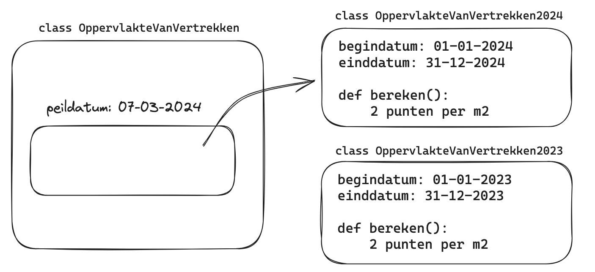
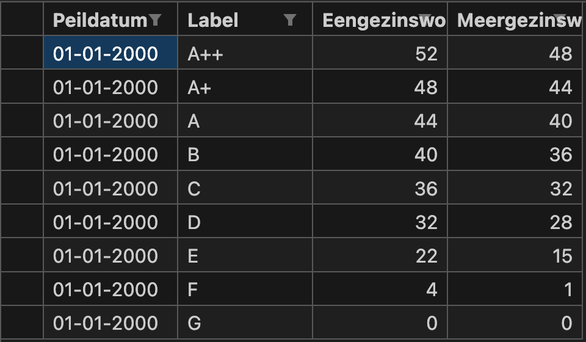

# Woningwaardering

⌛️ **Work in Progress**

Het Microservices team van Woonstad Rotterdam is in Q1 2024 begonnen met het ontwikkelen met een open-source Python-package waarmee het mogelijk zal zijn om het puntensysteeem van het [woningwaarderingsstelsel](https://aedes.nl/huurbeleid-en-betaalbaarheid/woningwaarderingsstelsel-wws) toe te passen. We gaan hierbij zo veel mogelijk uit van de [VERA-standaard](https://www.coraveraonline.nl/index.php/VERA-standaard) van de corporatiesector. Het doel is om tot een completere woningwaarderingsstelsel-berekening te komen dan die nu beschikbaar zijn via tools zoals bijvoorbeeld die van de [huurcommissie](https://www.huurcommissie.nl/huurders/sociale-huurwoning/maximale-huurprijs-berekenen).

Voor vragen kunt u contact opnemen met de Product Owner van Team Microservices [Wouter Kolbeek](mailto:wouter.kolbeek@woonstadrotterdam.nl) of één van de maintainers van deze repo.

## Inhoudsopgave

- [Woningwaardering](#woningwaardering)
  - [Inhoudsopgave](#inhoudsopgave)
  - [1. Opzet woningwaardering-package](#1-opzet-woningwaardering-package)
    - [Implementatie beleidsboek huurcommissie](#implementatie-beleidsboek-huurcommissie)
    - [Repository-structuur](#repository-structuur)
    - [Design](#design)
    - [Lookup tabellen](#lookup-tabellen)
  - [2. Contributing](#2-contributing)
    - [Setup](#setup)
    - [Naamgeving van classes](#naamgeving-van-classes)
      - [Stelsels](#stelsels)
      - [Stelselgroepen](#stelselgroepen)
      - [Stelselgroepversies](#stelselgroepversies)
    - [Testing](#testing)
      - [Conventies voor tests](#conventies-voor-tests)
      - [Test modellen](#test-modellen)
    - [Datamodellen](#datamodellen)
      - [Datamodellen uitbreiden](#datamodellen-uitbreiden)
    - [Referentiedata](#referentiedata)
  - [3. Datamodel uitbreidingen](#3-datamodel-uitbreidingen)
    - [Ruimtedetailsoort kast](#ruimtedetailsoort-kast)
    - [Verbonden ruimten](#verbonden-ruimten)
    - [Gedeeld met aantal eenheden](#gedeeld-met-aantal-eenheden)
    - [Bouwkundige elementen](#bouwkundige-elementen)

## 1. Opzet woningwaardering-package

### Implementatie beleidsboek huurcommissie

Voor het berekenen van een woningwaardering worden de [beleidsboeken van de Nederlandse Huurcommissie](https://www.huurcommissie.nl/huurcommissie-helpt/beleidsboeken) voor de waarderingstelsels voor zelfstandige en onzelfstandige woningen gevolgd.
De beleidsboeken van de Huurcommissie Nederland volgen Nederlandse wet- en regelgeving zoals beschreven in [Artikel 14 van het "Besluit huurprijzen woonruimte"](https://wetten.overheid.nl/BWBR0003237/2024-01-01#Artikel14).

Om berekeningen te maken met betrekking tot een woningwaardering wordt het gepubliceerde beleid vertaald naar Python-code.
Een woningwaardering wordt gemaakt op basis van woningelementen.
De stelselgroepen waarop gescoord wordt, zijn vastgelegd in het [woningwaarderingstelselgroep](https://www.coraveraonline.nl/index.php/Referentiedata:WONINGWAARDERINGSTELSELGROEP) op www.coraveraonline.nl.
Deze worden aangehouden in de opzet van de `woningwaardering`-package.
Voor elke stelselgroep wordt een apart Python-object gemaakt met een naam die overeenkomt met [woningwaarderingstelselgroep](https://www.coraveraonline.nl/index.php/Referentiedata:WONINGWAARDERINGSTELSELGROEP).
Een stelselgroep-object zal een nieuwe versie krijgen wanneer nieuw gepubliceerde wet- en regelgeving, die is opgenomen in de [beleidsboeken van de Nederlandse Huurcommissie](https://www.huurcommissie.nl/huurcommissie-helpt/beleidsboeken), verschilt van de huidige berekening voor dat stelselgroep.

De woningwaardering package volgt de [beleidsboeken van de Nederlandse Huurcommissie](https://www.huurcommissie.nl/huurcommissie-helpt/beleidsboeken) en daarmee de Nederlandse wet en regelgeving m.b.t. het waarderen van woningen. Tijdens de ontwikkeling van deze package komt het voor dat we inconsistenties in de beleidsboeken vinden of dat er ruimte is voor interpretatie. Daarnaast kan het voorkomen dat dat de VERA modellen, met eventuele uitbreidingen, niet toereikend zijn om de stelselgroep voglens het beleidsboek tot op de letter nauwkeurig te implementeren. In [implementatietoelichting-beleidsboeken](docs/implementatietoelichting-beleidsboeken) onderbouwen wij hoe elke stelselgroep is geïmplementeerd en welke keuzes daarin zijn gemaakt per jaar.
In deze documenten wordt bijgehouden welke onderdelen van het beleidsboek wel en niet zijn geïmplementeerd per stelselgroep. De gepubliceerde tekst uit het beleidsboek wordt gekopieerd en wanneer een onderdeel niet in de code van de package is geïmplementeerd zal dit worden aangegeven met ~~doorgestreepte tekst~~.  
De reden van het niet implementeren van een regelonderdeel is vrijwel altijd dat het technisch niet mogelijk is op basis het inputmodel van de VERA-standaard. Een voorbeeld hiervan is dat voor oppervlakte van vertrekken in 2024 de minimale breedte van een vertrek over de volle lengte 1.5m moet zijn. Omdat wij alleen de totale oppervlakte binnenkrijgen via het inputmodel kunnen wij dit onderdeel van de regel niet implementeren. **Dit betekent dat het aan de gebruiker is om met deze regel-onderdelen rekening te houden bij het eenheid-inputmodel.** Een deel van de deze regelonderdelen wordt al afgevangen indien het eenheid-inputmodel voldoet aan de NEN-norm.
Regels die wel zijn geimplementeerd zijn niet doorgestreept.
Keuzes die zijn gemaakt en of interpretaties die zijn gedaan, worden in een gemarkeerd blok weergegeven zoals hieronder is gedaan.

> Dit is een tekstblok waarmee commentaar van een developer wordt aangegeven in het beleidsboek.

### Repository-structuur

De repository-structuur is ingedeeld volgens de [referentiedata van stelselgroepen van de VERA-standaard](https://www.coraveraonline.nl/index.php/Referentiedata:WONINGWAARDERINGSTELSELGROEP); eerst de stelsels (bijvoorbeeld _zelfstandig_, _onzelfstandig_) en vervolgens de stelselgroepen (bijvoorbeeld _Energieprestatie_, _Wasgelegenheid_).
In de folders van de stelselgroepen bevindt zich de code voor het berekenen van de punten per stelselgroep.

### Design

Het design van de `woningwaardering`-package is zo gekozen dat stelselgroep-objecten en bijbehorende regels modulair zijn.
Dit houdt in dat regels in een stelselgroep-object vervangbaar en inwisselbaar zijn, met als resultaat dat op basis van de gegeven input de woningwaardering berekend wordt met de juiste set aan stelselgroep-objecten en bijbehorende regels.
Ook wanneer een wet verandert met ingang van een bepaalde datum zorgt de modulariteit ervoor dat de juiste regels worden gebruikt voor de stelselgroep.
De `woningwaardering`-package selecteert op basis van een peildatum de juiste set aan regels die volgens de Nederlandse wet gelden voor de desbetreffende peildatum.
Hieronder is het modulaire principe op basis van een peildatum schematisch weergegeven voor het stelselgroep-object `OppervlakteVanVertrekken`.
Voor de duidelijkheid: Onderstaand voorbeeld is niet gebaseerd op een echte verandering in het beleidshandboek.
Het voorbeeld laat zien hoe de berekening van de `OppervlakteVanVertrekken` afhangt van de peildatum.
Op basis van de peildatum wordt voor de bovenste beleidsregel gekozen omdat die berekening geldig is voor de opgegeven peildatum.



### Lookup tabellen

In lookup tabellen worden constanten en variabelen opgeslagen die nodig zijn bij het berekenen van de punten voor een stelselgroep.
In de `woningwaardering` package wordt CSV gebruikt als bestandstype voor het opslaan van een lookup tabel.
De keuze is op CSV gevallen omdat lookup data soms bestaat uit meerdere datarijen waardoor dit vaak minder leesbaar wordt wanneer dit bijvoorbeeld in json of yaml wordt opgeslagen.
Voor VSCode-gebruikers is de extensie Excel Viewer van GrapeCity aan te raden.
Met behulp van deze extensie kunnen CSV-bestanden als tabel weergegeven worden in VSCode.
Hieronder is een voorbeeldtabel te zien zoals deze met Excel Viewer in VSCode wordt weergegeven.



Door gebruik van CSV-bestanden, wordt het selecteren van de juiste rij of waarde door middel van een peildatum vergemakkelijkt.
In de `woningwaardering`-package wordt een peildatum gebruikt om de juiste waarde van bijvoorbeeld een variabele uit een tabel te selecteren.
Dit kan worden gedaan op basis van de `Begindatum` en de `Einddatum` kolommen in een CSV-bestand.
Wanneer er geen `Begindatum` of `Einddatum` is gespecificeerd, dan is deze niet bekend.
Dit betekent niet dat er geen werkbare en geldige rij geselecteerd kan worden.
Wel zou het kunnen dat er door het ontbreken van een `Begindatum` of `Einddatum` meerdere rijen geldig zijn voor een peildatum.
In dit geval zal de `woningwaardering`-package een error geven die duidelijk maakt dat er geen geldige rij gekozen kan worden op basis van de peildatum voor het desbetreffende CSV-bestand.

## 2. Contributing

### Setup

Om de woningwaardering-package en de daarbij behorende developer dependencies te installeren, run onderstaand command:

```
git clone https://github.com/WoonstadRotterdamTemp/woningwaardering.git
cd woningwaardering
pip install -e ".[dev]"
```

### Naamgeving van classes

Voor de naamgeving van de classes in de woningwaardering module volgen we de VERA referentiedata. Deze referentiedata is gedefinieerd in de referentiedata enums, te vinden onder [woningwaardering/vera/referentiedata](woningwaardering/vera/referentiedata).

#### Genereren opzet woningwaarderingstelsels en -groepen

Om alle onderstaande naamgevingen correct en consequent door te voeren, is er een task beschikbaar die de opzet van een woningwaarderingstelsel en -groep volgens deze regels voor je kan aanmaken.

Zorg er voor dat [Task](https://taskfile.dev/installation/) en de dev dependencies zijn geïnstalleerd:

```
pip install -e ".[dev]"
```

Vervolgens voer je onderstaand command uit:

```
task genereer-opzet-woningwaarderinggroep
```

Dit script stelt je een aantal vragen, waarna de code en configuratie voor het stelsel en de stelselgroep aangemaakt worden.

#### Stelsels

De namen voor de stelsels zijn te vinden in de `Woningwaarderingstelsel` Enum. Bijvoorbeeld: het stelsel voor zelfstandige woonruimten wordt aangeduid als `Woningwaarderingstelsel.zelfstandige_woonruimten`. De implementatie van dit `Stelsel` bevindt zich in [woningwaardering/stelsels/zelfstandige_woonruimten/zelfstandige_woonruimten.py](woningwaardering/stelsels/zelfstandige_woonruimten/zelfstandige_woonruimten.py).
De begin- en einddatum van de geldigheid van een stelsel wordt vastgelegd in de configuratie `.yml` van het betreffende stelsel. Bijvoorbeeld: voor zelfstandige woonruimten is dit [woningwaardering/stelsels/config/zelfstandige_woonruimten.yml](woningwaardering/stelsels/config/zelfstandige_woonruimten.yml)

#### Stelselgroepen

De namen voor de stelselgroepen zijn te vinden in de `Woningwaarderingstelselgroep` Enum. Bijvoorbeeld: de stelselgroep voor oppervlakte van vertrekken wordt aangeduid als `Woningwaarderingstelselgroep.oppervlakte_van_vertrekken`. De implementatie van deze `Stelselgroep` bevindt zich in [woningwaardering/stelsels/zelfstandige_woonruimten/oppervlakte_van_vertrekken/oppervlakte_van_vertrekken.py](woningwaardering/stelsels/zelfstandige_woonruimten/oppervlakte_van_vertrekken/oppervlakte_van_vertrekken.py).
De begin- en einddatum van de geldigheid van een stelselgroep wordt vastgelegd in de configuratie `.yml` van het betreffende stelsel.

#### Stelselgroepversies

De daadwerkelijke implementatie van een stelselgroep is een `Stelselgroepversie`. Voor stelselgroepversies wordt de naam van de stelselgroep gevolgd door het jaar waarin de versie van de stelselgroep in gebruik gaat. Bijvoorbeeld: de implementatie van de `Stelselgroepversie` voor oppervlakte van vertrekken die in gaat in het jaar 2024 bevindt zich in [woningwaardering/stelsels/zelfstandige_woonruimten/oppervlakte_van_vertrekken/oppervlakte_van_vertrekken_2024.py](woningwaardering/stelsels/zelfstandige_woonruimten/oppervlakte_van_vertrekken/oppervlakte_van_vertrekken_2024.py).
Omdat het lastig is met terugwerkende kracht te achterhalen in welk jaar een versie van een stelselgroep ingegaan is, gebruiken we voor de eerste versie van een stelselgroep het jaar van de implementatie van de stelselgroep in deze module. Wanneer de berekening van een stelselgroep in een bepaald jaar niet wijzigt, wordt er geen nieuwe stelselgroepversie aangemaakt. De begin- en einddatum van de geldigheid van een stelselgroepversie wordt vastgelegd in de configuratie `.yml` van het betreffende stelsel.

### Releasemanagement

#### Versienummering

Voor versienummering maken we gebruik van [SemVer](https://semver.org/lang/nl/):

Bij SemVer wordt een versienummer in de vorm MAJOR.MINOR.PATCH gebruikt, waarbij elk element als volgt wordt verhoogd:

- `MAJOR` wordt verhoogd bij incompatibele API-wijzigingen,
- `MINOR` wordt verhoogd bij het toevoegen van functionaliteit die compatibel is met de vorige versie, en
- `PATCH` wordt verhoogd bij compatibele bugfixes.

Er zijn aanvullende labels beschikbaar voor pre-release en build-metadata om toe te voegen aan het `MAJOR.MINOR.PATCH`-formaat.

Bijvoorbeeld: stel dat de huidige versie `0.1.3-alpha` is.

- De suffix `-alpha` wordt gebruikt zolang de software nog niet volledig is, bijvoorbeeld zolang nog niet alle beoogde stelselgroepen geïmplementeerd zijn
- Wanneer een nieuwe release alleen compatibele bugfixes of updates van dependencies bevat, wordt de nieuwe versie `0.1.4-alpha`
- Wanneer een nieuwe release ook compatibele nieuwe functionaliteit toevoegt, bijvoorbeeld de implementatie van een nieuwe stelselgroep, dan wordt de nieuwe versie `0.2.0-alpha`.
- Wanneer alle beoogde stelselgroepen geïmplementeerd zijn, wordt de nieuwe versie `1.0.0-beta`. De publieke api mag vanaf dan enkel nog backwards-compatible wijzigen.
- Wanneer de software volledig is en in productie genomen wordt, wordt de nieuwe versie `1.0.0`
- Wanneer er een incompatible wijziging is in de VERA modellen, wordt de nieuwe versie `2.0.0`, eventueel met het `-alpha` of `-beta` label, afhankelijk van de implementatiestatus.

#### Releaseproces

Om een nieuwe release te starten, moet er een Git tag aangemaak worden volgens het format `v<versienummer>`. De prefix `v` geeft aan dat de tag een versiepunt markeert.

Bijvoorbeeld:

```cli
$ git tag v0.2.3-alpha
$ git push --tags
```

Hiermee start het releaseproces, gedefinieerd in een GitHub workflow: [.github/workflows/publish-to-pypi.ymls](.github/workflows/publish-to-pypi.yml)

In dit proces wordt een package aangemaakt met een [Python versienummer](https://packaging.python.org/en/latest/discussions/versioning/), afgeleid van het SemVer nummer in de tag. Bijvoorbeeld: `0.2.3-alpha` wordt `0.2.3a0`

De package wordt eerst gepubliceerd op [TestPyPi](https://test.pypi.org/project/woningwaardering/). Na goedkeuring wordt de package naar [PyPi](https://pypi.org/project/woningwaardering/) gepubliceerd. Daarna wordt er een release aangemaakt in GitHub, met een changelog met de titel en link naar alle pull requests die deel uitmaken van deze release.

### Testing

Voor het testen van code wordt het [pytest framework](https://docs.pytest.org/en/8.0.x/index.html) gebruikt. Meer informatie is te vinden over het framework.
Passende tests worden altijd met de nieuw geschreven code opgeleverd.
Er zijn verschillende "test-scopes" te bedenken, zoals het testen van details en specifieke functies.
Daarnaast is het testen van een hele keten of stelselgroep-object ook vereist.
Bij het opleveren van nieuwe code moet aan beide test-scopes gedacht worden.

#### Conventies voor tests

Tests worden toegevoegd aan de `tests`-folder in de root van de repository.
Voor de structuur in de `tests`-folder wordt dezelfde structuur aangehouden als die in de `woningwaardering`-folder.
De naam van het bestand waarin de tests staan geschreven is `test_<file_name>.py`.
Elke testfunctie begint met `test_`, gevolgd door de naam van de functie of class die getest wordt, bijvoorbeeld `def test_<functie_naam>()` of `def test_<ClassNaam>()`.
Hierin wordt de naam de van de functie of class exact gevolgd.
Voor pytest is `test_` een indicator om de functie te herkennen als een testfunctie.

Stel dat de functionaliteiten van `woningwaardering/stelsels/zelfstandige_woonruimten/oppervlakte_van_vertrekken/oppervlakte_van_vertrekken.py` getest moeten worden, dan is het pad naar het bijbehorende testbestand `tests/stelsels/zelfstandige_woonruimten/oppervlakte_van_vertrekken/test_oppervlakte_van_vertrekken.py`.
In `test_oppervlakte_van_vertrekken.py` worden testfuncties geschreven met bijbehorende naamconventies.
Hieronder is de functienaamconventie en python code weergegeven voor het testen van een losse functie (`def losse_functie`):

```python
def test_losse_functie() -> None:
    assert losse_functie() == True
```

Als er een class getest wordt, bijvoorbeeld `OppervlakteVanVertrekken`, dan is de testfunctie opzet als volgt:

```python

def test_OppervlakteVanVertrekken():
    opp_v_v = OppervlakteVanVertrekken()
    assert self.opp_v_v.functie_een() == 1
    assert self.opp_v_v.functie_twee() == 2
```

#### Test modellen

Om de woningwaardering-package zo nauwkeurig mogelijk te testen, zijn er eenheidmodellen (in .json format) toegevoegd in `tests/data/input/...`. De modellen volgen de VERA standaard en dienen als een testinput voor de geschreven tests. Omdat er gewerkt wordt met peildata en de berekening van een stelselgroep per jaar kan veranderen worden de outputmodellen per jaar opgeslagen. Zie bijvoorbeeld de folder `tests/data/output/zelfstandige_woonruimten/peildatum/2024-01-01`. Deze bevat de output voor de inputmodellen met als peildatum 2024-01-01 of later. Op deze manier kunnen dezelfde inputmodellen in tests met verschillende peildata getest worden. De resulterende outputs zijn met de hand nagerekend om de kwaliteit van de tests te garanderen.

Om heel specifieke regelgeving uit het beleidsboek te testen, kunnen er handmatig test modellen gemaakt worden. Deze test modellen worden opgeslagen in de test folder van een stelselgroep waarvoor de specifieke regelgeving die getest wordt. Zie bijvoorbeeld `tests/stelsels/zelfstandige_woonruimten/oppervlakte_van_vertrekken/data/input/gedeelde_berging.json`: hier is een gedeelde berging gedefinieerd om een specifieke set van regels in oppervlakte_van_vertrekken te testen.

### Datamodellen

De datamodellen in de `woningwaardering` package zijn gebaseerd op de OpenAPI-specificatie van het [VERA BVG domein](https://aedes-datastandaarden.github.io/vera-openapi/Ketenprocessen/BVG.html).

Wanneer je deze modellen wilt bijwerken, zorg er dan voor dat [Task](https://taskfile.dev/installation/) en de dev dependencies zijn geïnstalleerd:

```
pip install -e ".[dev]"
```

Vervolgens kan je met dit commando de modellen in deze repository bijwerken:

```
task genereer-vera-bvg-modellen
```

De classes voor deze modellen worden gegeneerd in `woningwaardering/vera/bvg/generated.py`

#### Datamodellen uitbreiden

Wanneer de VERA modellen niet toereikend zijn om de woningwaardering te berekenen, kan het VERA model uitgebreid worden.

Maak hiervoor altijd eerst een issue aan in de [VERA OpenApi repository](https://github.com/Aedes-datastandaarden/vera-openapi).

Maak vervolgens in de map [woningwaardering/vera/bvg/model_uitbreidingen](woningwaardering/vera/bvg/model_uitbreidingen) een class aan met de missende attributen. De naamgeving voor deze classes is: `_{classNaam}`.

Zet in de class bij het toegevoegde attribuut een comment met een link naar het issue in de VERA OpenApi repository zodat duidelijk is waar de toevoeging voor dient, en we kunnen volgen of de aanpassing is doorgevoerd in de VERA modellen.

Daarnaast neem je in de class een docstring op met uitleg over het gebruik en doel van de uitbreiding.

Bijvoorbeeld: voor het uitbreiden van de class `EenhedenRuimte` maak je een class `_EenhedenRuimte` aan:

```python
from typing import Optional

from pydantic import BaseModel, Field


class _EenhedenRuimte(BaseModel):
    # https://github.com/Aedes-datastandaarden/vera-openapi/issues/44
    gedeeld_met_aantal_eenheden: Optional[int] = Field(
        default=None, alias="gedeeldMetAantalEenheden"
    )
    """
    Het aantal eenheden waarmee deze ruimte wordt gedeeld. Deze waarde wordt gebruikt bij het berekenen van de waardering van een gedeelde ruimte met ruimtedetailsoort berging.
    """
```

De task `genereer-vera-bvg-modellen` zal de body van deze classes samenvoegen met de gelijknamige VERA class en zo de toegevoegde attributen beschikbaar maken.

### Referentiedata

We maken gebruik van de [VERA Referentiedata](https://github.com/Aedes-datastandaarden/vera-referentiedata).

Wanneer je de referentiedata wilt bijwerken, zorg er dan voor dat [Task](https://taskfile.dev/installation/) is geïnstalleerd

Vervolgens kan je met dit commando de referentiedata in deze repository bijwerken:

```
task genereer-vera-referentiedata
```

De referentiedata wordt gegenereerd in `woningwaardering/vera/referentiedata`

## 3. Datamodel uitbreidingen

Tijdens de ontwikkeling van de woningwaardering-package komt het voor dat de VERA modellen niet toereikend zijn om de punten voor een stelselgroep te berekenen. Daarom kunnen er indien nodig uitbreidingen gemaakt worden op de VERA modellen. In deze sectie onderbouwen en documenteren wij deze uitbreidingen. In de sectie Referentiedata wordt uitgelegd hoe [uitbreidingen toe te voegen](#datamodellen-uitbreiden) als contributor van dit project.

### Ruimtedetailsoort kast

Binnen het woningwaarderingsstelsel mag onder bepaalde voorwaarden de oppervlakte van vaste kasten worden opgeteld bij de ruimte waar de deur van de kast zich bevindt. Als hier bij het inmeten geen rekening mee gehouden is, kan het attribuut verbonden_ruimten gebruikt worden om de met een ruimte verbonden vaste kasten mee te laten nemen in de waardering. Hiervoor is de VERA referentiedata binnen deze repository uitgebreid met ruimtedetailsoort `Kast`, code `KAS`.

### Verbonden ruimten

Het attribuut `verbonden_ruimten` bevat de ruimten die in verbinding staan met de ruimte die het attribuut bezit. `verbonden_ruimten` wordt gebruikt bij het berekenen van de waardering van kasten en verwarming van ruimten. `verbonden_ruimten` heeft type `Optional[list[EenhedenRuimte]]` en is een uitbreiding op `EenhedenRuimte`. Voor deze uitbreiding staat een [github issue](https://github.com/Aedes-datastandaarden/vera-openapi/issues/47) open ter aanvulling op het VERA model.

### Gedeeld met aantal eenheden

Het attribuut `gedeeld_met_aantal_eenheden` geeft het aantal eenheden weer waarmee een bepaalde ruimte wordt gedeeld. Dit attribuut wordt gebruikt bij het berekenen van de waardering van een gedeelde ruimte met ruimtedetailsoort berging. `gedeeld_met_aantal_eenheden` heeft als type `Optional[int]`. Er staat een [github issue](https://github.com/Aedes-datastandaarden/vera-openapi/issues/44) open voor deze aanvulling op het VERA model.

### Bouwkundige elementen

In de beleidsboeken wordt soms op basis van een bouwkundig element dat aanwezig is in een ruimte, een uitzondering of nuance op een regel besproken. Dit kan bijvoorbeeld tot gevolg hebben dat er punten in mindering worden gebracht, of punten extra gegeven worden. Bijvoorbeeld bij de berekening van de oppervlakte van een zolder als vertrek of als overige ruimte is er informatie nodig over de trap waarmee de zolder te bereiken is. Daartoe is het VERA model `EenhedenRuimte` uitgebreid met het attribuut `bouwkundige_elementen` met als type `Optional[list[BouwkundigElementenBouwkundigElement]]`. Er staat een [github issue](https://github.com/Aedes-datastandaarden/vera-openapi/issues/46) open om `bouwkundige_elementen` standaard in het VERA model toe te voegen.

### Eenheidklimaatbeheersingsoort

Om te bepalen of de ruimten van een eenheid als individueel of collectief verwarmd gewaardeerd dienen te worden, mist de VERA standaard een veld voor de `Eenheidklimaatbeheersingsoort` referentiedata. Dit attribuut is toegevoegd aan `EenhedenEenheid`.  
Om dit attribuut ook aan de VERA standaard toe te voegen is
https://github.com/Aedes-datastandaarden/vera-openapi/issues/54 aangemaakt.

### Verwarmd

In de VERA standaard is nog geen mogelijkheid om aan te geven of een ruimte verwarmd is. Het attribuut `verwarmde_vertrekken_aantal` bestaat wel, maar dit bestaat op niveau van de eenheid en daarin bestaat geen onderscheid tussen vertrekken en overige ruimten. Dit is aangekaart in deze twee issues:

- https://github.com/Aedes-datastandaarden/vera-openapi/issues/41
- https://github.com/Aedes-datastandaarden/vera-referentiedata/issues/100
