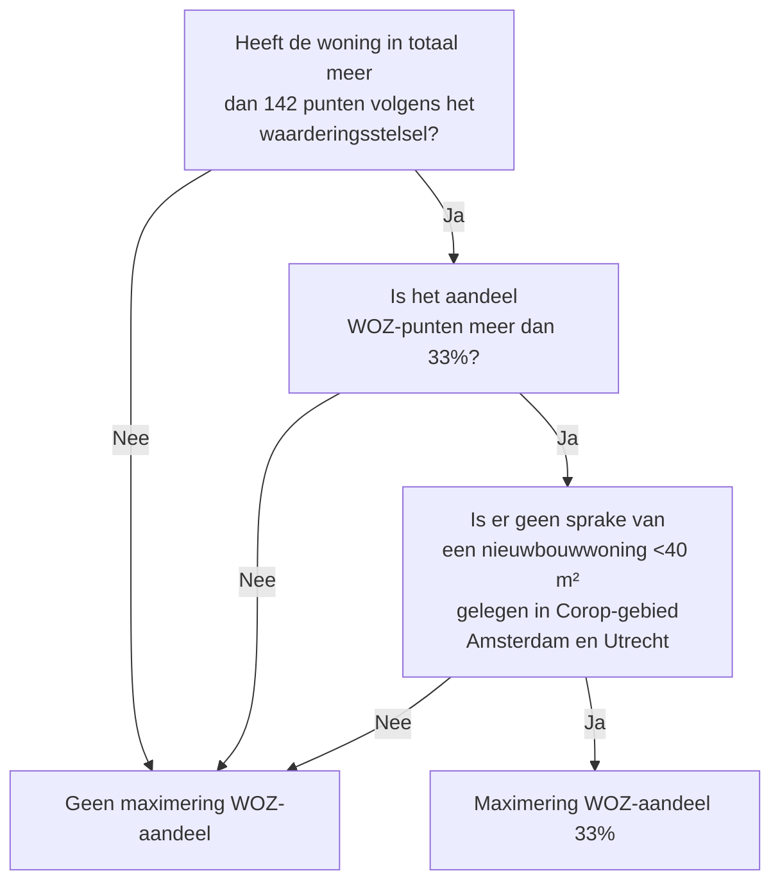

# 2024. Zelfstandige Woonruimten

## 4.2 Oppervlakte van Vertrekken

### 4.2.1 Wat zijn vertrekken?

Het eerste onderdeel van de woningwaardering is de oppervlakte van vertrekken. Onder vertrekken worden woonkamer, andere kamers (hobbykamer, studeerkamer, slaapkamer en eetkamer), keuken, badkamer of doucheruimte verstaan. De waardering van vertrekken is 1 punt per m2.

Geen vertrekken zijn: schuren, zolderberging, kelders, wasruimten, bijkeukens, garages en bergingen, gang, (speel)hal en zogenoemde verkeersruimten (bijvoorbeeld overlopen). De oppervlakte van deze ruimten tellen dus niet mee als vertrekken.  

De Huurcommissie geeft op een aantal punten nadere invulling aan de hierboven genoemde wettelijke begrippen. Dat wordt hierna beschreven.

**Woonkamer of andere kamer**  
Een woonkamer of een andere kamer is dus een vertrek in de zin van het woningwaarderingsstelsel.

Hiervan is alleen sprake als:

- ~~De vloer begaanbaar is.~~
- ~~De muren en wanden uit vast materiaal bestaan.~~
- ~~En de daglichttoetreding, de ventilatiemogelijkheid en het aantal elektrische lichtpunten in overeenstemming zijn met de geldende verkeersopvattingen.~~
- De ruimte een oppervlakte heeft van minimaal 4 m2.
- ~~De ruimte over de volle lengte ten minste 1,50 m breed is.~~
- ~~De ruimte over ten minste 50% van de oppervlakte een vrije hoogte heeft van 2.10 m (gemeten vanaf de vloer tot het zichtbare plafond).~~

Alleen als aan al deze eisen is voldaan, wordt de (oppervlakte van de) woonruimte of andere kamer meegeteld als “vertrek”. Zo niet, dan wordt de oppervlakte meegeteld als “overige ruimte” (zie [paragraaf 4.3](#43-oppervlakte-van-overige-ruimten).).  
Uitzondering hierop geldt voor de keuken: de eisen van minimaal 4 m2 en ~~minimaal 1,50 m breedte~~ gelden niet voor de keuken en verzetten zich er dus niet tegen om een keuken als “vertrek” aan te merken en overeenkomstig te waarderen.

**Badkamer of doucheruimte**  
Een badkamer of doucheruimte is dus een vertrek in de zin van het woningwaarderingsstelsel.

Hiervan is alleen sprake als:

- ~~De vloer begaanbaar is.~~
- ~~De muren en wanden uit vast materiaal bestaan.~~
- ~~En de ventilatiemogelijkheid en het aantal elektrische lichtpunten in overeenstemming zijn met de geldende verkeersopvattingen.~~
- ~~De ruimte over ten minste 50% van de oppervlakte een vrije hoogte heeft van 2,00 m. (gemeten vanaf de vloer tot het zichtbare plafond).~~

~~Alleen als aan al deze eisen is voldaan, wordt de (oppervlakte van de) badkamer of doucheruimte meegeteld als “vertrek”. Zo niet, dan wordt de oppervlakte meegeteld als “overige ruimte” (zie verderop).~~

> Hoewel de VERA-standaard een onderscheid maakt tussen badkamer, doucheruimte en badkamer/toilet (badkamer met toilet) beschouwen wij ieder van deze ruimtes indien zij een toilet bevatten als een badkamer met toilet, conform hoe de huurcommissie omgaat met deze ruimtes.. Zie ook [dit Github issue](https://github.com/Aedes-datastandaarden/vera-referentiedata/issues/96).

Voor gecombineerde bad-/doucheruimte met toilet geldt een minimale oppervlakte van 0,64 m².

> Elke Badkamer, Badkamer/toilet of Doucheruimte die als vertrek is aangemerkt wordt meegeteld als vertrek, tenzij onder aftrek van 1 m2 voor een in de ruimte geplaatst toilet de oppervlakte kleiner is dan 0,64 m². (Zie punt 5 in [4.2.2](#422-hoe-wordt-de-oppervlakte-van-vertrekken-gemeten)).

**Zolderruimte**  
Zolderruimten zijn in het algemeen “overige ruimte”. Echter, in geval een zolderruimte een functie heeft als “vertrek” (dus woonkamer, andere kamers, badkamer of doucheruimte), en ook voldoet aan de eisen die daarvoor gelden (zie hierboven), dan mag de zolderruimte meetellen als “vertrek”, mits deze ruimte bereikbaar is via een vaste trap ~~en het dak beschoten is~~.

> In het beleidsboek wordt er onderscheid gemaakt tussen een zolder vertrek met een vaste trap of zolder met een ander soort trap. Wanneer een zolder als vertrek wordt aangemerkt moet deze te bereiken zijn via een vaste trap. Daarom wordt er voor een zolder gekeken of er een vaste trap in de `bouwkundige_elementen` zit. Als dit het geval is dan telt de gehele oppervlakte van de zolder mee voor de punten van Oppervlakte van Vertrekken.

### 4.2.2 Hoe wordt de oppervlakte van vertrekken gemeten?

De wetgever heeft in de toelichting op het woningwaarderingsstelsel een aantal meetinstructies meegegeven:

1. Meting van de oppervlakte van vertrekken vindt plaats ~~van muur tot muur, op een hoogte van 1,50 m boven de vloer,~~ inclusief de oppervlakte van alle tot de woning behorende losse en vaste kasten (kleiner dan 2m²). ~~Deze meethoogte geldt ook als de oppervlakte afwijkt van die op vloerniveau.~~

De Huurcommissie hanteert hierbij de volgende uitgangspunten.

~~Als er sprake is van een pui wordt de binnenzijde van die pui (het kozijn) genomen. Een erker wordt meegerekend indien deze inwendig een vrije hoogte heeft van ten minste 1,50 m. Indien er sprake is van een zgn. entresol (tussenverdieping) dan dient de oppervlakte onder en/of boven deze entresol te worden meegerekend, indien de vrije hoogte ten minste 1,50m bedraagt.~~ Voor het meten van vertrekken die met elkaar in open verbinding staan, zie verderop.  
“Alle tot de woning behorende losse en vaste kasten” lees de Huurcommissie als: “alle tot de vertrekken behorende kasten”. De plaats van de deur van de kast bepaalt bij welk vertrek de kast behoort. Dus een kast die in een vertrek uitkomt wordt, ongeacht de afmeting, bij dat vertrek geteld. Dat geldt ook voor het waarderen van een kastenwand tussen twee vertrekken.

- Van vaste kasten (kleiner dan 2m²) wordt de netto oppervlakte bepaald en bij de oppervlakte van het betreffende vertrek opgeteld;
- Een kast, (kleiner dan 2m²) waarvan de deur uitkomt op een verkeersruimte, wordt niet gewaardeerd;
- Losse kasten zijn niet van belang bij het meten. De oppervlakte van het vertrek wordt bepaald, incl. de oppervlakte die wordt ingenomen door een losse kast;

> Binnen het woningwaarderingsstelsel mag onder bepaalde voorwaarden de oppervlakte van vaste kasten worden opgeteld bij de ruimte waar de deur van de kast zich bevindt. Als hier bij het inmeten geen rekening mee gehouden is, kan het attribuut `verbonden_ruimten` gebruikt worden om de met een ruimte verbonden vaste kasten mee te laten nemen in de waardering. Hiervoor is de VERA referentiedata binnen deze repository uitgebreid met ruimtedetailsoort Kast, code KAS.

2. ~~Als oppervlakte van een vertrek met een (ten dele hellend of verlaagd plafond geldt dat alleen het gedeelte waarboven het plafond ten minste 1,50m hoog is wordt meegeteld bij de berekening van de oppervlakte.~~

~~De Huurcommissie eist in geval van een (ten dele) hellend plafond dat de 1,50m-hoogte loopt tot het dakbeschot of tot het zichtbare dakvlak of plafond. Met gordingen en balken wordt bij de meting geen rekening gehouden.~~

3. ~~De vloeroppervlakte onder aanrechten, toestellen in de keuken, badkuip, lavet of douchebak, moederhaard, c.v.-ketel en boilerinstallatie, wordt meegeteld.~~

~~De Huurcommissie gaat hier als volgt mee om. Indien zich in een vertrek, of in een kast in een vertrek, een gas- en/of elektrameter bevindt, dan wordt de oppervlakte gewaardeerd onder aftrek van 30 x 60 cm (minimale afmeting meterkast bestaande bouw). De vloeroppervlakte onder radiatoren wordt meegeteld.~~

4. ~~De oppervlakte die wordt ingenomen door schoorsteenkanalen, ventilatiekanalen of stand- of grondleidingen (tenzij horizontale leidingen, zie hierna) wordt niet meegeteld.~~

~~Bij een schoorsteenmantel en/of rookkanaal (die naar boven of beneden breed kan uitlopen) is de oppervlakte op 1,50m-hoogte bepalend. De oppervlakte die wordt ingenomen door standleidingen (verticale leidingen) wordt niet meegeteld. De oppervlakte die wordt ingenomen door grondleidingen (horizontale leidingen), wordt wel meegeteld.~~

5. Indien een toilet in een badruimte of doucheruimte is geplaatst, wordt de oppervlakte van die ruimte met één vierkante meter verminderd.

6. ~~Van de oppervlakte onder een open dan wel gesloten vaste trap geldt dat gedeelte waar de ruimte tussen vloer en onderkant trap ten minste 1,50m hoog is.~~

7. Afronding van de oppervlakte op hele vierkante meters vindt plaats na saldering van de oppervlakte van alle vertrekken; bij 0,5m² of meer wordt afgerond naar boven, bij minder dan 0,5m² naar beneden. Waardering in punten vindt na saldering en afronding plaats.

De Huurcommissie licht dit als volgt toe:  

Afronding: eerst de oppervlakte per vertrek op 2 decimalen afronden en pas daarna de oppervlakte van alle vertrekken salderen en afronden op hele vierkante meters.

**_Voorbeeld:_**  
_kamer : lengte 3,76m x breedte 4,12m = 15,4912 m², afgerond : 15,49 m²_  
_keuken: lengte 2,95m x breedte 3,81m = 11,2395 m², afgerond : 11,24 m²_  
_Totaal : 26,73 m² Afronding op hele m² : 27 m²._

8. ~~Twee vertrekken die met elkaar in verbinding staan, worden in een bepaald geval als één vertrek gewaardeerd. Dit is het geval als zich tussen die twee vertrekken een opening bevindt, die breder is dan 50% van de muur, waarin deze opening zich bevindt (zie schets hieronder). Het moet hierbij gaan om een niet afsluitbare opening, die doorloopt tot aan de vloer. De muur wordt gemeten in het vertrek, waarin de tussenwand het smalst is.~~

## 4.3 Oppervlakte van overige ruimten

### 4.3.1 Wat zijn overige ruimten?

“Overige ruimten” die voor een puntenwaardering in aanmerking komen zijn:  

a. bijkeukens  
b. bergingen  
c. wasruimte  
d. schuren*  
e. garages  
f. zolderbergingen  
g. kelders  
~h. parkeerplaats (zie paragraaf 4.9.6)~

> *In de VERA-referentiedata wordt de code SCH gebruikt als detailsoortcode voor schuur. In de Aedes ILS (zie dit isssue: https://github.com/Aedes-datastandaarden/vera-referentiedata/issues/92) bestaat echter geen definitie voor schuur. Door sommige op de Aedes ILS gebaseerde implementaties wordt de code SCH al gebruikt voor schacht. Hierdoor ontstaat een conflict bij het waarderen van overige ruimtes omdat een schacht niet als overige ruimte mag worden gewaardeerd. Om dit probleem te ondervangen is het wel mogelijk om op basis van `ruimtedetailsoort.naam` schuur als overige ruimte te waarderen. Echter is het aanbevolen om een schuur aan te geven als een berging in het input-model. Zie ook: https://github.com/Aedes-datastandaarden/vera-referentiedata/issues/116.

Deze ruimten tellen alleen mee als de oppervlakte van een ruimte afzonderlijk gelijk is aan of groter dan twee vierkante meter, ~~voor zover de plafondhoogte ten minste 1,50 meter is boven de vloer.~~  

Verkeersruimten zoals hallen, gangen, en overlopen worden sowieso niet afzonderlijk gewaardeerd, dus krijgen geen punten op basis van dit onderdeel van het woningwaarderingsstelsel.

Tot bergingen worden de volgende ruimten gerekend: vaste kasten, bergingen in, achter, voor, dan wel onder de woning, bergingen onder de kap van etagewoningen, bergingen in flatgebouwen en dergelijke, mits deze een afzonderlijke ruimte vormen.

### 4.3.2 Hoe wordt de oppervlakte van overige ruimte gemeten?

De wetgever heeft een aantal eisen en meetinstructies meegegeven:

1. ~~De ruimten worden slechts als “overige oppervlakte” gewaardeerd, als de vloer begaanbaar is.~~

2. ~~Van de overige ruimten wordt de gehele oppervlakte gemeten, dus zonder aftrek van loop- of verkeersruimte. De oppervlakte van een trapgat wordt wel in mindering gebracht. De oppervlakte die een uitschuifbare of opvouwbare trap in gesloten toestand inneemt, wordt van de oppervlakte van de ruimte afgetrokken.~~

3. ~~Meting van de oppervlakte vindt plaats van muur tot muur, op een hoogte van 1,50m boven de vloer. En ook inclusief de oppervlakte van de moederhaard, CV-ketel en boilerinstallatie. Maar niet: de oppervlakte die wordt ingenomen door schoorsteenkanalen, ventilatiekanalen of stand- of grondleidingen.~~

~~De Huurcommissie meet als er sprake is van een pui, vanaf de binnenzijde van die pui (het kozijn). Ook een erker, die inwendig een vrije hoogte heeft van ten minste 1,50m, telt mee. De oppervlakte onder en/of boven een zogenaamde entresol (tussenverdieping) wordt meegerekend, indien de hoogte minstens 1,50m bedraagt.~~

~~De Huurcommissie berekent de hoogte van 1,50 meter door te meten tot het dakbeschot, het zichtbare dakvlak of plafond (gordingen en balken blijven buiten de meting).~~

4. Ook de oppervlakte van alle tot de woning behorende losse en vaste kasten (kleiner dan 2m²) wordt meegerekend.

Losse kasten zijn niet van belang bij het meten. De oppervlakte van de overige ruimte wordt bepaald, incl. de oppervlakte die wordt ingenomen door een losse kast.  
Van vaste kasten (kleiner dan 2m²) die uitkomen in een wel gewaardeerde overige ruimte wordt de netto oppervlakte bepaald en bij de oppervlakte opgeteld.  
Een kast, (kleiner dan 2m²) waarvan de deur uitkomt op een verkeersruimte, wordt niet gewaardeerd.

~~Indien zich in een overige ruimte, of een kast in een overige ruimte, een gas- en/of elektrameter bevindt, dan wordt de oppervlakte gewaardeerd onder aftrek van 30 x 60 cm (minimale afmeting meterkast bestaande bouw).~~

5. ~~De Huurcommissie telt de vloeroppervlakte onder radiatoren ook mee.~~  

~~Voor een schoorsteenmantel en/of rookkanaal (die naar boven of beneden breed kan uitlopen) vindt de Huurcommissie de oppervlakte op 1,50m-hoogte bepalend.~~

6. ~~Van de oppervlakte onder een vaste (open of gesloten) trap, telt mee dat gedeelte waar de ruimte tussen vloer en onderkant trap ten minste 1,50m hoog is.~~

7. ~~De oppervlakte die door een in ingeschoven toestand liggende inschuifbare of opvouwbare trap wordt ingenomen, wordt niet meegeteld.~~

8. Betreft het een zolderberging dan wordt ~~, naast de eis van een begaanbare vloer,~~ als voorwaarde gesteld, ~~dat het dak beschoten is en~~ dat de zolderruimte via een tot de woning behorende trap bereikbaar is. Indien aan deze voorwaarden niet is voldaan, tellen zolderber gingen bij de woningwaardering niet mee.

Indien geen vaste trap aanwezig is, wordt het aantal punten van de vloeroppervlakte van de zolderruimte met 5 verminderd, doch niet met meer punten dan voor de oppervlakte van de zolderruimten wordt gegeven.

~~Is er op de zolderverdieping ook nog een vertrek aanwezig dat alleen bereikbaar is via het zoldergedeelte dan wordt de oppervlakte van het zoldergedeelte verminderd met de loopruimte om het vertrek te bereiken. De dan resterende zolderoppervlakte dient minimaal 2 m2 te bedragen en wordt dan gewaardeerd als overige ruimte.~~

> Wanneer een zolder als overige ruimte wordt beschouwd, kijken we in de `bouwkundige_elementen` van de zolder of de zolder bereikbaar is via een trap. Wanneer deze bereikbaar is via een vaste trap telt de volledige oppervlakte mee voor de punten berekening van Oppervlakte van Overige ruimten. Wanneer deze wel bereikbaar is, maar niet via een vaste trap, moeten er 5 punten in mindering worden gebracht omdat de ruimte niet bereikt kan worden met een vaste trap. In onze implementatie hebben wij er voor gekozen om te checken of er dan wel een vlizotrap aanwezig is in de `bouwkundige_elementen`, aangezien dit de enige andere soort trap in het VERA model is waarmee een zolder ruimte bereikt zou kunnen worden. Daarnaast is het onze keuze om de 5 punten in mindering te brengen door de oppervlakte van de zolder te corrigeren. Het beleidsboek geeft aan dat de punten in mindering gebracht moeten worden op de punten berekend voor deze ruimte. Maar ook dat punten pas berekend moeten worden wanneer de totale oppervlakte van een eenheid bekend is en afgerond is. Dit is tegenstrijdig en daarom kiezen wij de implementatie die volgens ons het beleidsboek zo goed mogelijk benadert. Let op, door de afronding komt deze berekening niet helemaal juist uit, maar dit is de benadering waar wij nu voor kiezen.

9. Een overloop is een verkeersruimte en wordt dus niet gewaardeerd. ~~Als er met aftrek van de verkeersruimte en trap voldoende ruimte overblijft en deze (zolder)overloop kennelijk ook bedoeld is als bergruimte, dan wordt deze ruimte wel gewaardeerd.~~

10. Gemeenschappelijke bergingen worden gewaardeerd als overige ruimte als:

- ~~zij binnen het woongebouw liggen of tot de onroerende aanhorigheden behoren;~~
- ~~de vergoeding daarvoor in de huurprijs van de woning is begrepen;~~
- de oppervlakte, na deling door het aantal woningen, per woning minstens 2m2 bedraagt.

> Hiervoor is het `EenhedenRuimte` model uitgebreid met het attribuut `gedeeldMetAantalEenheden` of `gedeeld_met_aantal_eenheden` voor de Python representatie. Om deze berekening correct uit te voeren dient deze waarde gevuld te zijn. Zonder deze waarde wordt de volledige oppervlakte van een ruimte meegeteld.

De toekenning van punten bij een gemeenschappelijke berging is als volgt: totale oppervlakte, afronden in m2, delen door het aantal woningen en waarderen als “overige ruimte”. Kasten <2m2 en uitkomend in een verkeersruimte worden niet meegeteld.

1. Afronding van de oppervlakte op hele vierkante meters vindt plaats na saldering van de oppervlakte van alle afzonderlijke ruimten; bij 0,5m² of meer wordt afgerond naar boven, bij minder dan 0,5m² naar beneden. Waardering in punten vindt na saldering en afronding plaats.

De Huurcommissie licht dit als volgt toe:  
Afronding: eerst de oppervlakte per overige ruimte op 2 decimalen afronden en pas daarna de oppervlakte van alle overige ruimten salderen en afronden op hele vierkante meters.

**_Voorbeeld:_**  
_Garage : lengte 3,16m x breedte 6,12m = 19,3392 m², afgerond : 19,34 m²_  
_Bijkeuken: lengte 2,11m x breedte 2,87m = 6,0557 m², afgerond : 6,06 m²_  
_Totaal : 25,40 m² Afronding op hele m² : 25 m²._  

## 4.4 Verwarming

Het waarderingsstelsel kent punten toe voor verwarming. Hierbij gelden de volgende regels.

### 4.4.1 Punten voor verwarmde vertrekken en overige ruimtes

Punten voor verwarming kunnen aan de orde zijn zowel als het gaat om vertrekken als om overige ruimtes (zie voor deze begrippen paragraaf 4.2.1 en 4.3.1). Voor vertrekken kunnen maximaal 2 punten per verwarmd vertrek worden gerekend, voor verwarmde overige ruimtes maximaal 1 punt per ruimte (met een maximum van 4 punten voor alle overige ruimtes). Een en ander is afhankelijk van of het gaat om een collectief of individueel verwarmingssysteem, zie verderop, paragraaf 4.4.3.

### ~~4.4.2 Verwarmingselementen behorend tot de onroerende zaak~~

Per vertrek wordt voor de verwarming punten toegekend ~~, mits de verwarmingselementen, zoals bijvoorbeeld een radiator, tot de onroerende zaak of zijn onroerende aanhorigheid behoort. Dit is bij een radiator het geval als hij is bevestigd aan de muur of in de grond. Een mobiele elektrische radiator is dus geen verwarmingselement als hier bedoeld en maakt dus een vertrek niet tot een verwarmd vertrek waarvoor punten vanwege verwarming aan toegekend kunnen worden~~.

~~Hetzelfde geldt voor gevelkachels en gashaarden. Een verdikte buis, pijp of moederhaard wordt wél gerekend als verwarmingselement dat tot de onroerende zaak behoort, indien deze als zodanig bedoeld of herkenbaar is.~~

### 4.4.3 Collectief of individueel verwarmingssysteem

Voor het aantal punten per vertrek of overige ruimte is relevant of het gaat om een collectief verwarmingssysteem of een individueel systeem. Een cv-installatie waarmee meerdere woningen worden verwarmd, wordt voor de puntenwaardering vanwege het onderdeel warmte als een individueel systeem beschouwd.

In geval van een collectief verwarmingssysteem wordt per verwarmd vertrek 1,5 punt gerekend en per overige ruimte 0,75 punt. Van een collectief verwarmingssysteem is bijvoorbeeld sprake bij stadsverwarming, een WKO-installatie en blokverwarming.

In geval van een individueel verwarmingssysteem wordt per verwarmd vertrek met 2 punten gerekend. Voor overige ruimte 1 punt. Van een individueel verwarmingssysteem is bijvoorbeeld sprake in geval de woonruimte een eigen of gezamenlijke cv-installatie heeft.

### ~~4.4.4 Vertrekken die met elkaar in verbinding staan~~

~~Hierboven is genoemd dat per vertrek maximaal 2 punten voor verwarming kunnen worden gerekend. Een bijzondere situatie is de situatie dat twee vertrekken met elkaar verbonden zijn door een opening. (NB voor open keuken geldt een afzonderlijk regel, zie hierna in 4.4.6).~~

~~In de situatie dat vertrekken met elkaar in verbinding staan geldt het volgende. In geval de opening tussen beide vertrekken breder is dan 50% van de muur waarin de opening zich bevindt en de opening niet afsluitbaar is, worden deze vertrekken als één verwarmd vertrek beschouwd in het kader van de punten voor verwarming (zie schets hieronder). In geval de opening minder breed is dan 50% van de muur waarin de opening zich bevindt, worden de vertrekken als twee verwarmde vertrekken beschouwd in het kader van de punten voor de verwarming (zie schets hieronder).~~

~~Let op: hoeveel punten dan aan dat ene of die twee vertrek(ken) vanwege verwarming worden toegekend, hangt af van of het om een collectief of individueel verwarmingssysteem gaat, zie hierboven (onder 4.4.3).~~

~~Vertrekken die met een schuifwand met elkaar in verbinding staan, worden altijd als afzonderlijke vertrekken geteld, dus ongeacht de breedte van de opening.~~

### ~~4.4.5 Overige ruimten die met elkaar in verbinding staan~~

~~Hierboven is genoemd dat per overige ruimte maximaal 1 punt voor verwarming kan worden gerekend. Een bijzondere situatie is de situatie dat twee overige ruimtes met elkaar verbonden zijn door een opening. De vraag is ook hier of deze overige ruimtes dan als één of meer worden geteld. In geval de opening breder is dan 50% van de muur waarin de opening zich bevindt en de opening niet afsluitbaar is, worden deze overige ruimtes als één overige ruimte beschouwd in het kader van de punten voor verwarming (zie schets hieronder). In geval de opening minder breed is dan 50% van de muur waarin de opening zich bevindt, worden de overige ruimtes als twee overige ruimtes beschouwd in het kader van de punten voor de verwarming (zie schets hieronder).~~

~~Let op: hoeveel punten dan aan dat ene of die twee overige ruimte(s) vanwege verwarming worden toegekend, hangt af van of het om een collectief of individueel verwarmingssysteem gaat, zie hierboven (onder 4.4.3).~~

### 4.4.6 Open keukens

Voor open keukens gelden de volgende regels.

Een open keuken wordt als afzonderlijk verwarmd vertrek beschouwd en krijgt dus 2 punten in geval van een individueel verwarmingssysteem en 1,5 punt in geval van een collectief verwarmingssysteem.

~~Wanneer is sprake van een open keuken? Onder een open keuken wordt hier verstaan een keuken die in open verbinding staat met een ander vertrek, terwijl zich tussen de keuken en het andere vertrek een opening bevindt, die breder is dan 50% van de tussenmuur. Het moet hierbij gaan om een niet afsluitbare opening, die doorloopt tot aan de vloer. De muur wordt gemeten in het vertrek waarin de tussenwand het smalst is (zie schets hieronder). De aan- of afwezigheid van een verwarmingselement in het gedeelte open keuken is niet relevant.~~  
~~In geval de opening smaller is dan 50% van de tussenmuur, wordt de keuken niet als open keuken beschouwd. In dit geval dient de keuken zelf over een verwarmingselement te beschikken om als verwarmd vertrek gewaardeerd te worden.~~

Ook een aanrecht dat is geplaatst in een woon- of slaapvertrek is een open keuken, ook als er geen duidelijke afscheiding tussen keukengedeelte en de rest van het vertrek aanwezig is.

> Om een aanrecht in een woon- of slaapvertrek te waarderen als open keuken, moet de ruimte gespecificeerd worden met detailsoortcode `WOK` voor Woonkamer/keuken. Alternatief kan er in de bouwkundige elementen van een `Woonkamer`, `Slaapkamer` of `Woon-/slaapkamer` een bouwkundig element worden gespecificeerd met detailsoortcode `AAN` voor Aanrecht.

## 4.5 Energieprestatie

Een (groot) deel van het totale puntenaantal wordt bepaald door de energieprestatie van de woonruimte. Sinds 2011 speelt het energielabel een rol in het puntenstelsel, waarbi een energielabel of energie-index maximaal 10 jaar geldig is. De energieprestatie kan sinds 1 januari 2021 op drie manieren zin bepaald.

1. Een oud energielabel: registratie heeft plaatsgevonden vóór 1 januari 2015. In 2021 en later lopen veel sinds 1 juli 2011 verstrekte energielabels af, want de geldigheidsduur is tien jaar.
2. De energie-index: registratie op of na 1 januari 2015 tot 1 januari 2021. In 2025 en later lopen veel sinds 1 januari 2015 verstrekte energie-indexen af, want de geldigheidsduur is tien jaar.
3. Het energielabel op basis van primair fossiel energiegebruik: registratie op of na 1 januari 2021.

In [EP-online](https://www.ep-online.nl/) is te vinden wat de energieprestatie van een woning is.

> In de implemenatie is de combinatie `Energieprestatiesoort` met registratiedatum leidend om te beslissen welke lookup tabellen er worden gebruikt om na te gaan hoeveel punten er gegeven moeten worden voor het stelselgroep energieprestatie.

> In de tabellen ter ondersteuning van de tekst van het beleidsboek over de punten toekenning bij een nieuw energielabel is er voor gekozen om de implementatie van regel [4.5.3 Afwijkingsbevoegdheid hogere energielabelklasse dan A++](#453-afwijkingsbevoegdheid-hogere-energielabelklasse-dan-a) al toe te voegen aan de tabellen.

### 4.5.1 Puntentoekenning oud energielabel en energie-index

Bij een oud energielabel bepaalt de labelklasse (A t/m G) het aantal punten dat de verhuurder mag doorrekenen in de maximale huur. Een energielabel dat is geregistreerd vóór 2015 en dat niet ouder is dan tien jaar, is nog bruikbaar. ~~Bij een energie-index is de indeling in letters vervangen door een cijfer. De energie-index wordt meegenomen indien in EP-online staat aangegeven dat de energie-index geldig is voor het woningwaarderingsstelsel.~~

> De energie-index van een energieprestatie wordt niet gebruikt. In EP-Online hebben alle op energie-index gebaseerde energieprestaties ook een labelklasse. Deze labelklasse dient gebruikt te worden voor de waardering.

Zie hieronder de puntentoekenning van de energieprestatie bij een oud energielabel en een energie-index.

| (oude) Energielabel (afgegeven voor 1-1-2025)| Energie-index (afgegeven na 1-1-2025)| Eengezinswoning | Meergezinswoning |
| ----- | ------------- | --------------- | ----------------- |
| A++   | 0-0.6         | 44             | 40               |
| A+    | 0.6-0.8       | 40             | 36               |
| A     | 0.8-1.2       | 36             | 32               |
| B     | 1.2-1.4       | 32             | 28               |
| C     | 1.4-1.8       | 22             | 15               |
| D     | 1.8-2.1       | 14             | 11               |
| E     | 2.1-2.4       | 8              | 5                |
| F     | 2.4-2.7       | 4              | 1                |
| G     | 2.7-          | 0              | 0                |

### 4.5.2 Puntentoekenning nieuw energielabel

Per 1 januari 2021 geldt een nieuwe manier om de energieprestatie van een woonruimte te bepalen met een vernieuwd energielabel. Hierbij wordt gewerkt met een bepalingsmethode (NTA 8800) die een nieuwe indicator heeft voor de energieprestatie (in kWh/m2 per jaar). De uitkomst van de bepalingsmethode (NTA 8800) wordt gereduceerd tot een energielabel (van A++ tot G). Dit label wordt herleid tot punten voor het waarderingsstelsel.  

Aangezien de nieuwe bepalingsmethode tot structurele onderwaardering van de energieprestatie van kleine woningen leidt, wordt er in het kader van het nieuwe energielabel gewerkt met drie klassen met WWS-punten voor de energieprestatie. Dit is afhankelijk van de woninggrootte:

- \< 25 m2
- \> 25 m2 en < 40 m2
- \> 40 m2

> De hier gehanteerde woninggrootte wordt op een andere wijze bepaald dan de gebruiksoppervlakte. Hiervoor dient de gebruiksoppervlakte van de thermische zone die gebruikt is bij de registratie van de energieprestatie opgegeven te worden als EenhedenOppervlakte met code `GTZ` in de `oppervlakten` van een eenheid.

Voor woningen met een oppervlakte  >= 40 m2 geldt het volgende puntenaantal:

| Label | Eengezinswoning | Meergezinswoning |
| ----- | --------------- | ----------------- |
| A++++ | 52              | 48                |
| A+++  | 48              | 44                |
| A++   | 44              | 40                |
| A+    | 40              | 36                |
| A     | 36              | 32                |
| B     | 32              | 28                |
| C     | 22              | 15                |
| D     | 14              | 11                |
| E     | 8               | 5                 |
| F     | 4               | 1                 |
| G     | 0               | 0                 |

Voor woningen met een oppervlakte >= 25m2 en < 40 m2 geldt het volgende puntenaantal:

| Label | Eengezinswoning | Meergezinswoning |
| ----- | --------------- | ----------------- |
| A++++ | 56              | 52                |
| A+++  | 52              | 48                |
| A++   | 48              | 44                |
| A+    | 44              | 40                |
| A     | 40              | 36                |
| B     | 36              | 32                |
| C     | 32              | 28                |
| D     | 22              | 15                |
| E     | 14              | 11                |
| F     | 4               | 1                 |
| G     | 0               | 0                 |

Voor woningen met een oppervlakte < 25m2 geldt het volgende puntenaantal:

| Label | Eengezinswoning | Meergezinswoning |
| ----- | --------------- | ----------------- |
| A++++ | 60              | 56                |
| A+++  | 56              | 52                |
| A++   | 52              | 48                |
| A+    | 48              | 44                |
| A     | 44              | 40                |
| B     | 40              | 36                |
| C     | 36              | 32                |
| D     | 32              | 28                |
| E     | 22              | 15                |
| F     | 4               | 1                 |
| G     | 0               | 0                 |

### 4.5.3 Afwijkingsbevoegdheid hogere energielabelklasse dan A++

De hierboven vermelde tabellen met de puntentoekenning voor de labelklasse gaan tot A++. Het is mogelijk dat, bij een nieuw energielabel, een betere energielabelklasse dan A++ wordt afgegeven. Een energielabel voor de woonruimte kan tot maximaal A++++ gaan. De Huurcommissie heeft de bevoegdheid gekregen om af te wijken van de hierboven aangegeven puntenwaardering indien de energieprestatie hoort bij een betere energielabelklasse dan A++. Een dergelijke afwijking is uitsluitend mogelijk indien de gemaakte kosten om deze energieprestatie te bereiken, aanmerkelijk afwijken van hetgeen als gangbaar wordt beschouwd, of indien de energieprestatie aanmerkelijk beter is dan hetgeen als gangbaar bij een energielabelklasse A++ wordt beschouwd.  

De Huurcommissie vult deze bevoegdheid als volgt in. Indien sprake is van een A+++ label dan kent de Huurcommissie, 4 extra punten toe, boven op de punten die aan het label A++ worden toegekend. Indien sprake is van een A++++ label dan wordt 8 extra punten toegekend, boven op de punten die worden gegeven voor een label A++. 

### 4.5.4 Bouwjaar bepalend bij geen geldig energielabel of Energie-Index

Indien de energieprestatie van een woonruimte (in de vorm van een energielabel of een energieindex) niet tijdig is vastgesteld, of als de geldigheidsduur van het energielabel is verstreken, dan bepaalt het bouwjaar van de woning het aantal WWS-punten. Een (geldig) energielabel of EnergieIndex wordt door de Huurcommissie in de puntentelling betrokken als deze tijdig beschikbaar is om daarmee rekening te houden in de uitspraak. In geval de opnamedatum van het energielabel of de Energie-Index is gelegen na de relevante peildatum, geldt hierbij als voorwaarde dat de feitelijke toestand (wat energieprestatie betreft) op opnamedatum niet verschilt van de feitelijke toestand op de desbetreffende peildatum. Alleen als er geen verschil is zal de Huurcommissie het energielabel of Energie-Index bij de woningwaardering betrekken. De bewislast ligt bij de verhuurder.  

De puntentelling is in geval het bouwjaar geldt als volgt: 

| Bouwjaar     | Eengezinswoning | Meergezinswoning |
| ------------ | --------------- | ---------------- |
| 2002 en ouder | 36              | 32               |
| 2000 t/m 2001 | 32              | 28               |
| 1998 t/m 1999 | 22              | 15               |
| 1992 t/m 1997 | 22              | 11               |
| 1984 t/m 1991 | 14              | 11               |
| 1979 t/m 1983 | 8               | 5                |
| 1977 t/m 1978 | 4               | 1                |
| 1976 en ouder | 0               | 0                |

### ~~4.5.5 Gerede twijfel energielabel~~

~~Als huurder twijfelt aan de juistheid van het toepasselijke energielabel dan heeft de Huurcommissie de bevoegdheid om een ‘eigen oordeel’ uit te spreken bij gerede twijfel van het energielabel. Een Huurcommissie eigen oordeel (HEO) kan worden uitgesproken indien de huurder met bewijsstukken gemotiveerd aantoont dat sprake is van een verkeerd energielabel/energie-index en dat het gewijzigde energielabel/energie-index van invloed is op de huurprijs. Indien de Huurcommissie tot een eigen oordeel wil komen dan laat de Huurcommissie onderzoeken wat de energieprestatie van de woning is.~~

~~Het eigen oordeel is uitsluitend in de voorliggende zaak van kracht, wordt niet geregistreerd in het register van de Rijksdienst voor Ondernemend Nederland en komt te vervallen na ontbinding van de huurovereenkomst.~~

> Wanneer een eigen oordeel van kracht is, en de waardering daarop gebaseerd moet worden, dient de gewijzigde energieprestatie opgegeven te worden in plaats van de geregistreerde energieprestatie.

### 4.5.6 Energieprestatievergoeding

Voor woningen die zelf (gedeeltelijk) in hun energieverbruik voorzien, door bijvoorbeeld zonnepanelen, kan bij het verhuren een energieprestatievergoeding (EPV) worden afgesproken. De woning zal dan moeten voldoen aan de eisen voor een EPV. Als dit het geval is dan is het aantal punten op basis van het puntenstelsel voor energieprestatie lager. Om te voorkomen dat in de gevallen waarin een energieprestatievergoeding is overeengekomen, de opwekking van energie voor de huurder tevens wordt verdisconteerd in de huurprijs, wordt voor deze woningen een correctiefactor toegepast op het aantal punten voor de energieprestatie. In die gevallen wordt de energieprestatie gewaardeerd met een aantal punten gelijk aan de waardering voor een Energie-Index 1,2 < EI ≤ 1,4 (of Energielabel B), met 32 punten voor een ééngezinswoning en 28 punten voor meergezins- en duplexwoningen.

> Wanneer er sprake is van een energieprestatievergoeding, kan deze doorgegeven worden als een prijscomponent met detailsoort EPV op een eenheid

## 4.6 Keuken

Het woningwaarderingsstelsel kent aan een zelfstandige woonruimte punten toe voor het onderdeel keukeninstallatie. Het woningwaarderingsstelsel geeft dus, naast punten voor de oppervlakte van de keuken (zijnde een vertrek, zie hiervoor onder [4.2.1](#421-wat-zijn-vertrekken)) ook punten voor de keukeninstallatie. Er zijn door de wetgever wel eisen gesteld om aan zo’n keukeninstallatie punten te mogen toekennen. En ook heeft de wetgever bepaald aan de hand waarvan je tot puntentoekenning komt. Hieronder wordt uiteengezet aan welke eisen moet zijn voldaan om punten aan een keukeninstallatie toe te kennen en op welke manier je de punten moet berekenen ([4.6.1](#461-voorzieningen-keuken)). Ook wordt besproken wanneer er extra kwaliteitspunten worden toegekend, welke keukenvoorzieningen daarvoor in aanmerking komen ([4.6.2](#462-voorzieningen-die-extra-kwaliteitspunten-opleveren)).

### 4.6.1 Voorzieningen keuken

Het woningwaarderingsstelsel geeft, naast punten voor de oppervlakte van het vertrek, ook punten voor de keukeninstallatie van zo’n vertrek.

**Keukeninstallatie?**  
Om punten vanwege de keukeninstallatie toe te kennen, moet het wel gaan om een inrichting van het vertrek dat als keukeninstallatie moet worden beschouwd. Daarvoor is in ieder geval vereist dat er een aanrecht aanwezig is. Zonder aanrecht spreken we niet van een keukeninstallatie. Aanvullend geldt nog dat de keuken voorzien moet zijn van een aan- en afvoer van water. Verder moet de keuken tenminste één aansluitpunt voor koken op gas of elektriciteit hebben. En het aanrecht moet zijn voorzien van minimaal twee onderkasten (met laden, deuren of schuiven).  

In geval aan deze eisen niet wordt voldaan, is er geen sprake van een keukeninstallatie in de zin van het woningwaarderingsstelsel en worden er dus geen punten voor keukeninstallatie gerekend, ongeacht de lengte van het aanrecht (zie hierna). Ook kom je dan niet toe aan extra punten vanwege de kwaliteit van de voorzieningen als bedoeld in paragraaf [4.6.2](#462-voorzieningen-die-extra-kwaliteitspunten-opleveren).

#### Punten: lengte van het aanrecht

Uitgangspunt voor de waardering van de keukeninstallatie is de lengte van het aanrecht:

- Is de lengte van het aanrecht minder dan 1 meter, dan worden er geen punten toegekend.
- Is de lengte van het aanrecht tussen de 1 en 2 meter, dan worden er 4 punten toegekend.
- Is de lengte van het aanrecht 2 meter of langer, dan worden er 7 punten toegekend.

De lengte van het aanrecht moet over midden van het bovenblad worden gemeten. Daarbij moeten de ingebouwde spoelbakken worden meegeteld. Ingebouwde kookplaten worden niet meegeteld.  

Een aanrecht met spoelbak, waarvan de lengte minder bedraagt dan 1 meter, voldoet dus niet aan de eis van 1 meter en wordt daarom niet als aanrecht gewaardeerd, maar als wastafel. Een aanrecht zonder onderkasten wordt gewaardeerd als een wastafel.  

Indien een aanrechtblad langer is dan de aanwezige onderkasten met de bedoeling dat er onder het langere gedeelte van het aanrechtblad een losstaande koelkast, vaatwasser, wasmachine e.d., kan worden geplaatst, dan wordt dit gedeelte van het aanrechtblad mee gemeten mits er onder het blad aansluitmogelijkheden aanwezig zijn voor genoemde apparatuur.  

Een ingebouwde (onroerende) koelkast, vaatwasser en/of oven beschouwen we als onderkast, mits daarnaast voldoende vervangende (andere) kastruimte aanwezig is.

Indien er sprake is van onderbouwapparatuur (roerend), dan kan dit niet in de plaats van een onderkast worden gesteld en dient er voldoende vervangende (andere) kastruimte aanwezig te zijn. Een kastruimte in de vorm van een plank kan niet als zodanig worden aangemerkt.

### ~~4.6.2 Voorzieningen die extra kwaliteitspunten opleveren~~

> Er is gekozen om de extra kwaliteitspunten niet te implementeren aangezien veel elemeten niet gemodelleerd zijn in het huidige VERA model.

~~Het woningwaarderingsstelsel kent de mogelijkheid om extra kwaliteitspunten te rekenen in geval de afwerking van de keuken daartoe aanleiding geeft. De extra kwaliteitspunten zijn een gestandaardiseerde invulling van de bevoegdheid van de Huurcommissie om investeringen ten behoeve van extra kwaliteit met extra punten te waarderen, tot maximaal het aantal punten dat reeds op grond van de aanrechtlengte is bepaald.~~

~~De Huurcommissie kent extra kwaliteitspunten toe als de keukenuitrusting uitstijgt boven het minimale niveau, te weten:~~
- ~~een aanrechtblad met een lengte van minimaal 1 m (lengte incl. spoelbakken, exclusief afzuig installaties en inbouwkookplaten (tenzij 2-pits));~~
- ~~én 2 kasten (onder of boven of staande);~~
- ~~én wandtegelwerk of andersoortige waterdichte afwerking boven het aanrechtblad en in de kookhoek vanaf de vloer tot een hoogte van minimaal 1,5 m.~~

~~Indien de keukenuitrusting en/of -afwerking boven het minimale niveau uitstijgt, is de waardering als volgt. Hierna wordt de voorziening genoemd met aansluitend het aantal extra punten.~~

| Voorziening                                               | Aantal punten |
|-----------------------------------------------------------|---------------|
| inbouw kookplaat (gas/elektrisch)                         | 0,5           |
| inbouw kookplaat 5 of 6 pits luxe uitvoering (RVS e.d.)   | 0,75          |
| inbouw keramische kookplaat                               | 1,25          |
| inbouw inductiekookplaat                                  | 1,50          |
| inbouw oven (gas/elektrisch) of magnetron                 | 0,75          |
| inbouw combi oven/magnetron                               | 1,5           |
| inbouw oven inclusief kookplaat (gas/elektrisch)          | 1,25          |
| inbouw magnetron                                          | 0,75          |
| (inbouw) afzuigkap                                        | 0,5           |
| (inbouw) luxe uitgevoerde afzuigkap of wasemkap           | 0,75          |
| inbouw koelkast                                           | 0,75          |
| inbouw vrieskist of -kast                                 | 0,5           |
| inbouw vries/koelcombinatie                               | 1,25          |
| inbouw vaatwasmachine                                     | 1,25          |
| luxe mengkraan (bv. éénhandsbediening)                    | 0,25          |
| thermostatische watermengkraan                            | 0,5           |
| dubbele spoelbak                                          | 0,25          |
| extra wandbetegeling per 2 m2                             | 0,25          |
| vloertegels per 2 m2                                      | 0,25          |
| extra enkele kast *                                       | 0,25          |
| extra dubbele kast *                                      | 0,5           |

~~*Als er meer dan 6 kasten aanwezig zijn (enkele kasten van min. 50-60 cm breed) dan wordt per extra kastruimte 0,25 punt extra toegekend, tenzij het om vervangende kastruimte gaat voor de door inbouwapparatuur in beslag genomen ruimte.~~

~~Algehele luxe uitvoering (hardhouten of natuurstenen aanrechtblad, massief houten frontjes, ingebouwde verlichting, luxe wand, vloer en of plafondafwerking: ten hoogste 2 punten).~~

~~NB.: Een luxe uitvoering of ingebouwde voorziening/ apparatuur komt voor extra punten in aanmerking, ongeacht de onderhoudstoestand daarvan. Als de kosten van desbetreffende voorziening/ apparatuur aanzienlijk hoger zijn dan de kosten, die als basis voor bovengenoemde normering zijn gehanteerd, dan blijft een afwijkende puntentelling mogelijk. In beginsel wordt altijd uitgegaan van de waardering conform bovenstaande lijst.~~

~~Onder extra kastruimte wordt verstaan: elk gefixeerd element behorende tot de keuken/ het keukenblok, voorzien van een kastdeur, klep of lade én ongeacht de hoogte en breedte. Een element met twee deuren (bv. een hoekcarrousel) wordt als dubbele kast aangemerkt. Een element voorzien van laden wordt gewaardeerd als kast. Kastruimte boven een afzuigkap, waardoor het (lucht)afvoerkanaal verloopt, wordt meegeteld als volwaardige kastruimte.~~

## 4.7 Sanitair

Het woningwaarderingsstelsel kent aan een zelfstandige woonruimte punten toe voor het onderdeel sanitair. De waardering van het sanitair wordt bepaald op grond van de aanwezigheid van bepaalde voorzieningen binnen de woning. Hieronder wordt uiteengezet aan welke sanitaire voorzieningen punten worden toegekend en hoeveel punten die voorzieningen krijgen. Ook wordt besproken wanneer er extra kwaliteitspunten worden toegekend aan deze sanitaire voorzieningen.

### 4.7.1 Sanitaire voorzieningen

Het woningwaarderingsstelsel geeft punten aan de sanitaire voorzieningen toilet, wastafel, bad en douche. De puntentoekenning is als volgt:  
| Voorziening | Punten |
| -------- | -------- |
| toilet   | 3   |
| wastafel  | 1  |
| bidet    | 1  |
| lavet*   | 1  |
| douche   | 4  |
| bad      | 6  |
| bad en douche | 7  |

> De punten hierboven in de tabel zijn het aantal punten dat wordt toegekend aan de sanitaire voorziening. De gedetailleerde voorwaarden die hieronder volgen in het beleidsboek worden niet getoetst in de implementatie. Het is aan de gebruiker om alleen voorzieningen op te geven die voldoen aan de voorwaarden.

~~_*Een lavet wordt met vier punten gewaardeerd, als deze is voorzien van aansluitpunten voor warm en koud water én van douchegarnituur._~~

**Toilet**  
Drie punten worden toegekend aan een toilet ~~met waterspoeling als het toilet is geplaatst in een daartoe bestemde ruimte en als het toilet binnen het woongebouw is gelegen. Wanneer sprake is van een toilet dat buiten de woning maar binnen het woongebouw is gelegen, dan geldt dat het toilet in de waardering wordt meegenomen als het gebruik van het toilet door derden is uit te sluiten.~~  

**Wastafel**  
Wastafels worden met één punt gewaardeerd. ~~Als wastafels worden alle bakken geteld voor wassen en spoelen die op de waterleiding én op het huisriool zijn aangesloten. Een dergelijke bak wordt niet als wastafel gewaardeerd indien boven de bak een douche is aangebracht. Een bad en spoelbakken in een keukenaanrecht worden niet als wastafels gewaardeerd.~~ 

~~Als wastafel waardeert de Huurcommissie een fonteintje en een aanrecht dat niet voor punten in aanmerking komt, waarvan de aanrechtlengte korter is dan één meter.~~

**Bad en douche**  
Douches worden gewaardeerd met vier punten. ~~Als douche wordt meegeteld iedere door de verhuurder aangebrachte installatie voor het nemen van een stortbad. Hieronder valt eveneens een zogenaamde douchecabine, die voldoet aan bovengenoemde voorwaarden, als de douchecabine in een vertrek (anders dan bad- of doucheruimte) of overige ruimte is geplaatst. De oppervlakte van dat vertrek of van die overige ruimte wordt in dat geval niet verminderd met de door de douchecabine ingenomen oppervlakte.~~  

Aan baden worden zes punten toegekend, ~~ongeacht de lengte van het bad. Indien een bad is voorzien van een (hand)douche, dan wordt het douchegarnituur niet afzonderlijk geteld.~~  

Indien in de badruimte behalve het bad tevens een afzonderlijke douche is aangebracht, geldt een waardering van zeven punten.  

> Het is ambigu hoeveel punten er zouden moeten worden toegekend indien een badruimte meer dan één douche bevat en één bad of vice versa. I.v.m. de onwaarschijnlijkheid van het voortkomen van deze situatie is er gekozen om deze situatie niet te ondersteunen in de implementatie. Indien er een bad en een douche in dezelfde ruimte aanwezig zijn worden er 7 punten toegekend per combinatie van bad en douche.  
>
> Oftewel:
>
> - één bad en één douche in dezelfde ruimte: 7 punten  
> - één bad en twee douches in dezelfde ruimte: 7 punten
> - twee baden en één douche in dezelfde ruimte: 7 punten
> - twee baden en twee douches in dezelfde ruimte: 14 punten

~~**Voorzieningen in een bad- en doucheruimte**~~  
~~Indien sprake is van sanitaire voorzieningen in een bad- of doucheruimte[^1], dan worden alleen punten toegekend aan die voorzieningen indien de bad- of doucheruimte voldoet aan drie voorwaarden.~~

~~Ten eerste moet de wand- en vloerafwerking van de bad- of douchruimte voldoende waterdicht zijn. Een bad in een vertrek met een niet-waterdichte vloer wordt door de Huurcommissie wel gewaardeerd, omdat het bad zelf als een waterdichte afwerking wordt gezien. Ten tweede moet de bad- en doucheruimte zijn voorzien van aansluitingspunten voor warm en koud water. Met aansluitingspunten voor warm en koud water wordt niet een warmwater apparaat bedoeld. Als sprake is van een geiser of boiler dan hoeven deze niet door de verhuurder te zijn verstrekt. Ten derde moet het bad of de douche zijn voorzien van douchegarnituur. Met douchegarnituur bedoelt de Huurcommissie een warm- en koudwaterkraan of een mengkraan.~~

~~Indien het aansluitpunt voor warm en koud water bedoeld is voor gecombineerd gebruik van zowel een wastafel als de naastgelegen douche of bad (bijvoorbeeld door middel van een zogenaamde zwenkarm), dan wordt uitsluitend de douche of het bad gewaardeerd. Dus niet én 1 punt voor wastafel én 4 of 6 punten voor douche of lavet, respectievelijk bad.~~

~~Indien in de bad- of doucheruimte een toilet is geplaatst wordt dit toilet volledig gewaardeerd met drie punten.~~

[^1]: ~~_De Huurcommissie verstaat onder een bad-/doucheruimte een (afzonderlijke) ruimte met een vrije hoogte van ten minste 2 meter, gemeten vanaf de vloer tot aan het zichtbare plafond. Daarin dient tenminste aanwezig te zijn een wastafel of een douche of een bad. Voor een gecombineerde bad-/douche- en toiletruimte geldt, vanwege de oppervlakte-eis voor toilet- ruimten, een minimale oppervlakte van 0,64 m2. Indien een douche- of badruimte, eventueel gecombineerd met een toilet, niet een vrije hoogte heeft van 2,00 m, dan wordt de ruimte gewaardeerd als overige ruimte._~~

## 4.8 Woonvoorzieningen voor gehandicapten

> Nog niet geïmplementeerd.

## 4.9 Privé-buitenruimten

Voor privé-buitenruimten worden aan de woning punten toegekend indien de privé-buitenruimte een diepte, breedte en vrije hoogte heeft van 1,50 m of meer.

### 4.9.1 Definitie privé-buitenruimte

~~Er is sprake van een privé-buitenruimte indien de buitenruimte behoort tot de woning, waarvan de huurder van de desbetreffende woning volgens de huurovereenkomst het exclusieve gebruiksrecht heeft. Met exclusief gebruiksrecht van privé-buitenruimte wordt bedoeld dat uitsluitend de huurder het recht heeft om te bepalen welk gebruik hij maakt van de privé-buitenruimten die tot de woning behoren. Hieronder wordt ook verstaan een gebruiksrecht dat toekomt aan een collectief van huurders, maar waarbij het gebruiksrecht in feite exclusief voor de huurder is omdat de huurder het gebruik door derden kan weren.~~

Voor-, zij- of achtertuinen, balkons, platjes, terrassen en parkeervoorzieningen kunnen als privé-buitenruimte worden aangemerkt. Franse balkons worden niet als privé-buitenruimten beschouwd. Een Frans balkon is een opening in de gevel met naar binnen draaiende deuren, voorzien van een balustrade direct tegen het kozijn of de gevel.

~~Als sprake is van een procedure toetsing aanvangshuurprijs dan geldt dat de privé-buitenruimte bij de aanvang van de huurovereenkomst aanwezig moet zijn. Indien de privé-buitenruimte is ontstaan ná de aanvang van de huur dan wordt de ruimte niet aangemerkt als privé-buitenruimte en dus niet met punten gewaardeerd.~~

> Buitenruimten die niet aan bovenstaande doorgehaalde eisen voldoen, dienen niet doorgegeven te worden. De woningwaardering package controleert deze eisen niet.

### 4.9.2 Aftrekpunten bij geen privé-buitenruimte

Als de woning in het geheel geen privé-buitenruimte heeft, wordt een aftrek toegepast van 5 punten.

Bij aftrekpunten moet een onderscheid worden gemaakt tussen het aanwezig zijn van een privé-buitenruimten wanneer een privé-buitenruimte gewaardeerd wordt met punten. De aftrek wordt uitsluitend toegepast wanneer geen sprake is van een privé-buitenruimte zoals in paragraaf 4.9.1 is weergegeven. De voorwaarden dat de privé-buitenruimte een diepte, breedte en vrije hoogte van 1,50 m moet hebben, die gelden om met punten gewaardeerd te kunnen worden, zijn niet relevant bij de vraag of aftrekpunten moeten worden toegepast.

**Voorbeeld:**  
_Als uitsluitend een balkon, smaller dan 1,50 m aanwezig is, dan wordt de aftrek van 5 punten niet toegepast, omdat in dat geval het balkon (geen Frans balkon) wel als privé-buitenruimte wordt gezien. De afmetingen van de prive-buitenruimte zijn bij de vraag of er aftrek van punten moet worden toegepast dus niet relevant. Enkel relevant is of er een privé-buitenruimte aanwezig is, ongeacht de afmetingen._

### 4.9.3 Hoe wordt de oppervlakte van privé-buitenruimten gemeten?

Een privé-buitenruimte wordt alleen met punten gewaardeerd indien de privé-buitenruimte een diepte, breedte en vrije hoogte heeft van 1,50 m of meer. ~~Van deze buitenruimten wordt de gehele onbebouwde oppervlakte gemeten, gemeten loodrecht op de voor, achter of zijgevel. Bij balkons wordt gemeten vanaf de binnenzijde van het balkonhek. Bij (gedeeltelijk) inpandige balkons wordt bovendien gemeten ten opzichte van het terug liggende deel van de gevel. De oppervlakte, die wordt ingenomen door een balkonkast (minder dan 2 m2) of kolenhok e.d., wordt bij de oppervlakte van de desbetreffende privé-buitenruimte meegerekend.~~

~~**Voorbeeld:**~~

_~~Er is sprake van een achtertuin waarboven een balkon uitsteekt. Tussen de onderzijde van het balkon en de achtertuin, heeft de tuin een vrije hoogte van 1,50 m of meer. Hierdoor wordt de tuin doorgemeten tot aan de gevel (inclusief de ruimte onder het balkon). Is de vrije hoogte onder het balkon lager dan 1,50 m, dan wordt de tuin daaronder niet doorgemeten.~~_

> Er wordt vanuit gegaan dat buitenruimten conform deze eisen zijn gemeten. De woningwaardering package controleert deze eisen niet. Aan het Eenheden-Ruimte model is een lengte, breedte en hoogte attribuut toegevoegd. Deze gebruiken we in de bepaling of een buitenruimte in aanmerking komt voor waardering.

### 4.9.4 Balkons en dakterrassen

~~De Huurcommissie hanteert aanvullende voorwaarden voor balkons en dakterrassen om voor punten in aanmerking te komen.~~

Balkons en dakterrassen krijgen alleen punten indien zij:

- ~~zijn voorzien van een beloopbare afwerking, zoals vlonders, tegels e.d.;~~  
- ~~rondom zijn voorzien van een balustrade;~~  
- ~~via een deur* toegankelijk zijn én;~~  
- een diepte, breedte en vrije hoogte hebben van 1,50 m of meer.

~~_*Indien de balkon of dakterras is voorzien van beweegbare ramen en/of deuren in de gevel, die bestemd zijn om als privé-buitenruimte te worden gebruikt, dan worden deze met punten gewaardeerd._~~

> Er wordt vanuit gegaan dat alleen balkons en dakterassen die aan bovenstaande doorgehaalde voorwaarden voldoen worden doorgegeven. Deze voorwaarden worden niet door de woningwaardering package gecontroleerd.

### 4.9.5 Puntentoekenning privé-buitenruimten

Het woningwaarderingsstelsel geeft punten aan de privé-buitenruimten op basis van oppervlakten. De puntentoekenning is als volgt.

| Oppervlakte (m2) | Punten |
|-----------------|--------|
| tot 25          | 2      |
| 25 tot 50       | 4      |
| 50 tot 75       | 6      |
| 75 tot 100      | 8      |
| 100 t/m 125     | 10     |
| 126 t/m 150     | 12     |
| 151 t/m 175     | 14     |
| 176 en meer     | 15     |

2 punten worden aan een carport toegekend. De oppervlakte onder de carport wordt niet als privé-buitenruimte gemeten.  

Indien sprake is van meerdere privé-buitenruimten dan wordt voor de berekening eerst de oppervlakte per privé-buitenruimte (op twee decimalen) afgerond en pas daarna wordt de oppervlakte van alle privé-buitenruimten bij elkaar opgeteld. Het puntenaantal voor deze ruimten op basis van oppervlakten kan oplopen tot maximaal 15 punten (exclusief carport).

### ~~4.9.6 Parkeervoorziening~~

> De complexiteit van parkeervoorzieningen is in deze versie van het beleidsboek te groot. Zie: https://github.com/Aedes-datastandaarden/vera-referentiedata/issues/110. Er is gekozen om de hierondergenoemde parkeervoorzieningen niet te ondersteunen in de implementatie.

~~Er kunnen punten voor een parkeervoorziening worden toegekend als deze als onroerende aanhorigheid gekwalificeerd kan worden. Hiervan is sprake indien de parkeervoorziening naar haar aard onlosmakelijk verbonden is met de woonruimte of omdat de parkeervoorziening volgens de huurovereenkomst deel uitmaakt van de gehuurde woning. Indien in de huurovereenkomst is afgesproken dat de parkeervoorziening tot de onroerende zaak behoort, dan geldt de eis dat de woonruimte en parkeerplaats verhuurd moeten zijn zonder dat ze van elkaar contractueel te scheiden zijn.~~  

~~Als de huurovereenkomst een huurder recht geeft op medegebruik van een gemeenschappelijk parkeerterrein dan geldt dat in beginsel sprake is van een onroerende aanhorigheid. Als het gaat om voorzieningen die voor eenieder toegankelijk zijn én niet exclusief bedoeld zijn voor de woningen in het wooncomplex (bijvoorbeeld een openbaar parkeerterrein dat niet bij het woon-complex hoort), dan maken deze voorzieningen geen onderdeel uit van de gehuurde woonruimte.~~  

> ~~Er wordt vanuit gegaan dat alleen parkeervoorzieningen die aan bovenstaande doorgehaalde voorwaarden voldoen worden doorgegeven. Deze voorwaarden worden niet door de woningwaardering package gecontroleerd.~~

~~Bij een parkeervoorziening kunnen verschillende situaties voorkomen die door de Huurcommissie op verschillende manieren worden gewaardeerd.~~  

~~1. _Er is sprake van een gesloten parkeergarage (bijvoorbeeld in de onderbouw van een appartementencomplex) met een specifiek tot de woning behorende, afgebakende parkeerplaats._~~  

~~De oppervlakte van deze afgebakende parkeerplaats wordt als ‘overige ruimte’ gewaardeerd onder ‘garage’. Zie paragraaf 4.3 inzake overige ruimte.~~  

~~1. _Er is sprake van een gesloten parkeergarage met voor elke woning een, al dan niet afgebakende, parkeerplaats (alle betrokken huurders moeten op elk moment van de dag kunnen parkeren)._~~  

~~De oppervlakte van deze afgebakende parkeerplaats wordt als ‘overige ruimte’ gewaardeerd onder ‘garage’. Zie paragraaf 4.3 inzake overige ruimte. Bij een niet specifiek tot de woning behorende parkeerplaats wordt uitgegaan van een fictieve oppervlakte van 12 m2.~~

~~3. _Er is sprake van een tot het complex behorende open parkeergarage (een open ruimte, dus geen wanden maar wel een dak, bijvoorbeeld onder een complex appartementen) met voor elke woning een al dan niet specifiek toegewezen parkeerplaats._~~  

~~Een dergelijke parkeervoorziening wordt vergeleken met een carport en als zodanig onder ‘privé-buitenruimte’ gewaardeerd met 2 punten.~~ 

~~4. _Er is sprake van een afsluitbare gemeenschappelijke parkeerruimte, zonder dak, en zonder privé plek._~~

~~In deze situatie wordt de parkeerruimte gewaardeerd als buitenruimte. Dit houdt in dat maximaal 15 punten op basis van de oppervlakte van de ruimte kan worden gegeven gedeeld door het aantal wooneenheden.~~ 

~~5. _Er is sprake van een afsluitbare gemeenschappelijke parkeerruimte, zonder dak, met privé plek._~~

~~Een dergelijke parkeervoorziening wordt vergeleken met een carport en als zodanig onder ‘privé-buitenruimte’ gewaardeerd met 2 punten.~~

## 4.10 Punten voor de WOZ-waarde

Een groot deel van het totale puntenaantal wordt bepaald door de punten die een woonruimte krijgt voor de WOZ-waarde van het gehuurde. WOZ staat voor Wet waardering onroerende zaken. De WOZ-waarde geeft de geschatte marktwaarde van de woning weer zoals volgt uit de Wet waardering onroerende zaken. Deze waarde wordt in principe ieder kalenderjaar door de gemeente vastgesteld, die in de WOZ-beschikking van de desbetreffende woning wordt weergegeven. De waardepeildatum van de WOZ-waarde ligt op 1 januari van het voorafgaande kalenderjaar. Ter illustratie: de WOZ-waarde in de WOZ-beschikking van 2023 heeft een waardepeildatum van 1 januari 2022.  Indien de huurder bezwaar maakt bij de gemeente tegen de WOZ-beschikking, die een rol speelt bij een procedure bij de Huurcommissie, dan kan de Huurcommissie de zaak aanhouden totdat daarop een beslissing is geweest.

### 4.10.1 Berekening punten voor de WOZ-waarde

Op basis van de WOZ-waarde vindt een berekening plaats die een puntenaantal oplevert voor het puntenstelsel. Hiervoor worden kengetallen gebruikt die ieder jaar opnieuw worden vastgesteld door de minister. Deze kengetallen van de afgelopen drie jaar staan in tabel 4.10.1 hieronder weergegeven.

De berekening voor het puntenaantal op basis van de WOZ-waarde bestaat uit twee onderdelen.

- Onderdeel I: 1 punt wordt gegeven voor iedere € 14.146 (vanaf 1 juli 2023) van de laatstelijk vastgestelde WOZ-waarde.
- Onderdeel II: 1 punt wordt gegeven voor iedere € 222 (vanaf 1 juli 2023) van de WOZ-waarde per m2 van de vertrekken en overige ruimten van de woning.

De punten van de twee onderdelen worden bij elkaar opgeteld. Dit levert een puntenaantal op voor het onderdeel WOZ-waarde. De totale waardering in punten vindt na saldering en afronding plaats. Bij 0,5 punten of meer wordt afgerond naar boven en bij minder dan 0,5 naar beneden.

_**Rekenvoorbeeld:**_

_De WOZ-waarde van een woning is (met de WOZ-beschikking 2023) voor het kalenderjaar 2022 vastgesteld op € 200.000 en de oppervlakte van de vertrekken en overige ruimten van de woning is 60 m2_

- _Onderdeel I: € 200.000 / € 14.146 = 14,14 punten_

- _Onderdeel II: € 200.000 / 60 (m2) / € 222 = 15,02 punten_

Het totale puntenaantal is 14,14 + 15,02 = 29,16. Na afronding is het puntenaantal 29 punten.

_In dit rekenvoorbeeld zijn de kengetallen gebruikt die per 1 juli 2023 gelden, zie tabel 4.10.1._

### 4.10.2 Nieuwbouwwoningen en woningen gelegen in COROP-gebied

Om de bouw van huurwoningen in het middenhuursegment te bevorderen heeft de wetgever bepaald dat voor nieuwbouwwoningen opgeleverd in kalenderjaar 2015-2019 en kleine nieuwbouwwoningen (<40 m2) gelegen in COROP-regio’s Amsterdam en Utrecht een andere berekening geldt. Deze berekening leidt tot een hoger aantal punten voor het onderdeel WOZ-waarde.

**Nieuwbouwwoningen**

Indien de bouwkundige oplevering van de woning heeft plaatsgevonden in de jaren 2015-2019 en die woning voor de onderdelen 1 t/m 8 en 12 van het woningwaarderingsstelsel minimaal 110 punten heeft behaald dan worden, voor het aantal punten voor de WOZ-waarde, minimaal 40 punten toegekend. Dit heeft als gevolg dat het puntenaantal van de woning boven de liberalisatiegrens uitkomt.

Indien de bouwkundige oplevering plaatsvindt ná het kalenderjaar 2019 en/of de woning behaalt niet de 110 punten op basis van de overige onderdelen van het puntenstelsel dan geldt de ‘gewone’ berekening die in de paragraaf hierboven is weergegeven.

**Woningen gelegen in COROP-gebied (2018-2022)**

~~Indien de bouwkundige oplevering van een woning, die kleiner is dan 40 m2, heeft plaatsgevonden in de jaren 2018-2022 en de woning is gelegen in de Corop-gebieden Amsterdam en Utrecht, dan wordt het puntenaantal voor de WOZ-waarde berekend op basis van een ander kengetal dan wat in de paragraaf hierboven is weergegeven. In het tweede onderdeel van de berekening wordt de WOZ-waarde gedeeld door het aantal m2 van de oppervlaktes van de woning, gedeeld door het kengetal € 222 (per 1 juli 2023). Bij kleine nieuwbouwwoningen (<40 m2) gelegen in COROP-regio’s Amsterdam en Utrecht wordt dan niet het kengetal € 222 gebruikt maar € 94 (per 1 juli 2023).~~

~~Indien de bouwkundige oplevering plaatsvindt ná het kalenderjaar 2022 of de woning is groter dan 40 m2 of de woning is niet gelegen in de Corop-gebieden Amsterdam en Utrecht, dan geldt de ‘gewone’ berekening die in de paragraaf hierboven is weergegeven.~~

~~In bijlage 3 van dit beleidsboek staan de gemeenten opgesomd die zijn gelegen in de Coropgebieden Amsterdam en Utrecht.~~

_**Rekenvoorbeeld:**_

_De WOZ-waarde van een woning in Amsterdam is voor het kalenderjaar 2022 vastgesteld op € 200.000 en de oppervlakte van de vertrekken en overige ruimten van de woning is 35 m2._

- _Onderdeel I: € 200.000 / € 14.146 = 14,14 punten_
- _Onderdeel II: € 200.000 / 35 (m2) / € 94 = 60,79 punten_

_Het totale puntenaantal is 14,14 + 58,91 = 74,93. Na afronding is het puntenaantal 75 punten. In dit rekenvoorbeeld zijn de kengetallen gebruikt die per 1 juli 2023 gelden, zie tabel 4.10.1._

**Tabel 4.10.1 Kengetallen WOZ**

| Jaar            | Onderdeel I | Onderdeel II | Corop-gebieden |
| --------------- | ----------- | ------------ | -------------- |
| 1 juli 2020     | € 10.289    | € 160        | € 68           |
| Per 1 juli 2021 | € 11.041    | € 172        | € 73           |
| Per 1 juli 2022 | € 12.090    | € 189        | € 80           |
| Per 1 juli 2023 | € 14.146    | € 222        | € 94           |

### 4.10.3 Hoogniveau renovatie

De specifieke berekeningsmethodiek, die geldt voor nieuwbouwwoningen (2015-2019) en kleine woningen (<40 m2) gelegen in COROP-gebieden Amsterdam en Utrecht, is ook van toepassing indien in de eerdergenoemde kalenderjaren sprake is van hoogniveau renovatie. Hiermee wordt bedoeld ingrijpende gerenoveerde woningen die wat betreft de energieprestatie voldoen aan de eisen van artikel 5.2 van het Bouwbesluit 2012 die gelden voor nieuwbouwwoningen. Hieruit volgt dat sprake is van hoogniveau renovatie indien voor de woning een energielabel A+++ of A++++ is afgegeven (na 1 januari 2021). Indien sprake is van verbouw in de jaren 2015-2021 dan is sprake van hoogniveau renovatie als het Energie-Index van de woning lager is dan 0,4. Indien de verbeteringen niet hebben geleid tot een energieprestatie op nieuwbouwniveau, dan is er geen sprake van hoog niveau renovatie. In die gevallen mogen er voor de renovatie of transformatie punten worden berekend op basis van de investering, conform de berekening als omschreven in paragraaf (4.11) over het onderdeel renovatie.

4.10.4 Minimum WOZ-waarde

Een bijzondere regeling is door de wetgever voorzien voor specifieke woningen van specifieke verhuurders, zoals ‘containerwoningen’ die zijn bestemd voor studentenhuisvesting. In die gevallen wordt een minimum WOZ-waarde gehanteerd indien de WOZ-waarde lager is dan deze minimumwaarde. Deze waarde bedraagt per 1 juli 2023 € 71.602. Zie de tabel hieronder voor de minimumwaarde van de afgelopen drie jaar.

**Tabel 4.10.2**

| Jaar             | Minimumwaarde |
| ---------------- | ------------- |
| Per 1 juli 2020  | € 52.085      |
| Per 1 juli 2021  | € 55.888      |
| Per 1 juli 2022  | € 61.198      |
| Per 1 juli 2023  | € 71.602      |

### 4.10.5 Gebouwd eigendom in aanbouw

~~Indien de WOZ-waarde betrekking heeft op een ‘gebouwd eigendom in aanbouw’, als bedoeld in artikel 17 lid 4 Wet WOZ, dan wordt voor de puntentoekenning uitgegaan van de waarde van de woning als ware de bouw is voltooid. De WOZ-beschikking zal het voortgangspercentage vermelden. De Huurcommissie heeft dan tot taak de WOZ-waarde gerelateerd aan de voortgang van de aanbouw om te rekenen naar de waarde “als ware de bouw voltooid”, dus naar 100%.~~

~~Onder een ‘gebouwd eigendom in aanbouw’ wordt verstaan een onroerende zaak of gedeelte daarvan waarvoor een omgevingsvergunning is verleend en die door bouw nog niet geschikt is voor gebruik overeenkomstig haar beoogde bestemming. Het gaat hier om de situatie waarbij nieuwbouw/verbouw is begonnen na 1 januari van een lopend jaar en die niet is afgerond voor 1 januari van het daaropvolgende jaar.~~

~~Hiervan is bijvoorbeeld sprake als, in het kader van de WOZ-beschikking 2022 dat als peildatum 1 januari 2021 heeft, de werkzaamheden aan het gehuurde zijn aangevangen na 1 januari 2021 en zijn voltooid ná 1 januari 2022, De WOZ-beschikking 2023, dat als peildatum 1 januari 2022 heeft, zal in dat geval niet de waarde weergeven “als ware de bouw voltooid”. In dat geval kan de woning worden aangemerkt als een ‘een gebouwd eigendom in aanbouw’ als bedoeld in artikel 17 lid 4 Wet WOZ en moet de Huurcommissie de waarde omrekenen naar 100%.~~

> Wanneer sprake is van gebouwd eigendom in aanbouw, dient de naar 100% omgerekende WOZ-waarde met de juiste waardepeildatum doorgegeven te worden.

### 4.10.6 Geen WOZ-beschikking voorhanden

~~Het kan voor komen dat geen WOZ-waarde van het gehuurde beschikbaar is. Hierbij kan het gaan om verschillende situaties.~~

~~a. Het kan gaan om een nieuwbouwwoning of een woning die is ontstaan door transformatie van bijvoorbeeld een kantoor naar woningen. In deze situatie gaat het om nieuwbouw/verbouw die is begonnen na 1 januari van een lopend jaar en die is afgerond voor 1 januari van het daaropvolgende jaar. In die gevallen is geen WOZ-beschikking voor de woning afgegeven, ook niet voor de woning in aanbouw als bedoeld in artikel 17 lid 4 van de wet WOZ.~~

~~In deze situatie houdt de Huurcommissie de zaak aan totdat de WOZ-beschikking van het volgend kalenderjaar wordt afgegeven. Deze WOZ-beschikking zal niet de WOZ-waarde bevatten die de Huurcommissie nodig heeft in verband met de peildatum van het desbetreffende verzoek. Dit betekent dat de waarde in de WOZ-beschikking moet worden bepaald door middel van terugindexatie. Op de website van de Waarderingskamer is de waardeontwikkeling voor woningen per gemeente beschikbaar die gebruikt wordt voor de terug indexatie: https://www.waarderingskamer.nl/.~~

~~_**Voorbeeld:**_~~

~~_De ingangsdatum van de huurovereenkomst is 1 juli 2021. De Huurcommissie heeft daarom de WOZ-beschikking 2021 nodig (die als waardepeildatum 1 januari 2020 heeft). Als die beschikking 2021 er niet is, dan wacht de Huurcommissie de WOZ-beschikking 2022 af. De waarde in deze WOZ-beschikking 2022 geeft de waarde per peildatum 1 januari 2021. Dit betekent dat de Huurcommissie de waarde uit de WOZ-beschikking 2022 (met waardepeildatum 1 januari 2021) door middel van terugindexatie bepaalt naar de waardepeildatum 1 januari 2020._~~

~~_Stel dat de woning is gelegen in Amsterdam en de WOZ-waarde is volgens de WOZ-beschikking 2022 € 250.000. De gemiddelde waardestijging van de woningen voor het jaar 2020 (waardepeildatum 2021 t.o.v. 2020) in Amsterdam is volgens de website van de Waarderingskamer 3.8%. De volgende berekening wordt dan gemaakt om tot de WOZ-waarde met waardepeildatum 2020 te komen:_~~

~~_250.000/103,8 * 100 = € 240.848,00 (afgerond op tientallen)._~~

~~a. Het kan gaan om gesplitste woningen, die formeel niet gesplitst zijn. Er is dan (vaak) wel een WOZ-waarde voor het geheel (bij feitelijke splitsing) maar dus niet voor het woonobject in kwestie. Of om woningen die feitelijk samengevoegd zijn tot één woonruimte, waarbij er wel een WOZ-waarde is voor de afzonderlijke woonruimten, maar dus niet voor het woonobject in kwestie.~~

~~In deze situatie neemt de Huurcommissie de WOZ-waarde voor het ongesplitste (in geval van feitelijke splitsing) woonobject of de WOZ-waarden voor de afzonderlijke woonruimten (in geval van feitelijke samenvoeging) als basis ter bepaling. In de situatie van feitelijke splitsing wordt de WOZ-waarde van het ongesplitste object gedeeld door de oppervlaktes van de vertrekken en overige ruimten. In de situatie van feitelijke samenvoeging wordt de WOZ-waarde van het samengevoegde object bepaald door de oppervlaktes van de vertrekken en overige ruimten van de desbetreffende woonruimtes bij elkaar op te tellen~~

~~_**Voorbeeld:**_~~

~~_Het totale woonobject is (zonder vergunning) gesplitst in vier gelijkwaardige studio’s en de WOZ-waarde van het object is € 550.000 met een totale gebruiksoppervlakte van 180 m2. De oppervlakte van de vertrekken en overige ruimten van de desbetreffende studio is, volgens de meting van de onderzoeker, 45 m2. De WOZ-waarde van deze studio is dan volgens de Huurcommissie in dit geval 45/180 x € 550.000 = € 137.500._~~

~~Alleen als een partij een alternatieve manier voor WOZ-waarde bepaling heeft overgelegd, die overtuigend tot een betere waardebepaling leidt, is er aanleiding om de WOZ-waarde volgens die alternatieve manier over te nemen.~~

~~c. Een derde situatie is de volgende. Er is een WOZ-waarde voor het woonobject in kwestie, maar niet met de juiste waardepeildatum. Bijvoorbeeld: er is wel een WOZ-waarde voor het kalenderjaar 2022, maar de Huurcommissie heeft nodig de WOZ-waarde voor kalenderjaar 2021 omdat de peildatum Huurcommissie 2021 is (bijvoorbeeld vanwege ingangsdatum huurovereenkomst in 2021). In zo’n geval zal de Huurcommissie de bekende WOZ-waarde door middel van terugindexatie omrekenen naar een WOZ-waarde peildatum met behulp van de informatie op de website van de Waarderingskamer over prijsontwikkeling per jaar per gemeente.~~

> In ieder van deze gevallen dient de omgerekende WOZ-waarde met de juiste waardepeildatum doorgegeven te worden.

### 4.10.7 Maximering WOZ-punten tot maximaal 33%

Per 1 mei 2022 is het aandeel van de WOZ-waarde in de puntenwaardering gemaximeerd. Hierbij geldt dat maximaal 33% van het totale puntenaantal van een woning bepaald mag worden door de WOZ-waarde van de woning. Dit wordt ook wel de ‘cap op de WOZ’ genoemd. Deze regeling is van toepassing voor zowel nieuwe als bestaande huurcontracten. In de vrije sector is deze regeling alleen relevant wanneer de aanvangshuurprijs wordt getoetst door de huurder.

Deze beperking geldt echter niet voor woningen waarvan de waardering zonder die beperking lager is dan 142 punten en voor kleine nieuwbouwwoningen34 (<40 m2) gelegen in COROP-regio’s Amsterdam en Utrecht die zijn opgeleverd in de jaren 2018-2022.

Daarnaast wordt in nog twee andere gevallen de cap op de WOZ niet toegepast. In het geval dat de minimumwaarde is toegepast vindt namelijk ook geen aftopping plaats aangezien de WOZ-waarde niet meer dan 33% zal bedragen. Het tweede geval gaat het om nieuwbouwwoningen gebouwd in de jaren 2015-2019 waarvoor minimaal 110 punten zijn behaald voor de onderdelen 1 tot en met 8 en 12 van het woningwaarderingsstelsel. Ook in dat geval wordt de cap op de WOZ niet toegepast. In deze situatie wordt minimaal 40 punten voor het onderdeel WOZ-waarde toegekend en dit komt overeen met 26,6%, waardoor geen aftopping plaatsvindt. Deze gevallen zijn niet expliciet in de wet uitgezonderd, omdat het puntenaantal voor de WOZ-waarde rekenkundig, in deze gevallen, nooit meer dan 33% kan bedragen. Daarom zijn ze niet opgenomen in onderstaand schema.

In onderstaande stroomschema staat weergegeven wanneer de cap op de WOZ wordt toegepast.

## 4.11 Punten bij renovatie

Volgens het woningwaarderingsstelsel kan aan een woning punten voor renovatie worden toegekend. Om voor punten voor dit onderdeel in aanmerking te komen, dient er voor de renovatie een investering te zijn gedaan van minimaal € 10.000. Per geïnvesteerd bedrag van € 1.000 wordt met 0,2 punt gewaardeerd. Deze punten kunnen worden doorberekend vanaf het jaar waarin de renovatie is gerealiseerd en gedurende de vijf daaropvolgende kalenderjaren. Dus in totaal maximaal zes jaar. De Huurcommissie kent renovatiepunten toe indien de renovatie heeft plaatsgevonden en is gereedgekomen op of ná 1 oktober 2016.

_**Voorbeeld:**_

_In februari 2022 heeft in een woning een renovatie plaatsgevonden van € 15.000. Deze investering ligt derhalve boven het drempelbedrag van € 10.000. De investering levert 3 punten op voor het waarderingsstelsel: 15.000 / 1000 * 0,2 = 3. Deze punten mogen bij het puntenaantal in de jaren 2022, 2023, 2024, 2025, 2026 en 2027 worden opgeteld._

> Om een renovatie te waarderen, dien je de details van de renovatie door te geven onder het attribuut `renovatie` van een eenheid.
>- `datum`: Specificeer de datum waarop de renovatie is gereedgekomen.
>- `bedrag_investering`: Specificeer het deel van de investering dat is toegekend aan de renovatie van deze eenheid.

### 4.11.1 Hoogniveau renovatie in 2015-2019

Er worden geen renovatiepunten toegekend indien een zogenoemde hoogniveau renovatie heeft plaatsgevonden in de jaren 2015-2019 die op grond van rubriek 9.2 van het woningwaarderingsstelsel heeft geleid tot minimaal 40 punten voor de WOZ-waarde[^1]. Met hoogniveau renovatie worden ingrijpende gerenoveerde woningen bedoeld die wat betreft de energieprestatie voldoen aan de eisen van artikel 5.2 van het Bouwbesluit 2012 die golden voor nieuwbouwwoningen in de jaren 2015-2019. Hieruit volgt dat sprake is van hoogniveau renovatie in de jaren 2015-2019 als het Energie-Index van de woning lager is dan 0,4.

[^1]: Zie paragraaf 4.10.1.

### 4.11.2 Wat verstaat de Huurcommissie onder renovatie?

Onder renovatie wordt verstaan een investering van minimaal € 10.000. Onder dit begrip valt ook een transformatie van een winkelruimte of kantoorruimte naar een woonruimte, indien de investeringen voor de desbetreffende woonruimte meer zijn geweest dan het drempelbedrag van € 10.000.

### ~~4.11.3 Aanleveren facturen renovatiewerkzaamheden~~

~~Het is aan de verhuurder om aan te tonen dat de renovatie heeft plaatsgevonden en de daarop betrekkende investering. Om voor renovatiepunten in aanmerking te komen, dient de verhuurder facturen aan te leveren die zien op de desbetreffende renovatiewerkzaamheden en -investeringen.~~

> In de woningwaarderingpackage wordt geen controle op facturen gedaan.

## 4.13 Rijksmonument en woningen gelegen in beschermd stads- en dorpsgezicht

Aan een woning mogen extra punten worden toegekend als een woning bestaat uit of deel uitmaakt van een rijksmonument of als een woning is gelegen in een beschermd stads- of dorpsgezicht.

### 4.13.1 Rijksmonument

Indien een woonruimte bestaat uit of deel uitmaakt van een rijksmonument, als bedoeld in artikel 1.1 Erfgoedwet, dan worden 50 punten extra toegekend. Hiermee worden rijksmonumenten, en dus niet gemeentelijke monumenten, bedoeld die zijn geregistreerd in het monumentenregister van de Rijksdienst voor het Cultureel Erfgoed. Alleen deze monumenten krijgen een toeslag van 50 punten.

Het Rijksmonumentenregister kan door eenieder worden geraadpleegd. Het register bevat gegevens over de inschrijving en ter identificatie van de Rijksmonumenten: http://monumentenregister.cultureelerfgoed.nl/.

### ~~4.13.2 Woning gelegen in beschermd stads- en dorpsgezicht~~

~~Voor woningen, niet zijnde Rijksmonument, binnen beschermd stads- of dorpsgezicht geldt geen toeslag van 50 punten. Wel geldt een 15% hogere maximale huurprijs indien:~~

- ~~a. die woonruimte behoort tot een beschermd stads- en dorpsgezicht als bedoeld in artikel 1, onder g, van de Monumentenwet 1988,~~  
- ~~b. die woonruimte is gebouwd voor 1945, en~~  
- ~~c. door de verhuurder noodzakelijkerwijs gelden zijn besteed voor de instandhouding van de monumentale waarde van die woonruimte.~~

~~Een woning gebouwd voor 1945 en gelegen in een Rijksbeschermd stads- en dorpsgezicht kan dus, als aan bepaalde voorwaarden is voldaan, een toeslag van 15% op de maximale huurprijsgrens krijgen.~~

~~De Huurcommissie hanteert voor beschermde stads- en dorpsgezichten een passief beleid. Dit betekent dat het aan de verhuurder is om aan te tonen dat de woonruimte is gelegen binnen een beschermd stads- en dorpsgezicht en/of hier deel van uitmaakt. Er dient te worden aangetoond datBeleidsboek in een recent verleden en noodzakelijkerwijs investeringen zijn gedaan voor instandhouding van de monumentale waarde. De verhuurder dient middels facturen aan te tonen dat investeringen zijn gedaan op de beeldbepalende elementen én geen sprake is van noodzakelijke vervanging/ onderhoud of reguliere onderhoudswerkzaamheden. Alleen in die gevallen kan de commissie besluiten om de volgens waarderingsstelsel berekende maximale huurprijs, met 15% te verhogen. De beoordeling kan per situatie verschillen.~~

~~De berekende maximale huurprijs incl. 15% toeslag resulteert in de wettelijk maximale huurprijs. Indien de investeringen niet aantoonbaar zijn, dan wordt de 15% toeslag niet berekend.~~

## 4.14 Gemeenschappelijke ruimten en voorzieningen

Gemeenschappelijke vertrekken, overige ruimten, of voorzieningen (verwarming, keuken of sanitair), waarvan het (mede-)gebruik is inbegrepen in de huurovereenkomst, worden gewaardeerd overeen- komstig het woningwaarderingsstelsel, zoals toegelicht in de voorgaande paragrafen van dit hoofdstuk. Omdat het gaat om gemeenschappelijk te gebruiken ruimten en voorzieningen, wordt het puntenaantal evenredig verdeeld over het aantal wooneenheden. De grootte van de betreffende wooneenheid is niet relevant. Ook onzelfstandige wooneenheden worden meegeteld.

### 4.14.1 Wat wordt gewaardeerd bij gemeenschappelijke vertrekken, overige ruimten en voorzieningen?

- Alle gemeenschappelijke vertrekken en overige ruimten (recreatiezaal, hobbyruimte, bibliotheek, eetruimte, logeerkamers, wasruimte, berging, overdekte fietsenstalling etc.) worden gewaardeerd indien deze in de huurovereenkomst van de woning zijn inbegrepen c.q. waarvan de huurder contractueel gebruik kan maken. Met “waarvan de huurder gebruik kan maken” wordt bedoeld dat de gemeenschappelijke ruimten vertrekken of overige ruimten moeten zijn die, als onderdeel van de huurovereenkomst, door de huurder, zijn gezinsleden en gasten gebruikt kunnen worden. Uitgesloten zijn vertrekken en overige ruimten waarvoor ook door derden een vergoeding/ huurprijs wordt betaald alsmede vertrekken en ruimten die door de eigenaar/verhuurder in gebruik zijn (bijv. kantoor- ruimte, opslagruimte, e.d.)

> Indien bij een vertrek of overig ruimte er sprake is van een gemeenschappelijke ruimte, dient het attribuut `gedeeldMetAantalEenheden` te worden ingevuld. Wanneer `gedeeldMetAantalEenheden` groter is dan 1 wordt het vertrek of de overige ruimte als gemeenschappelijke ruimte gezien. Het oppervlak van de ruimte wordt dan gedeeld door het aantal eenheden.

- Alle voorzieningen (~~verwarming~~, keuken/pantry uitrusting, sanitair, etc.) die zich bevinden in gemeenschappelijke vertrekken en overige ruimten worden gewaardeerd conform het woningwaarderingsstelsel en vervolgens verdeeld over het aantal wooneenheden.

> Idien bij een voorziening er sprake is van een gemeenschappelijke voorziening, dient het attribuut `gedeeldMetAantalEenheden` te worden ingevuld bij de ruimte waarin zich de voorziening bevindt. Wanneer `gedeeldMetAantalEenheden` groter is dan 1 wordt de voorziening als gemeenschappelijke voorziening gezien.

- Indien sprake is van een gemeenschappelijke buitenruimte (tuin, terras, parkeervoorziening, etc.) dan worden de oppervlaktes van die buitenruimtes bij elkaar opgeteld en gewaardeerd conform het onderdeel ‘privé-buitenruimte’, zoals toegelicht in paragraaf 4.9 (maximaal 15 punten). De punten, en niet oppervlakte, worden vervolgens gedeeld door het aantal wooneenheden.

> Deze regel leidt tot complicaties wanneer niet elke gemeenschappelijke buitenruimte met evenveel eenheden wordt gedeeld. Daarom hebben wij ervoor gekozen om in plaats van de punten te delen door het aantal eenheden, de oppervlakte te delen door het aantal eenheden. Hierdoor kan er een onjuist puntenaantal ontstaan. In de praktijk blijkt dat meestal dit puntenaantal alsnog een goede benadering is van de beoogde berekening.

- Indien het verstrekken van warme maaltijden onderdeel vormt van de huurovereenkomst dan worden ook de aanwezige gemeenschappelijke (spoel)keuken en bijbehorende opslagruimte in de waardering meegenomen. Het gaat hier om de puntenwaardering van de oppervlakte van die ruimten.

> Voor een gemeenschappelijke (spoel)keuken moet `gedeeldMetAantalEenhden` groter dan 1 zijn voor ruimtedetailsoort `keuken`.

- ~~De ervaring leert dat bij het waarderen van de gemeenschappelijke ruimten en voorzieningen in een zorgwoning of woon/zorgcomplex de waardering per woning veelal uitkomt op een totaal van ongeveer 3 punten. Om arbeidsintensief meetwerk te voorkomen waardeert de Huurcommissie in dat geval een waardering van 3 punten per woning.~~