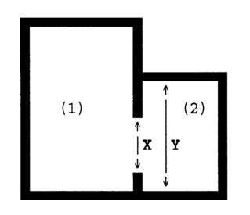
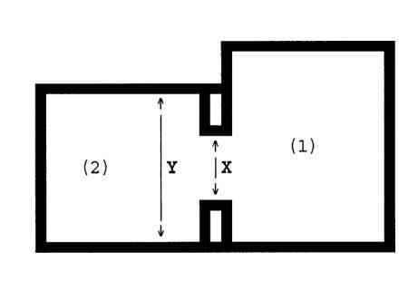
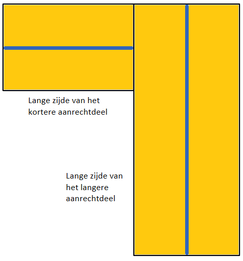

# Onzelfstandige Woonruimten

Hier worden toelichtingen gedocumenteerd van developers op het Beleidsboek Waarderingsstelsel onzelfstandige woonruimte (januari 2026)

## Hoofdstuk 1 – Basisinformatie woningwaardering

Dit beleidsboek gaat over de waardering van een onzelfstandige woonruimte. Hiervoor heeft de Huurcommissie dit beleidsboek opgesteld.

Dit hoofdstuk begint met algemene uitleg over het woningwaarderingsstelsel (paragraaf 1.1 en 1.2). In paragraaf 1.3 staat uitleg over de huursectoren van de onzelfstandige woonruimte. Tot slot staat in dit hoofdstuk uitleg over de jaarlijkse wijzigingen van huurprijzen en andere waardes die worden gebruikt bij de woningwaardering (paragraaf 1.5).

### 1.1 Het woningwaarderingsstelsel

De waardering van een onzelfstandige woonruimte gebeurd volgens het
woningwaarderingsstelsel. De wettelijke basis voor dit stelsel ligt in de Uitvoeringswet huurprijzen woonruimte (hierna: Uhw) en het Besluit huurprijzen woonruimte (hierna: Bhw). De waardering van de kwaliteit van een woonruimte vindt plaats volgens het stelsel dat opgenomen is in Bijlage I van het Bhw. [^1]

_Dwingend stelsel_
Het woningwaarderingsstelsel is een **dwingend stelsel**. Dat betekent dat het verplicht toegepast moet worden. Voor de Huurcommissie heeft de wetgever wel een uitzondering gemaakt. De wetgever biedt de Huurcommissie namelijk de mogelijkheid om van het woningwaarderingsstelsel af te wijken. De Huurcommissie heeft dus een **afwijkingsbevoegdheid**. De Huurcommissie is bevoegd om af te wijken als de aard van de woonruimte daar aanleiding toe geeft. De Huurcommissie gaat hier terughoudend mee om.

### 1.2 Onzelfstandige woonruimte heeft altijd huurprijsbescherming

De maximale huurprijs is de hoogste huurprijs die voor de woonruimte gevraagd mag worden door een verhuurder. Dit noemen wij huurprijsbescherming. Hoe meer punten een woonruimte heeft, hoe hoger die huurprijs mag zijn.

Kamerwoningen en andere vormen van onzelfstandige woonruimten vallen **nooit** in de **vrije sector**. Onzelfstandige woonruimtes zijn altijd onderdeel van de sociale sector. De huurder van een onzelfstandige woonruimte heeft daarom altijd recht op huurprijsbescherming. Het maakt daarbij dus niet uit hoe hoog de huurprijs is die is afgesproken bij het sluiten van de huurovereenkomst.

Voor meer informatie over de verschillende huursectoren wordt verwezen naar paragraaf 1.3 van het beleidsboek zelfstandige woonruimten.

[^1]: Artikel 5 Bhw.

### 1.3 De vaststelling van de maximale huurprijs

Met de regels van dit beleidsboek bepaalt de Huurcommissie wat de maximale huurprijs is voor een onzelfstandige woonruimte. Het puntenaantal van de woonruimte bepaalt (samen met de eventuele prijsopslagen) de maximale huurprijs. De maximale huurprijs per puntenaantal staat vastgelegd in de wet en wordt elk jaar opnieuw vastgesteld.

### 1.4  Zelfstandige woonruimte of onzelfstandige woonruimte

Voor het waarderen van de woonruimte is het belangrijk om vast te stellen of er sprake is van een zelfstandige woonruimte of een onzelfstandige woonruimte. De wetgever heeft alleen een definitie gegeven van een zelfstandige woonruimte. Deze definitie is:

_“Onder een woonruimte welke een zelfstandige woning vormt, wordt een woonruimte verstaan als bedoeld in artikel 7:234 van het Burgerlijk Wetboek, welke wordt bewoond door maximaal twee personen of welke wordt bewoond door drie of meer personen die een duurzame gemeenschappelijke huishouding hebben. (…).”_ [^2]

Het beleid dat de Huurcommissie gebruikt om vast te stellen of sprake is van een onzelfstandige of zelfstandige woonruimte staat in het [beleidsboek zelfstandige woonruimte](https://www.huurcommissie.nl/support/beleidsboeken/waarderingsstelsel-zelfstandige-woonruimte).

> [!TIP]
> Om een woonruimte als onzelfstandige woning te waarderen, dient dit aangegeven te worden in het attribuut `woningwaarderingstelsel`:
> /// tab | JSON
```json

```
> ///
> /// tab | Python
```python

```
> ///

[^2]: Artikel 1 lid 2 Bhw.

### 1.5 Jaarlijkse indexatie huurprijsgrenzen, maximale huurprijzen
In de voorgaande paragrafen wordt gesproken over de maximale huurprijzen. De hieraan gekoppelde bedragen en de kengetallen die gebruikt worden bij de berekening van het puntenaantal voor de WOZ-waarde worden jaarlijks geïndexeerd.

#### 1.5.1 De maximale huurprijzen
De maximale huurprijzen worden elk jaar per 1 januari geïndexeerd. Een overzicht van de maximale huurprijzen per 1 januari 2026 is te vinden in Bijlage 1 van dit beleidsboek.

## Hoofdstuk 2 – Het woningwaarderingsstelsel voor een onzelfstandige woning

In dit hoofdstuk wordt toegelicht waarvoor een onzelfstandige woning punten kan krijgen, wanneer er een prijsopslag van toepassing is en hoe de commissie in de praktijk met de regels omgaat. Zo wordt duidelijk welke voorwaarden gelden en hoe de maximale huurprijs uiteindelijk wordt berekend.

De waardering vindt plaats per thema of categorie, de zogenoemde rubrieken. Er zijn 13 rubrieken. In paragraaf 2.1 staan de algemene regels die gelden bij de woningwaardering. In de paragrafen 2.2 tot en met 2.13 staan de regels per rubriek uitgewerkt. Tot slot staat in paragraaf 14 uitgelegd welke prijsopslagen bovenop de maximale huurprijs mogelijk zijn.

### 2.1  Algemene regels over de woningwaardering

#### 2.1.1 Waardering van de woning als onroerende zaak

Bij de woningwaardering geldt de algemene regel dat alleen de (gemeenschappelijke) vertrekken, overige ruimten en voorzieningen die tot de onroerende zaak behoren met punten worden gewaardeerd. Een onroerende zaak is een gebouw of constructie die duurzaam met de grond is verbonden. Een kamerwoning is dus een voorbeeld van een onroerende zaak.

Daarnaast komt in dit beleidsboek het begrip ‘onroerende aanhorigheden voor’. Een onroerende aanhorigheid komt voor waardering in aanmerking omdat het onderdeel is van de woning (als onroerende zaak). Van onroerende aanhorigheden is sprake als het gaat om
voorzieningen die:

- naar hun aard onlosmakelijk met de gehuurde woning zijn verbonden, of;
- volgens de huurovereenkomst deel uitmaakt van de woning.

Of een voorziening naar zijn aard onlosmakelijk met de gehuurde woning is verbonden, wordt mede beoordeeld aan de hand van twee criteria uit artikel 4 van Boek 3 van het Burgerlijk Wetboek (hierna: BW). Het gaat om:

1. voorzieningen die volgens de verkeersopvatting (de algemeen gangbare mening) onderdeel uitmaken van een zaak of;
2. voorzieningen die zodanig verbonden zijn met een zaak dat zij niet zonder beschadiging van betekenis kunnen worden losgemaakt.

De vraag of iets een onroerende aanhorigheid is kan bij verschillende onderdelen van de woningwaardering van belang zijn. Zoals bij de rubriek verwarming en verkoeling (rubriek 3), de keuken (rubriek 5), de gemeenschappelijke ruimtes (rubriek 9) en gemeenschappelijke parkeerplaatsen (rubriek 10). Waar nodig wordt nader uitleg gegeven.

#### 2.1.2 Algemene regel: waardering van de door verhuurder aangebrachte voorzieningen

De algemene regel is dat alleen de voorzieningen die de verhuurder heeft aangebracht voor waardering in aanmerking komen. Voorzieningen die de bewoner onverplicht en voor eigen rekening heeft aangebracht (de zogenaamde ‘zelf aangebrachte voorzieningen’) worden niet met punten gewaardeerd, tenzij de verhuurder een vergoeding heeft verstrekt voor de zelfaangebrachte voorziening.

> [!NOTE]
> Indien een zelf aangebrachte voorziening niet voor waardering in aanmerking komt, dient deze ook niet opgevoerd te worden.

#### 2.1.3 Algemene regel: waardering van voorzieningen niet afhankelijk van functioneren

Voor de waardering volgens het woningwaarderingsstelsel is noodzakelijk dat de voorzieningen zijn ingebouwd en door de verhuurder zijn aangebracht, zoals in de paragraven hierboven toegelicht. Het functioneren van de voorziening is bij de woningwaardering niet relevant. Wel kan er dan mogelijk sprake zijn van een ernstig onderhoudsgebrek.

#### 2.1.4 Toegang én gebruiksrecht

Bij een onzelfstandige woonruimte (bijvoorbeeld een kamer in een studentenhuis) zijn er vaak gedeelde ruimtes of voorzieningen, zoals een gedeelde keuken, badkamer, wc of een gemeenschappelijke tuin. In het woningwaarderingsstelsel worden de punten voor deze gedeelde ruimtes en voorzieningen gedeeld door het aantal onzelfstandige woonruimten waarvan de bewoner(s) volgens hun huurovereenkomst toegang én gebruiksrecht hebben. Waar nodig wordt dit per rubriek nader toegelicht.

> [!NOTE]
> Wij hebben `gedeeldMetAantalOnzelfstandigeWoonruimten` toegevoegd als property van ruimten om te kunnen specificeren met hoeveel andere personen op hetzelfde adres een ruimte gedeeld wordt. Indien deze property leeg is of kleiner is dan 2, tellen we de ruimte mee als zijnde niet gedeeld.

#### 2.1.5 Gelijke verdeling van punten bij gedeeld gebruik van ruimtes en voorzieningen

De punten die voor een gemeenschappelijk ruimte of gedeelde voorziening gelden, worden verdeeld over alle bewoners die er gebruik van mogen maken. [^3]

De verdeling gaat gelijk (evenredig): iedereen krijgt hetzelfde aantal punten. Hoe groot of klein de (eigen) onzelfstandige woonruimte is in vergelijking met de andere woningen maakt dus niet uit.

Als _niet_ alle bewoners toegang en gebruiksrecht hebben tot een bepaalde ruimte (bijvoorbeeld een extra badkamer waar alleen sommige kamerwoningen gebruik van mogen maken), dan worden de punten alleen verdeeld over de bewoners die daar volgens het huurcontract toegang en gebruiksrecht toe hebben.

[^3]: Huurders moeten exclusieve toegang en gebruiksrecht hebben volgens de huurovereenkomst. Dit is toegelicht in paragraaf 2.1.3.

#### 2.1.6 Algemene rekenregel: afronding per rubriek

Het totaal aantal punten wordt per rubriek afgerond op 0,25 punt, waarbij vanaf een achtste (1/8) punt naar boven wordt afgerond. Dat wil zeggen dat 0,125 wordt afgerond naar 0,25. Een kwartpunt is de kleinst werkbare waardering binnen het woningwaarderingsstelsel voor een afzonderlijke rubriek.

{==

VOORBEELD

Een woning krijgt in rubriek 8 een puntenaantal van 4,81. In dit geval wordt afgerond op 4,75 punten en niet 5,00 punten. De reden is dat tussen 4,81 en 4,75 geen verschil zit van 0,125 punt – ofwel 1/8 punt. Er is dus geen afronding op een 0,25 punt naar boven. Er wordt afgerond op 0,25 punt naar beneden.

==}

#### 2.1.7 Algemene rekenregel: eindsaldering op hele punten

Het totale puntenaantal voor de woonruimte wordt berekend door eerst alle punten per rubriek bij elkaar op te tellen (inclusief de punten voor de gemeenschappelijke ruimten en voorzieningen). Het totaal moet daarna worden afgerond op hele punten. Bij 0,5 punten of meer wordt afgerond naar boven op hele punten, bij minder dan 0,5 punten wordt afgerond naar beneden op hele punten.

#### 2.1.8 Algemene rekenregel: aparte berekening bij meer dan 250 punten

Bij een woonruimte met méér dan 250 punten wordt de maximale huurprijs als volgt berekend: elk punt boven de 250 wordt vermenigvuldigd met het verschil tussen de bedragen, genoemd in de huurprijstabel (zie Bijlage 1) bij 249 en 250 punten. Het verkregen bedrag wordt vervolgens opgeteld bij de maximale huurprijs die volgens de huurprijstabel behoort bij 250 punten.

### 2.2 Rubriek 1 en 2: vertrekken en overige ruimten

Binnen het woningwaarderingsstelsel is sprake van drie soorten binnenruimten, namelijk vertrekken, overige ruimten en verkeersruimten. Dit onderscheid is belangrijk omdat de waardering per soort ruimte verschilt. De oppervlakte van vertrekken en overige ruimten worden gewaardeerd onder rubriek 1 en 2. Gemeenschappelijke ruimten worden gewaardeerd onder rubriek 9.

#### 2.2.1 Vertrekken

{==

1 punt per m² per privévertrek  
1 punt per m² per gemeenschappelijke ruimte / onzelfstandige woonruimten met
toegang en gebruiksrecht  

==}

> [!TIP]
> Dit voorbeeld toont de minimale gegevens voor waardering van de oppervlakte van vertrekken
> /// tab | JSON
```json

```
> ///
> /// tab | Python
```python

```
> ///

Voorbeelden van privé-vertrekken zijn een eigen woonkamer, slaapkamer of studeerkamer die voldoet aan de gestelde eisen. Daarnaast geldt dat een ruimte die uitsluitend als keuken, badkamer of doucheruimte is bestemd <u>altijd</u> een vertrek is. Een vertrek wordt gewaardeerd met 1 punt per vierkante meter.

Een gemeenschappelijk vertrek wordt ook gewaardeerd met 1 punt per vierkante meter, gedeeld door het aantal onzelfstandige woonruimten die toegang en gebruiksrecht hebben tot de gemeenschappelijke ruimte.

> [!NOTE]
> Wij hebben `gedeeldMetAantalOnzelfstandigeWoonruimten` toegevoegd als property van ruimten om te kunnen specificeren of een ruimte gedeeld wordt met andere personen op hetzelfde adres.

##### 2.1.1.1 Rekenregels vertrekken

De oppervlakten voor privé- en gemeenschappelijke vertrekken worden afzonderlijk berekend. De rekenmethode is als volgt:

- Bepaal de oppervlakte per vertrek afgerond op twee decimalen.
- Tel de oppervlakte van alle privévertrekken bij elkaar op en rond af:
    - Bij een getal dat eindigt op 0,50 m² wordt afgerond omhoog. Bijvoorbeeld: 28,51 m² wordt 29 m²
    - Als het getal eindigt op 0,49 m² of lager wordt naar beneden afgerond. Bijvoorbeeld: 15,43 m² wordt 15 m².
- Doe hetzelfde voor de gemeenschappelijke vertrekken
- Tel de m² van beide soorten vertrekken bij elkaar op en rond af op hele vierkante meters, volgens de bovenstaande afrondingsmethode.
- Bepaal het puntenaantal voor de vertrekken op basis van de m².

##### 2.2.1.2 De voorwaarden van een vertrek

> [!NOTE]
> * De gespecificeerde ruimtesoort is leidend bij de waardering van een ruimte. Een ruimte dient `Ruimtesoort` `vertrek` te hebben om in aanmerking te komen voor een waardering in de rubriek 'Oppervlakte van vertrekken'.
> * Een ruimte dient alleen als vertrek gespecificeerd te worden wanneer deze voldoet aan alle onderstaande eisen. De doorgehaalde eisen worden niet door het systeem gecontroleerd.
> * Wanneer een ruimte met `Ruimtesoort` `vertrek` niet voldoet aan de minimale oppervlakte, wordt er gekeken of de ruimte gewaardeeerd kan worden onder de rubriek 'Oppervlakte van overige ruimten'.

Een ruimte wordt als een vertrek gewaardeerd als deze voldoet aan alle van de volgende eisen:

1. ~~de vloer moet begaanbaar zijn;~~
2. ~~de muren (wanden) moeten uit vast materiaal te bestaan;~~
3. de ruimte moet:
    - ~~over ten minste 80% van de langste zijde ten minste 1,50 meter breed zijn;~~
    - minimaal 4,00 m² groot zijn (een oppervlakte van 3,50 m² of 3,95 m² is onvoldoende);
    - ~~een vrije hoogte hebben van minimaal 2,10 meter (gemeten vanaf de vloer tot het zichtbare plafond, waarbij het eventuele balkon onder het zichtbare plafond buiten beschouwing blijft), over ten minste 50% van de oppervlakte of over een oppervlakte van 11 m²;~~
    - ~~ten minste 0,50 m² aan de buitenlucht grenzend transparant oppervlak te hebben (bijvoorbeeld een raam of deur met vensters);~~
    - ~~beschikken over ventilatie die direct met de buitenlucht is verbonden;~~
    - ~~voorzien zijn van ten minste één stopcontact en één lichtpunt.~~

##### 2.2.1.3 Zolderruimte als vertrek

Een zolderruimte kan worden gewaardeerd als een vertrek of een overige ruimte. Om een zolderruimte als vertrek te kunnen aanmerken moet deze aan 2 extra eisen voldoen:

1. de zolderruimte moet bereikbaar zijn via een vaste trap en
2. ~~het dak van de zolderruimte moet beschoten zijn. Dat betekent dat het dak aan de binnenkant is afgewerkt, waardoor de dakconstructie is afgesloten en de binnenzijde niet open ligt (en er bijvoorbeeld geen dakpannen zichtbaar zijn).~~

> [!NOTE]
> * Een zolderruimte groter dan 2m2 met het `Bouwkundigelement` `vlizotrap` wordt gewaardeerd onder `Oppervlakte van overige ruimten`, mits deze wordt ingeschoten met `ruimtesoort` `overige ruimte`.
> * Een zolderruimte groter dan 2m2 maar kleiner dan 4m2 met het `Bouwkundigelement` `trap` wordt gewaardeerd onder `Oppervlakte van overige ruimten`, mits deze wordt ingeschoten met `ruimtesoort` `overige ruimte`.
> * Zolderruimte groter dan 4m2 met het `Bouwkundigelement` `trap` wordt gewaardeerd onder `Oppervlakte van vertrekken`, mits deze wordt ingeschoten met `ruimtesoort` `vertrek`.

##### 2.2.1.4 Aangrenzende ruimten met een open doorgang

> [!NOTE]
> Wanneer twee aangrenzende ruimten volgens onderstaane regels als één ruimte gewaardeerd moeten worden, dan dienen deze ook als één ruimte opgevoerd worden. 

Het kan voorkomen dat twee vertrekken (of overige ruimten) die met elkaar in verbinding
staan, als één vertrek (of overige ruimte) gewaardeerd moeten worden. Dat is het geval als
tussen de twee vertrekken (of overige ruimten) er een niet afsluitbare opening is die:

- ~~breder is dan 50% van de muur waarin die opening zit en~~
- ~~minimaal 0,85 meter breed en 2 meter hoog is.~~
- ~~De muur in het vertrek (of de overige ruimte) waar de tussenwand het smalst is dient als uitgangspunt te worden gemeten.~~

Hieronder volgen twee voorbeelden:

{==

VOORBEELD 1

Als de lengte van de doorgang (X) breder is dan 50% van de lengte van Y, dan zijn ruimten 1 en 2 samen één vertrek of overige ruimte.



==}

{==

VOORBEELD 2

Als de lengte van de doorgang (X) minder is dan 50% van de lengte van Y, dan zijn ruimten 1 en 2 beiden afzonderlijk een vertrek of overige ruimte. Let op : als zich in de opening een (deur)omlijsting bevindt, dan wordt gesproken van twee (afzonderlijke) ruimten en geldt deze situatie dus niet.



==}

#### 2.2.2 Overige ruimten

> [!TIP]
> Dit voorbeeld toont de minimale gegevens voor waardering van de oppervlakte van overige ruimten
> /// tab | JSON
```json

```
> ///
> /// tab | Python
```python

```
> ///

{==

0,75 punt per m² per privé overige ruimte
0,75 punt per m² per gemeenschappelijke overige ruimte / onzelfstandige woonruimten met toegang en gebruiksrecht

==}

Een overige ruimte is bijvoorbeeld een bijkeuken, berging, wasruimte, kelder of toiletruimte die voldoet aan eisen van een overige ruimte. Een overige ruimte wordt gewaardeerd met 0,75 punt per m².

In dit hoofdstuk staat hoe het aantal vierkante meters per overige ruimte moet worden bepaald en aan welke eisen een overige ruimte moet voldoen.

##### 2.2.2.1 Rekenregels vertrekken

De oppervlakten voor privé- en gemeenschappelijke overige ruimten worden afzonderlijk
berekend. De rekenmethode is als volgt:

- Bepaal de oppervlakte per overige ruimte afgerond op twee decimalen.
- Tel de oppervlakte van alle privé overige ruimtes bij elkaar op en rond af:  
  Bij een getal dat eindigt op 0,50 m² wordt afgerond omhoog. Bijvoorbeeld: 28,51 m² wordt 29 m²  
  Als het getal eindigt op 0,49 m² of lager wordt naar beneden afgerond. Bijvoorbeeld: 15,43 m² wordt 15 m².  
- Doe hetzelfde voor de gemeenschappelijke overige ruimtes.
- Tel de m² van beide soorten vertrekken bij elkaar op en rond af op hele vierkante
meters, volgens de bovenstaande afrondingsmethode.
- Bepaal het puntenaantal voor de overige ruimtes op basis van de m².

##### 2.2.2.2 De voorwaarden van een overige ruimte

> [!NOTE]
> * De gespecificeerde ruimtesoort is leidend bij de waardering van een ruimte. Een ruimte met `Ruimtesoort` `overige ruimte` komt in aanmerking voor waardering in de rubriek 'Oppervlakte van overige ruimten' als de oppervlakte minimaal 2 m² is. Een ruimte met `Ruimtesoort` `vertrek` komt in aanmerking voor waardering in de rubriek 'Oppervlakte van overige ruimten' als de oppervlakte minder dan 4 m² en minimaal 2 m² is.
> * Een ruimte dient alleen als overige ruimte gespecificeerd te worden wanneer deze voldoet aan alle onderstaande eisen. De doorgehaalde eisen worden niet door het systeem gecontroleerd.

Een ruimte wordt als overige ruimte gewaardeerd als deze voldoet aan alle van de volgende eisen:

1. ~~de vloer moet begaanbaar zijn;~~
2. de ruimte moet een minimale oppervlakte van 2,00 m² hebben (1,95 m² voldoet hier dus niet aan);
3. ~~de ruimte voldoet niet aan de eisen van een vertrek (zie [paragraaf 2.2.1](#221-vertrekken)) of een verkeersruimte (zie [paragraaf 2.2.3](#223-verkeersruimten))~~.

##### 2.2.2.3 Zolderruimte zonder vaste trap

Als een zolderruimte geen vertrek is maar wel als overige ruimte kan worden aangemerkt en er is <u>geen vaste trap</u> naar de zolder, dan worden er <u>5 punten afgetrokken</u> van de waarde die aan het vloeroppervlak wordt toegekend. Maar: er kunnen nooit meer punten afgetrokken worden dan het totaal aantal punten dat de zolderruimte zelf waard is. Met andere woorden: de waarde van de zolder kan door deze aftrek niet negatief worden.

##### 2.2.2.4 Toegang ruimte via zolderruimte

Als er op zolder een ruimte is die alleen bereikbaar is via de zolderruimte, dan wordt de loopruimte die je nodig hebt om die ruimte te bereiken niet meegeteld bij de oppervlakte van de zolder. Wat dan overblijft aan zolderruimte moet minimaal 2,00 m² zijn, anders voldoet de zolderruimte niet meer aan de eisen voor de waardering van een ‘overige ruimte’.

#### 2.2.3 Verkeersruimten

{==

N.v.t.

==}

Verkeersruimten zijn ruimten die bedoeld zijn voor het bereiken van een andere ruimte en niet zijn bestemd om duurzaam in te verblijven. Bekende voorbeelden zijn een hal, gang of overloop. Verkeersruimten krijgen geen punten voor hun oppervlakte in rubriek 1 of 2.

#### 2.2.4 Meetinstructies vertrekken en overige ruimtes

> [!NOTE]
> De woningwaardering package gaat er vanuit dat de gebruiker zich houdt aan onderstaande meetinstructies. Met uitzondering van _kasten_ kunnen de meetinstructies niet getoetst of berekend worden op basis van het VERA model.

In de toelichting op het woningwaarderingsstelsel geeft een aantal meetinstructies. In deze paragraaf staat hoe de Huurcommissie deze instructies toepast.

_Binnenmaatse meting van oppervlakten van vertrekken_  
~~De oppervlakten van vertrekken en overige ruimtes worden door de Huurcommissie ‘binnenmaats’ gemeten. Het gaat dus om netto en niet om bruto oppervlakten (waarin ook binnen- en buitenmuren en verkeersruimten worden inbegrepen).~~
~~De vertrekken en overige ruimten moeten voor de woningwaardering worden opgemeten:~~

- ~~van **muur tot muur**;~~
- ~~op een hoogte van **1,50 meter boven de vloer**;~~
- **inclusief de oppervlakte van alle tot de ruimte behorende kasten**.

~~De meethoogte van 1,50 meter geldt ook als de oppervlakte afwijkt van die op het vloerniveau.~~

_**Let op:** De volgende regels gaan over welke delen van een ruimte juist wel of niet moeten worden meegeteld bij het bepalen van de netto vloeroppervlakte van een ruimte._

_Kasten_  
In de toelichting van het Bhw staat dat alle tot de woning behorende losse en vaste kasten moeten worden meegenomen in de berekening van de oppervlakte. Voor de praktijk van de Huurcommissie betekent dit dat alle tot de vertrekken behorende kasten moeten worden meegerekend.

Met andere woorden: de netto oppervlakte van een kast die in een vertrek uitkomt, telt mee bij de oppervlakte van dat vertrek. De afmetingen van de kast heeft hier geen invloed op. De plek van de deur van de kast bepaalt bij welke ruimte een kast hoort. Dat geldt ook voor het waarderen van een kastenwand tussen twee vertrekken. Hieronder een aantal voorbeelden:

_~~Vloeroppervlakte onder aanrecht, keukentoestel, wasbak en installaties~~_  
~~De vloeroppervlakte onder aanrechten, toestellen in de keuken, badkuip, lavet of douchebak, moederhaard, cv-ketel, boilerinstallatie en radiatoren telt mee bij het bepalen van de totale oppervlakte van de ruimte. De oppervlakte van het vertrek of overige ruimte wordt dus bijvoorbeeld niet verminderd de oppervlakte van een douchecabine.~~

_~~Gas- en/of elektrameter~~_  
~~Zit in een (kast in een) vertrek of overige ruimte een gas- en/of elektrameter, dan wordt van de gemeten oppervlakte 30 x 60 centimeter afgetrokken. Dit is de minimale afmeting van een meterkast bij bestaande bouw.~~

_~~Oppervlakte kanalen en leidingen~~_  
~~De oppervlakte die wordt ingenomen door grondleidingen (horizontale leidingen) wordt meegeteld bij het bepalen van de oppervlakte van de ruimte. Niet meegeteld wordt de oppervlakte die ingenomen wordt door:~~

- ~~verticale koven;~~
- ~~schoorsteen- en ventilatiekanalen;~~
- ~~stand- of grondleidingen (behalve horizontale leidingen)~~

~~Bij een schoorsteenmantel en/of rookkanaal (die naar boven of beneden breed kan uitlopen) is de oppervlakte op 1,50 meter hoogte bepalend.~~

_~~Pui~~_  
~~Bij een pui wordt de binnenzijde (het kozijn) als uitgangspunt gebruikt voor de meting.~~

_~~Erker~~_  
~~Een erker wordt meegerekend in de oppervlakte als deze aan de binnenkant een vrije hoogte heeft van ten minste 1,50 meter.~~

_~~Entresol~~_  
~~Bij een entresol (ook wel een mezzanine of tussenverdieping genoemd) wordt de oppervlakte boven én onder de entresol meegerekend, mits de entresol een vrije hoogte heeft van ten minste 1,50 meter.~~

_~~Hellend of verlaagd plafond~~_  
~~Bij een (ten dele) hellend of verlaagd plafond wordt alleen het gedeelte van de ruimte waarboven het plafond ten minste 1,50 meter hoog is meegenomen in de oppervlakteberekening.~~

~~Voor een (ten dele) hellend plafond geldt aanvullend dat de 1,50 meter hoogte loopt tot het dakbeschot, het zichtbare dakvlak of het zichtbare plafond. Met gordingen en balken wordt bij de meting geen rekening gehouden.~~

_~~Oppervlakte onder een open of gesloten vaste trap~~_  
~~Van de oppervlakte onder een open of gesloten vaste trap telt alleen mee het gedeelte waar de ruimte tussen de vloer en de onderkant van de trap ten minste 1,50 meter hoog is. De oppervlakte die door een ingeschoven liggende inschuifbare of opvouwbare trap wordt ingenomen, wordt niet meegeteld.~~

### 2.3 Rubriek 3: Verwarming en verkoeling

> [!NOTE]
> Op het moment is het met de VERA-standaard niet mogelijk om op ruimte-niveau aan te geven of een ruimte verwarmd en/of verkoeld is. Zie [https://github.com/Aedes-datastandaarden/vera-referentiedata/issues/100](https://github.com/Aedes-datastandaarden/vera-referentiedata/issues/100). Daarom hebben wij `verwarmd` en `verkoeld` als boolean-kenmerken van een `EenhedenRuimte` toegevoegd.

> [!TIP]
> Dit voorbeeld toont de minimale gegevens voor waardering van de verkoeling en verwarming van ruimten.
> /// tab | JSON
```json

```
> ///
> /// tab | Python
```python

```
> ///

{==

2 punten per verwarmd privévertrek  
1 punt per verwarmde privé overige ruimte of privé verkeersruimte (tot maximaal 4 punten)  
1 punt extra per verwarmd én verkoeld privévertrek (tot maximaal 2 punten)  

==}

{==

2 punten per verwarmd gemeenschappelijk vertrek / onzelfstandige wooneenheden met toegang  
1 punt per verwarmde gemeenschappelijke overige ruimte of gemeenschappelijke verkeersruimte (tot maximaal 4 punten) / onzelfstandige wooneenheden met toegang en
gebruiksrecht  
1 punt extra per verwarmd én verkoeld gemeenschappelijk vertrek (tot maximaal 2 punten) / onzelfstandige wooneenheden met toegang en gebruiksrecht  

==}

Vertrekken, overige ruimtes én verkeersruimtes kunnen punten krijgen als deze zijn verwarmd, namelijk 2 punten per verwarmd vertrek en 1 punt voor overige ruimtes en
verkeersruimten. Voor de laatste twee soorten binnenruimten geldt een maximum van 4 punten. Daarnaast kan een vertrek ook punten krijgen als deze is verkoeld kan worden. Hiervoor geldt ook een maximum aantal van 2 punten. Voor de waardering gelden nadere regels die hieronder worden uitgelegd.

#### 2.3.1 Punten voor verwarmde ruimtes

~~Punten voor verwarming en verkoeling in een vertrek, overige ruimte of verkeersruimte worden alleen toegekend als de verwarming (of de voorziening met zowel een
verwarmingsfunctie als verkoelingsfunctie) tot de woning behoort (de onroerende zaak of als onroerende aanhorigheid, zie hiervoor [paragraaf 2.1.1](#211-waardering-van-de-woning-als-onroerende-zaak) Dit is het geval bij radiatoren als deze zijn bevestigd aan de muur of in de grond. Een mobiele elektrische radiator of een mobiele airco behoort niet tot de onroerende zaak. Gevelkachels en gashaarden behoren ook niet tot de onroerende zaak. Een verdikte buis, pijp of moederhaard wordt wél gerekend tot de onroerende zaak, indien deze als zodanig bedoeld of herkenbaar is.~~

> [!NOTE]
> De properties `verkoeld` en `verwarmd` mogen alleen gebruikt worden voor ruimten die verkoeld dan wel verwarmd worden door onroerende zaken die tot de onroerende aanhorigheid behoren.

#### 2.3.2 Open keuken in een vertrek of overige ruimte

~~Vertrekken of overige ruimten die met elkaar in verbinding staan, worden in een bepaald geval als één verwarmd vertrek of overige ruimte gewaardeerd. Dit is het geval als zich tussen die twee verwarmde vertrekken of overige ruimten een opening bevindt, die breder is dan 50% van de muur, waarin deze opening zich bevindt. Het moet hierbij gaan om een niet afsluitbare opening, die over een breedte van minimaal 0,85 meter een minimumhoogte heeft van 2,00 meter. Het voorbeeld in [paragraaf 2.2.1.4](#2214-aangrenzende-ruimten-met-een-open-doorgang) geeft dit visueel weer.~~

Binnen rubriek 3 van de woningwaardering wordt van de bovenstaande regel afgeweken. Zowel de open keuken als het vertrek of overige ruimte waarmee de open verbinding
bestaat, wordt voor deze rubriek namelijk individueel gewaardeerd met punten indien deze verwarmd zijn. ~~Onder een open keuken wordt hier dus verstaan een keuken die in open verbinding staat met een ander vertrek of overige ruimte, terwijl zich tussen de keuken en het andere vertrek een opening bevindt, die breder is dan 50% van de tussenmuur [paragraaf 2.2.1.4](#2214-aangrenzende-ruimten-met-een-open-doorgang).~~ Een privé verwarmde woonkamer met open keuken wordt dus gewaardeerd met 4 punten.

Ook een aanrecht dat is geplaatst in een woon- of slaapvertrek is een open keuken, ook als er geen duidelijke afscheiding is tussen het keukengedeelte en de rest van het vertrek.

#### 2.3.3 Extra punten bij verkoelingsfunctie

De Huurcommissie waardeert 2 soorten situaties wat betreft de verkoeling van de woonruimte, namelijk:

- woningen die zonder koeling voldoende koel kunnen blijven
- voorzieningen in de woning met een verwarmingsfunctie én een verkoelingsfunctie

Hierbij moet rekening worden gehouden met de volgende nadere eisen:

- **Alleen vertrekken** komen in aanmerking voor een waardering door een verkoelingsfunctie. Er kan 1 punt worden behaald per vertrek tot een maximum van 2 punten.
- ~~Bij een woning die zonder koeling voldoende koel kan blijven moet er een geldige energielabel zijn opgenomen volgens de NTA 8800 methode (geldig vanaf 1 januari 2021). In dit energielabel moet de koelfunctie zijn meegenomen. Een verouderd label is dus onvoldoende.~~
- ~~Centrale koelsystemen zoals omkeerbare warmtepompen, passieve koeling door een bodemlus of een WKO systeem moeten zijn voorzien zijn van vloerkoeling, lage temperatuur-radiatoren of radiatorconvectoren.~~
- ~~Bij een ander koelsysteem (onroerend aanhorig) dan hierboven genoemd, zoals een vaste airco, moet de koelingsvoorziening een productgebonden energielabel hebben van minimaal A+ (bepaald volgens de Europese Ecodesign-richtlijn) en een minimaal vermogen kunnen leveren van 100 W/m2 bij een werkingstemperatuur tot 35 graden Celsius.~~

> [!NOTE]
> Indien een ruimte wordt doorgegeven als `verkoeld` moet het koelsysteem dat ervoor zorgt dat de ruimte verkoeld wordt aan deze voorwaarden voldoen.

### 2.4 Rubriek 4: Energieprestatie

{==

-0,15 t/m 1 punt per m² van de privé- en gemeenschappelijke vertrekken

==}

De energieprestatie van de woning telt mee in de woningwaardering. De energieprestatie moet zijn vastgesteld voor het pand op het adres waar de onzelfstandige woning onderdeel van uitmaakt. De energieprestatie is af te lezen in een geldig energielabel of geldige energie-index van de woning.

> [!TIP]
> Dit voorbeeld toont de minimale gegevens voor de waardering van de energieprestatie van een woning met een energieprestatievergoeding. De monumentale status is van belang omdat die invloed heeft op de waardering van de energieprestatie.  
> /// tab | JSON
```json

```
> /// 
> /// tab | Python
```python
  
```
> ///

#### 2.4.1 Vindplaats energieprestatie woning

De energieprestatie is van een woonruimte is op te zoeken via de website van [EP-online](https://www.ep-online.nl/). Door te zoeken op een postcode en huisnummer kan de energieprestatie van
de woonruimte worden gevonden. De energieprestatie blijkt (ook) uit het energielabelafschrift dat wordt uitgegeven nadat een energielabel of energie-index is opgenomen in de woonruimte.

#### 2.4.2 Energieprestaties die geldig zijn voor de woningwaardering

De woonruimte krijgt punten voor de energieprestatie als de woning een geldend energielabel of energie-index heeft. Aan een woonruimte zonder geldig energielabel of energie-index worden punten toegekend op basis van het bouwjaar van de woning. De volgende energielabels of -indexen zijn geldig:

- een energielabel dat is opgenomen vóór 1 januari 2015;
- een energie-index die is opgenomen op of na 1 januari 2015 tot 1 januari 2021 (én als op www.EP-online.nl staat aangegeven dat deze energie-index geldig is voor de
toepassing van het woningwaarderingsstelsel);
- een energielabel dat is opgenomen op of na 1 januari 2021 (op basis van de opnamemethode NTA 8800).

#### 2.4.3 Energieprestaties die _niet_ geldig zijn voor de woningwaardering

1. _Energieprestatie opgenomen ná de peildatum_  
   Voor de woningwaardering dient een geldige energieprestatie op tijd te zijn vastgesteld. Voor de Huurcommissie betekent dit dat een geldige energieprestatie moet zijn opgenomen vóór de peildatum van de procedure, bijvoorbeeld de ingangsdatum van de huurovereenkomst.
2. _Energie-index zonder de toevoeging: geldig voor WWS_  
   Bij de energie-index is de indeling in letters vervangen door een cijfer. Deze wordt alleen in de puntentelling meegenomen als op de website van EP-online staat aangegeven dat de energie-index geldig is voor de toepassing van het woningwaarderingsstelsel (‘geldig voor WWS’). Staat er enkel een energie-index zonder die toevoeging, dan worden hier geen punten voor toegekend.
3. _Vervallen energielabel of energie-index_  
   Een energielabel of energie-index is maximaal 10 jaar geldig. Dat betekent dat een energielabel, opgenomen op bijvoorbeeld 1 oktober 2014 vervalt per 1 oktober 2024. Aan een vervallen energielabel of energie-index wordt geen waardering toegekend.
4. _Energielabel afgegeven in de periode 1 januari 2015 tot 1 januari 2021_  
   Een energielabel dat is afgegeven in de periode van 1 januari 2015 tot 1 januari 2021 krijgt geen punten in het woningwaarderingsstelsel. Dit zijn namelijk de zogenaamde ‘vereenvoudigde energielabels’, die slechts een meer globale inschatting van de energieprestatie van een woonruimte geven. Alleen energie-indexen die in de genoemde periode zijn afgegeven komen in aanmerking voor waardering.

#### 2.4.4 Punten voor geldige energieprestaties
Het puntenaantal voor de energieprestatie voor de onzelfstandige woning wordt gerekend op basis van het totaal aantal m² oppervlakte die de huurder heeft als privé vertrekken en de aan huurder toe te rekenen gemeenschappelijke vertrekken.

{==

VOORBEELD  
Huurder heeft een privé slaapkamer van 20 m² in een pand met energielabel A. Naast de privé slaapkamer heeft huurder toegang tot een gemeenschappelijke woonkamer
van 40 m².

Huurder deelt de woonkamer met drie andere huurders van onzelfstandige woonruimten op het adres. Het aantal m2 gemeenschappelijk vertrek dat aan de huurder is toe te rekenen is dus 40 m²/4 = 10 m².

Het puntenaantal voor de energieprestatie wordt dan als volgt berekend:
(20 + 10) x 0,65 = 19,50 punten.

==}

De labelklasse (A++++ t/m G) bepaalt het aantal punten voor de energieprestatie. Bij een energie-index wordt het puntenaantal bepaald door het relevante cijfer. In de onderstaande tabellen is dit nader ingevuld.

| **Energielabel NTA 8800<br>(afgegeven op of na 1 januari 2021)** | **Punten per m²** |
|--------------|-------------:|
| A++++        | 1,00          |
| A+++         | 0,95          |
| A++          | 0,85          |
| A+           | 0,75          |
| A            | 0,65          |
| B            | 0,50          |
| C            | 0,35          |
| D            | 0,20          |
| E            | -0,05         |
| F            | -0,10         |
| G            | -0,15         |

| **Energie-index (EI)**     | **Punten per m²**  |
|------------------------|--------------:|
| EI ≤ 0,6               | 0,85           |
| 0,6 < EI ≤ 0,8         | 0,75           |
| 0,8 < EI ≤ 1,2         | 0,65           |
| 1,2 < EI ≤ 1,4         | 0,50           |
| 1,4 < EI ≤ 1,8         | 0,35           |
| 1,8 < EI ≤ 2,1         | 0,20           |
| 2,1 < EI ≤ 2,4         | -0,05          |
| 2,4 < EI ≤ 2,7         | -0,10          |
| EI > 2,7               | -0,15          |

#### 2.4.5 Punten energieprestatie zonder geldig energielabel of energie-index

Als een woonruimte geen (geldig) energielabel of energie-index heeft bepaalt het bouwjaar van de woning het aantal punten voor de energieprestatie. Het ontbreken van een (geldig) energielabel leidt in het algemeen tot een lager aantal punten. Bij het waarderen van de energieprestatie op basis van het bouwjaar wordt namelijk geen rekening gehouden met het feit dat veel woningeigenaren op een later moment energiebesparende voorzieningen hebben aangebracht. Die voorzieningen komen in een energielabel wel tot uitdrukking.

De waardering van de energieprestatie op basis van het bouwjaar blijkt uit de onderstaande tabel:

| **Bouwjaar**         | **Punten per m²** |
|----------------------|------------------:|
| 2002 en later        | 0,65              |
| 2000 t/m 2001        | 0,50              |
| 1992 t/m 1999        | 0,35              |
| 1984 t/m 1991        | 0,20              |
| 1979 t/m 1983        | -0,05             |
| 1977 t/m 1978        | -0,10             |
| 1976 of ouder        | -0,15             |

#### 2.4.6 Uitzonderingssituaties energieprestatie

In een aantal gevallen geldt een afwijking voor het bepalen van de waardering van de energieprestatie. Deze situaties worden hieronder uitgelegd.

##### 2.4.6.1 Energieprestatie van monumenten

{==

0 punten bij monumenten met label E, F of G

==}

Er geldt een uitzonderingregel voor de waardering van de energieprestatie voor rijks-, provinciale en gemeentelijke monumenten. Hiervoor worden geen minpunten toegekend voor de energielabels E, F en G en daarmee samenhangende energie-indexen (EI tussen 2,1 t/m 2,7) en bouwjaren (1979 of ouder). De puntentoekenning voor de energieprestatie is dan 0 punten.

Of een woonruimte geheel of ten dele onderdeel is van een rijks-, provinciaal of gemeentelijk monument is afhankelijk van nadere regels. Deze regels staan in [paragraaf 14]() van dit hoofdstuk per soort monument uitgelegd. Voor de toepassing van deze uitzonderingsituatie geldt dat de Huurcommissie **passief beleid** voert. Het is dus aan partijen (veelal de verhuurder) om aan te tonen dat een woonruimte onder deze uitzondering valt.

##### 2.4.6.2 Afwijkingsbevoegdheid Huurcommissie

De hierboven opgenomen tabellen met puntentoekenning voor de energielabels gaan tot A++++. De Huurcommissie heeft voor twee situaties de bevoegdheid gekregen om daarvan af te wijken:

1. als blijkt dat de kosten die gemaakt zijn voor het bereiken van de energieprestatie aanmerkelijk afwijken van wat als gebruikelijk wordt beschouwd.
2. als de energieprestatie aanmerkelijk beter is dan wat als gebruikelijk wordt beschouwd bij een energielabel A++++.

### 2.5 Rubriek 5: Keuken

Een keuken komt voor waardering in aanmerking als deze aan bepaalde basiseisen voldoet.

#### 2.5.1 De basiseisen voor een keuken

Om punten te krijgen in de rubriek ‘keuken’ moet er in de ruimte een aantal basisvoorzieningen aanwezig zijn. Die basisvoorzieningen zijn:

- ~~een aan- en afvoer van water;~~
- ~~ten minste één vast aansluitpunt voor koken op gas of elektriciteit;~~
- een aanrechtblad van minimaal 1 meter lengte in één stuk (de lengte is inclusief spoelbak en/of kookplaat);
- ~~twee inbouwkasten van ten minste 50 centimeter breed;~~
- ~~een waterdichte wandafwerking boven het waterdichte aanrechtblad en in de kookhoek van minimaal 1,50 meter (gemeten vanaf de vloer). De wandafwerking moet een onroerende aanhorigheid zijn (zie [paragraaf 2.1.1](#211-waardering-van-de-woning-als-onroerende-zaak)). Een keuken met bijvoorbeeld een tegelwand of waterdichte verf voldoet dus wel aan deze eis, maar een plastic zeil als wandafwerking voldoet niet. Een hedendaagse keuken zal aan deze eis voldoen, daarom neemt de Huurcommissie als uitgangspunt dat de wandafwerking waterdicht is.~~

~~Als een of meer van de basisvoorzieningen niet aanwezig zijn, dan worden geen punten toegekend voor het onderdeel ‘keuken’ in de woningwaardering. Dus ook niet voor eventuele extra voorzieningen als hierna in [paragraaf 2.5.3](#253-punten-voor-extra-voorzieningen-keuken) benoemd.~~

> [!NOTE]
> Zorg ervoor dat alleen aanrechten mét een spoelbak worden meegegeven, en alleen indien de keuken voldoet aan de basisvoorzieningen, en dat deze spoelbak niet ook nog als aparte `wastafel` wordt meegegeven.

#### 2.5.2 Punten voor basisvoorzieningen keuken

> [!TIP]
> Dit voorbeeld toont de minimale gegevens voor de waardering van een keuken met een aanrecht. De lengte van het aanrecht (3000 mm) bepaalt de puntenwaardering.
> /// tab | JSON
```json

```
> /// 
> /// tab | Python
```python

```
> ///

~~Als een keuken over alle basisvoorzieningen beschikt, worden hiervoor punten toegekend.~~ Het aantal punten hangt af van de lengte van het waterdichte aanrechtblad, volgens de
onderstaande tabel. De punten moeten worden gedeeld door het aantal onzelfstandige woonruimten die toegang en gebruiksrecht hebben tot de keuken.

| Lengte aanrecht           | Punten |
|---------------------------|-------:|
| Minder dan 1 meter        | 0      |
| Tussen 1 en 2 meter       | 4      |
| Tussen 2 en 3 meter       | 7      |
| Meer dan 3 meter          | 10     |
| Meer dan 5 meter *         | 13     |

\* Er worden 13 punten toegekend mits er _minimaal_ 8 onzelfstandige wooneenheden toegang en gebruiksrecht hebben tot de keuken.

Een aanrecht met spoelbak dat korter is dan 1 meter voldoet niet aan de basisvoorzieningen en krijgt daarom géén punten in de rubriek keuken. Wel kan de spoelbak als wastafel nog
één punt krijgen in de rubriek sanitair. Een aanrecht zonder onderkasten kan ook als wastafel gewaardeerd worden.

_De lengte van het aanrecht bepalen_  
Voor het meten van een aanrecht gelden de volgende regels:

- ~~de aanrechtlengte wordt gemeten over het midden van het bovenblad, waarbij ingebouwde spoelbakken en kookplaten mee gemeten worden.~~
- ~~de lengte van werkblad dat niet direct aan het aanrecht aansluit wordt meegeteld. Dat geldt ook voor een werkblad dat uit ander materiaal is samengesteld.~~
- ~~als een aanrechtblad langer is dan de onderkasten (als het ware uitsteekt) dan wordt dat deel van het aanrechtblad mee gemeten als er onder dat langere deel losse apparatuur (bijv. koelkast, vaatwasser of wasmachine) kan worden geplaatst en daaronder aansluitmogelijkheden aanwezig zijn voor die apparatuur.~~
- ~~bij een ingemetseld aanrechtblad of waar de wandbetegeling op het blad is aangebracht, wordt alleen het bruikbare/zichtbare gedeelte gemeten.~~
- ~~de lengte van een kookeiland wordt bepaald door de lengte van de lange zijde.~~
- ~~{ align=right width="50%" } bij een hoekaanrecht wordt de lengte bepaald door de lange zijde van het langere aanrechtdeel te meten (de horizontale blauwe lijn in de tekening) en daarbij de lengte van de lange zijde van het korte aanrechtdeel (de verticale lijn in de tekening) bij elkaar op te tellen.~~


#### 2.5.3 Punten voor extra voorzieningen keuken

> [!TIP]
> Dit voorbeeld toont de minimale gegevens voor de waardering van voorzieningen in een keuken. De lengte van het aanrecht is van belang om tot waardering van de voorzieningen te komen.
> /// tab | JSON
```json

```
> /// 
> /// tab | Python
```python

```
> ///

Een ruimte die beschikt over de basisvoorzieningen voor een keuken kan ook extra punten voor voorzieningen in de keuken krijgen. Het aantal punten voor de extra voorzieningen kan niet meer zijn dan het aantal punten voor de basisvoorzieningen (de aanrechtlengte). Als het aantal punten voor de extra voorzieningen hoger uitvalt, dan wordt dit afgetopt. De toegekende punten worden gedeeld door het aantal onzelfstandige woningen dat toegang en gebruiksrecht heeft.

{==

VOORBEELD
Op een adres zijn vier onzelfstandige woonruimten delen vier woningen één keuken, met een aanrechtlengte tussen de 2 en 3 meter. Hiervoor worden 7 punten toegekend. Daarnaast worden 3 punten toegekend voor extra voorzieningen (een inbouwkoelkast, inbouw keramische kookplaat en inbouw magnetron). De keuken krijgt dus voor de basisvoorzieningen en de extra voorzieningen 10 punten (7 +3).

Omdat de keuken wordt gedeeld door vier onzelfstandige woonruimten moet de volgende som worden gebruik voor het puntenaantal voor 1 onzelfstandige woning: 10 punten / 4 woonruimtes = 2,5 punt in totaal.

==}

De voorzieningen die voor waardering in aanmerking komen staan in de onderstaande tabel:

| Voorziening                                                                                                     | Punten  |
|-----------------------------------------------------------------------------------------------------------------|--------:|
| Afzuiginstallatie\*                                                                                            | 0,75    |
| Inbouw kookplaat inductie                                                                                       | 1,75    |
| Inbouw kookplaat keramisch                                                                                      | 1       |
| Inbouw kookplaat gas                                                                                            | 0,50    |
| Inbouw koelkast                                                                                                 | 1       |
| Inbouw vrieskast                                                                                                | 0,75    |
| Inbouw oven elektrisch                                                                                          | 1       |
| Inbouw oven gas                                                                                                 | 0,50    |
| Inbouw magnetron                                                                                                | 1       |
| Inbouw vaatwasmachine                                                                                           | 1,50    |
| Extra kastruimte boven het minimum (per 60 cm breedte, met een minimum van 60 cm hoogte)\*\*                   | 0,75    |
| Éénhandsmengkraan                                                                                               | 0,25    |
| Thermostatische mengkraan                                                                                       | 0,50    |
| Kokend waterfunctie (al dan niet apart of in aanvulling op de kraan)                                            | +0,50   |

\* Bij een afzuiginstallatie gaat het om een luchtafvoer met afzuiging naar buiten de woning of op basis van recirculatie met actieve koolstof- en vetfilters. Een afzuiginstallatie kan zowel een afzuig- of recirculatiekap boven de kookinstallatie zijn, als een afzuigsysteem dat in het in het aanrecht is ingebouwd.  
\*\* Om aan het basisniveau voor de kwalificatie als keuken te voldoen, moeten twee inbouwkasten aanwezig zijn met een breedte van minimaal 50 centimeter (per stuk) aanwezig zijn. De totale minimumbreedte bedraagt dus 1 meter. Per 60 centimeter breedte extra kastruimte kan vervolgens, als ook aan de andere eisen wordt voldaan, 0,75 punt extra worden toegekend. ~~Bij de meting wordt uitgegaan van de buitenmaat.~~

#### 2.5.4 Voorziening met twee functies

Eén voorziening met twee functies worden als twee losse voorzieningen gewaardeerd. Bijvoorbeeld een ingebouwde combi-magnetron/oven of een gecombineerde koel- en vrieskast. Een koelkast met een klein vriesvakje wordt niet als combinatievoorziening gezien. Van een koel-/vriescombinatie is sprake als beide een eigen aparte deur hebben.

### 2.6 Rubriek 6: Sanitair

Sanitair komt voor waardering in aanmerking. De waardering van sanitair is niet beperkt tot de badkamer en toiletruimte, maar kan ook gaan over sanitaire voorzieningen in andere ruimten. Bijvoorbeeld een douche in een woon- of slaapkamer. Privé sanitaire voorzieningen krijgen het volledige puntenaantal. Bij gemeenschappelijke voorzieningen wordt het puntenaantal gedeeld door het aantal onzelfstandige woonruimten op het adres die toegang en gebruiksrecht hebben tot de sanitaire voorzieningen.

#### 2.6.1 Punten voor sanitaire basisvoorzieningen

Het woningwaarderingsstelsel geeft punten aan de hieronder beschreven sanitaire basisvoorzieningen:

_Toilet_  
Een toilet met waterspoeling krijgt punten als deze geplaatst is in een daartoe bestemde ruimte ~~én binnen de woonruimte ligt~~. ~~Een toilet dat buiten de woonruimte, maar binnen het woongebouw ligt wordt alleen gewaardeerd als het gebruik door derden is uit te sluiten~~. Toiletten die buiten toiletruimten en badkamers zijn aangebracht worden niet gewaardeerd.

| Voorziening                            | Punten |
|----------------------------------------|--------|
| Toilet (staand) in een toiletruimte    | 3      |
| Toilet (staand) in een badkamer        | 2      |
| Hangend toilet in een toiletruimte     | 3,75   |
| Hangend toilet in een badkamer         | 2,75   |
| Toilet buiten toiletruimte of badkamer | n.v.t. |

_Wastafel_  
Alle bakken voor wassen en spoelen die op de waterleiding én het huisriool zijn aangesloten, worden geteld als wastafel. De kranen kunnen onder de voorwaarden van [paragraaf 2.6.2](#262-punten-voor-extra-sanitaire-voorzieningen) afzonderlijk worden gewaardeerd als extra sanitaire voorzieningen. Een meerpersoonswastafel heeft een minimale breedte van 70 centimeter en is voorzien van twee kranen. Voor dergelijke wastafels geldt een maximum van 1,50 punt per vertrek of overige ruimte, met uitzondering van de badkamer. Voor wastafels geldt een maximum van 1 punt per vertrek of overige ruimte, met uitzondering van de badkamer.

| Voorziening                        | Punten                                    |
|-------------------------------------|--------------------------------------------|
| Wastafel in badkamer               | 1 per wastafel                             |
| Wastafel in vertrek/overige ruimte | Maximaal 1 per vertrek of overige ruimte\*  |
| Meerpersoonswastafel in badkamer   | 1,5 per meerpersoonswastafel               |
| Meerpersoonswastafel in vertrek/overige ruimte | Maximaal 1,5 per vertrek of overige ruimte |

\* Bij een adres met 8 of meer onzelfstandige woonruimten geldt een uitzonderingsregel: bij 1 ander vertrek (dan de badkamer) of overige ruimte is het maximum van 1 (meerpersoons) wastafel niet van toepassing. Er kunnen in dat geval méér wastafels worden gewaardeerd.

> [!NOTE]
> Zorg dat wastafels alleen worden meegenomen die voldoen aan de vereisten van een wastafel.

Niet als wastafel worden gewaardeerd:

- ~~een dergelijke bak waarboven een douche is aangebracht;~~
- een spoelbak in het keukenaanrecht, tenzij deze onderdeel uitmaakt van een keukenaanrecht dat korter is dan één meter (zie ook paragraaf 5.2);
- een bidet of lavet.
- ~~een aansluitpunt voor warm en koud water dat bedoeld is voor het gecombineerd gebruik van een wastafel én het naastgelegen bad of douche (bijv. door een zwenkarm). In dit geval wordt alleen het bad of de douche gewaardeerd.~~

> [!NOTE]
> Indien een aanrecht met een lengte korter dan één meter wordt meegegeven wordt deze als wastafel gewaardeerd. Geef hier niet ook nog een wastafel mee voor de spoelbak.

_Bad en douche_  
~~Als douche wordt iedere, door de verhuurder aangebrachte, installatie voor het nemen van een stortbad geteld. Hieronder valt dus ook een douchecabine die in een ander vertrek of overige ruimte staat dan de bad- of doucheruimte.~~

Een bad wordt gewaardeerd ~~indien een volwassen persoon er in een normale zithouding in kan plaatsnemen. Als een bad is voorzien van een (hand)douche, dan wordt de douchegarnituur niet afzonderlijk geteld~~.

| Voorziening    | Punten |
|----------------|--------|
| Douche         | 3      |
| Bad            | 5      |
| Bad/douche     | 6      |

#### 2.6.2 Punten voor extra sanitaire voorzieningen

> [!TIP]
> Dit voorbeeld toont de gegevens voor de waardering van sanitaire extra voorzieningen. Voor de waardering van extra voorzieningen dient in de ruimte ook een bad of douche aanwezig te zijn.
> /// tab | JSON
```json

```
> /// 
> /// tab | Python
```python

```
> ///

Het is mogelijk om extra punten te krijgen voor sanitaire voorzieningen die zich bevinden in een bad- of doucheruimte. Maar het aantal punten voor extra voorzieningen kan niet meer zijn dan het totaalaantal punten voor de douche, het bad en/of bad/douche gezamenlijk. Als het aantal punten voor de extra voorzieningen hoger uitvalt, dan wordt dit afgetopt.

Een bad- of doucheruimte kan punten krijgen voor extra voorzieningen als de ruimte voldoet aan alle van de volgende eisen:

- ~~een waterdichte vloerafwerking (inclusief een bad in een vertrek met een niet-waterdichte vloer, omdat een bad zelf als waterdichte afwerking wordt gezien);~~
- ~~de ruimte heeft over ten minste 50% van de oppervlakte een vrije hoogte van 2,00 meter (gemeten vanaf de vloer tot het zichtbare plafond);~~
- ~~een waterdichte wandafwerking tot 1,50 meter hoogte voor de badruimte en 1,80 meter voor de doucheruimte;~~
- een wastafel ~~inclusief (tweehands)mengkraan en spiegel~~;
- een douche of bad ~~met aansluitpunten voor warm en koud water, voorzien van een warm- en koudwaterkraan of een mengkraan~~.

Alleen als aan de bovenstaande eisen wordt voldaan, kunnen alleen voor de volgende voorzieningen extra punten gekregen worden.

| Voorziening                                                              | Punten                          |
| ------------------------------------------------------------------------ | ------------------------------- |
| Bubbelfunctie van het bad                                                | 1,50                            |
| Gemonteerde volledige afscheiding van de douche\*                       | 1,25                            |
| Handdoekenradiator                                                       | 0,75                            |
| Ingebouwd kastje met in- of opgebouwde wastafel                          | 1                               |
| Kastruimte (mits minimaal 40 centimeter in breedte en hoogte)            | 0,75 (tot een maximum van 0,75) |
| Stopcontact (maximaal twee per (meerpersoons)wastafel)                   | 0,25                            |
| Éénhandsmengkraan                                                        | 0,25                            |
| Thermostatische mengkraan                                                | 0,50                            |

\* In het geval van een gemonteerde volledige afscheiding van de douche vindt de waardering van 1,25 punten plaats wanneer de doucheruimte beschikt over een onroerend aanhorige afscheiding met een waterdichte afwerking aan alle zijden van de douche. Ter illustratie: een glazen douchewand en glazen deuren vallen hier wel onder, maar een douchegordijn (dat snel weggenomen kan worden) niet.

> [!NOTE]
> Voor een ingebouwde kast met wastafel moet de wastafel als aparte voorziening worden meegegeven.

{==

VOORBEELD  
Er is een pand met een 1 bad/douchecombinatie in een badkamer (6 punten). Deze wordt gedeeld door de bewoners van 4 onzelfstandige wooneenheden. Voor de sanitaire basisvoorzieningen worden dus 6 punten toegekend.

De badruimte voldoet aan de eisen voor de waardering van extra sanitaire voorzieningen. De badruimte heeft een bubbelfunctie voor het bad (1,50 punt), een gemonteerde volledige afscheiding van de douche (1,25 punt), 2 handdoekenradiatoren (2 x 0,75 punt), 1 thermostatische mengkraan (0,50 punt) en 1 éénhandsmengkraan (0,25 punt). De extra sanitaire voorzieningen worden gewaardeerd met 5 punten in totaal. De punten worden voor de extra sanitaire voorzieningen (5 punten) worden niet afgetopt, omdat het puntenaantal lager is dan het totaal aantal punten voor de bad/douchecombinatie (6 punten).

Omdat de badkamer wordt gedeeld door 4 onzelfstandige wooneenheden is het puntenaantal per woonruimte: 6 / 4 = 1,5 punt.

==}

### ~~2.7 Rubriek 7: Woonvoorzieningen voor personen met een handicap~~

> [!WARNING]
> Rubriek 7: Woonvoorzieningen voor personen met een handicap is niet geïmplementeerd.

{==

~~1 punt per € 332,00 netto-investering* / onzelfstandige wooneenheden met toegang en gebruiksrecht~~

==}

~~Het woningwaarderingsstelsel kent punten toe voor woonvoorzieningen voor personen met een handicap. Daaronder wordt in deze rubriek verstaan: een persoon die ten gevolge van ziekte of gebrek aantoonbare beperkingen ondervindt.~~

~~Er wordt 1 punt toegekend per € 332,00 netto-investering door de verhuurder. De toegekende punten worden gedeeld door het aantal personen met een handicap die toegang en gebruiksrecht hebben tot de aangebrachte voorzieningen. De netto-investering is het bedrag dat overblijft na aftrek van subsidie en eigen bijdrage van de huurder. Daarbij geldt de voorwaarde dat de kosten in een redelijke verhouding staan tot de geboden kwaliteit.~~

~~Met deze puntenwaardering wordt ervan uitgegaan dat de verhuurder een redelijke rendementswaarborg heeft voor het door hem geïnvesteerde vermogen. Hiermee wordt bedoeld: de kosten van de ingrepen minus:~~

- ~~de eigen bijdrage van de huurder, en;~~
- ~~de financiële tegemoetkoming van gemeente, of;~~
- ~~een financiële tegemoetkoming van een andere instantie die vanwege een wettelijke regeling die tegemoetkoming verleent (bij dure woonvoorzieningen).~~

~~Indien de huurovereenkomst met de persoon met een handicap is beëindigd dan vervalt de toepassing van deze rubriek, tenzij de nieuwe huurder ook een handicap heeft.~~

#### ~~2.7.1 Voorwaarden voor puntentoekenning~~

~~Er zijn voorwaarden voor de puntentoekenning waaraan de bestede kosten in of aan de woonruimte ten behoeve van de persoon met een handicap moet voldoen. Het moet gaan om:~~

- ~~maatwerkvoorzieningen: op de behoeften, persoonskenmerken en mogelijkheden van een persoon afgestemd geheel van diensten, hulpmiddelen, woningaanpassingen en andere maatregelen ten behoeve van zelfredzaamheid, participatie of beschermd wonen en opvang, of;~~
- ~~woningaanpassingen: een bouwkundige of woontechnische ingreep in of aan een woonruimte, zoals bedoeld in artikel 1.1.1, eerste lid, van de Wet maatschappelijke ondersteuning 2015, of;~~
- ~~gesubsidieerde voorzieningen of ingrepen op grond van een andere wettelijke regeling.~~

~~Voor de bovenstaande woonvoorzieningen, woningaanpassingen of ingrepen kunnen punten worden toegekend indien aan de volgende (opeengestapelde) voorwaarden is voldaan:~~
1. ~~de ingreep moet hebben plaatsgevonden op of ná 01-04-1994;~~
2. ~~de ingreep moet voor een deel zijn gesubsidieerd;~~
3. ~~de ingreep dient voor de persoon met een handicap te zijn aangebracht.~~

~~Extra vloeroppervlakte (als bedoeld in de subsidieregelingen) wordt aangemerkt als gesubsidieerde voorziening.~~

#### ~~2.7.2 Geen waardering als volledig gedekt door subsidie~~

~~Als de kosten voor de voorzieningen ten behoeve van de persoon met een handicap, met een subsidie volledig zijn gedekt, dan komen de voorzieningen niet voor waardering in aanmerking.~~

#### ~~2.7.3 Gedeeltelijke subsidiëring~~

~~Het komt voor dat een voorziening niet geheel maar deels word beschouwd als een specifieke aanpassing voor een persoon met een handicap en daarom slechts voor een deels is gesubsidieerd. In zo’n geval worden alleen die onderdelen van de voorziening gewaardeerd, die ook in een vergelijkbare woning als standaardvoorziening voorkomen.~~

### 2.8 Rubriek 8: Buitenruimten

{==

2 punten per privé-buitenruimte + 0,35 punt per m²  
0,75 punt per m² gemeenschappelijke buitenruimte / adressen in het woongebouw met toegang en gebruiksrecht / aantal onzelfstandige woonruimten op het woonadres met toegang en gebruiksrecht

==}

Buitenruimten komen voor waardering in aanmerking. Het woningwaarderingsstelsel maakt hierbij onderscheid tussen privé-buitenruimten en gemeenschappelijke buitenruimten. Er worden **maximaal 15 punten** toegekend voor zowel de privé-buitenruimte als gemeenschappelijke buitenruimte samen.

#### 2.8.1 Punten voor privé-buitenruimte

Privé-buitenruimten zijn tot de woning behorende buitenruimten, waarvan de huurder van de desbetreffende woning **volgens de huurovereenkomst het exclusieve gebruiksrecht en toegang heeft**. Dit kunnen onder meer voor-, zij- of achtertuinen, balkons, platjes of terrassen zijn, maar ook een oprit die exclusief tot de woning behoort. Wanneer zich binnen de privé-buitenruimte een parkeerplek bevindt, gelden de parkeerplek en de weg daar naartoe als privé-buitenruimte.

Met exclusief gebruiksrecht van een privé-buitenruimte wordt bedoeld dat uitsluitend de huurder het recht heeft om te bepalen welk gebruik deze maakt van de privé-buitenruimte die tot de woning behoort.

Voor de aanwezigheid van een privé-buitenruimte worden 2 punten toegekend en vervolgens per vierkante meter 0,35 punt. Voor de privé-buitenruimte geldt géén minimumafmeting. Bijvoorbeeld: 10 m² privé-buitenruimte = 5,5 punt (2 + (10 x 0,35)).

#### 2.8.2 Punten voor een gemeenschappelijke buitenruimte

Gemeenschappelijke buitenruimten zijn ruimtes die worden gebruikt door:

- meerdere bewoners die wonen op hetzelfde adres  
- bewoners van meerdere adressen, maar waarbij die adressen onderdeel zijn van hetzelfde woongebouw.  

De bewoners delen de ruimtes, bijvoorbeeld een tuin of dakterras. Voor gemeenschappelijke buitenruimten worden 0,75 punten per vierkante meter toegekend:

- gedeeld door het aantal adressen dat toegang en gebruiksrecht heeft, en  
- daarna gedeeld door het aantal onzelfstandige woonruimten op het adres dat toegang en gebruiksrecht heeft.  

Gemeenschappelijke buitenruimten moeten voor de woningwaardering aan een drietal voorwaarden voldoen, namelijk:

1. er moet sprake zijn van een minimumafmeting van 2,00 meter x 1,50 meter, 1,50 meter (hoogte, breedte, diepte), en,  
2. ~~het moet gaan om tot het woongebouw behorende buitenruimte waar de bewoners van het woongebouw en/of het woonadres volgens de huurovereenkomst **exclusieve toegang en gebruiksrecht** toe hebben en,~~  
3. ~~de huurder(s) moet(en) toegang hebben tot de gemeenschappelijke buitenruimte zonder vertrekken, overige ruimten of verkeersruimten te gebruiken die uitsluitend ter beschikking staan aan de verhuurder of aan (een) andere huurder(s).~~  

> [!NOTE]
> Er wordt vanuitgegaan dat gemeenschappelijke buitenruimten die worden meegegeven als zodanig aan de hierboven beschreven eisen voldoen.

{==

**VOORBEELD:** gemeenschappelijke tuin voor een woning met meerdere bewoners  
Een woonhuis bestaat uit 4 onzelfstandige woonruimten. De bewoners van deze woonruimten delen een gemeenschappelijke tuin van 30 m² en hebben hier exclusieve toegang en gebruiksrecht toe volgens hun huurovereenkomst. De tuin wordt dan gewaardeerd met: (0,75 x 30) / 1 = 22,5 punten. Dit puntenaantal moet worden gedeeld door 4 onzelfstandige wooneenheden = 5,625 punten.

Er wordt afgerond op een kwart punt. Het puntenaantal voor één onzelfstandige woning is dan in totaal: 5,60 punten.

==}

#### 2.8.3 Gemeenschappelijke buitenruimte als parkeerplek

Gedeelde buitenruimten die als parkeerplek voor auto’s bedoeld zijn, worden gewaardeerd volgens rubriek 10.

> [!NOTE]
> Ondanks dat het op basis van het woordgebruik van deze rubriek lijkt alsof parkeerplekken met meerdere onzelfstandige woonruimten op het hetzelfde adres gewaardeerd horen te worden in rubriek 10, staat in rubriek 10 expliciet vermeld dat parkeerplekken alleen worden gewaardeerd als ze gedeeld zijn met minimaal 2 adressen. Omdat anders parkeerplekken gedeeld met hetzelfde adres nergens gewaardeerd zouden worden, waarderen wij die hier in rubriek 8.

#### 2.8.4 Eisen aan balkons, dakterrassen en loggia’s

> [!NOTE]
> Er wordt vanuitgegaan dat balkons, dakterrassen en loggia's alleen worden meegegeven als ze aan de hieronder beschreven eisen voldoen.

Balkons, dakterrassen en loggia’s moeten aan de volgende eisen voldoen om voor punten in aanmerking te komen. Ze moeten:

1. ~~zijn voorzien van een beloopbare afwerking, zoals vlonders, tegels e.d. en~~  
2. ~~rondom voorzien van een afscheiding die ook dient als valbeveiliging, en~~  
3. ~~via een deur\* of schuifpui toegankelijk zijn.~~  

\* ~~Als het balkon of dakterras is voorzien van beweegbare ramen en/of deuren in de gevel, die bestemd zijn om als toegang tot de buitenruimte te worden gebruikt, dan wordt het balkon of het terras met punten gewaardeerd.~~

_Loggia is altijd een buitenruimte_  
Een loggia wordt gewaardeerd als buitenruimte en dus niet als binnenruimte.

_Franse balkons en zeembalkons_  
Franse balkons worden niet als buitenruimte beschouwd. Een Frans balkon is een opening in de gevel met naar binnen draaiende deuren, voorzien van een balustrade direct tegen het kozijn of de gevel.

Zeembalkons worden, zolang zij voldoen aan de hiervoor aangegeven eisen van een balkon, wel gewaardeerd als buitenruimte. Een zeembalkon is een zeer smal balkon, dat net breed genoeg is voor het zemen van ramen.

> [!NOTE]
> Indien een zeembalkon voldoet aan de eisen voor een balkon moet deze als `balkon` worden meegegeven.

#### 2.8.5 Meetinstructies buitenruimten

Van de buitenruimten wordt de gehele onbebouwde oppervlakte gemeten, gemeten loodrecht op de voor-, achter- of zijgevel. Bij balkons wordt gemeten vanaf de binnenzijde van het balkonhek. Bij (gedeeltelijk) inpandige balkons wordt bovendien gemeten ten opzichte van het terugliggende deel van de gevel.  
Als uitzondering op de regel voor het meten van de gehele onbebouwde oppervlakte, wordt de oppervlakte, die wordt ingenomen door een balkonkast of kolenhok e.d., bij de oppervlakte van de desbetreffende buitenruimte meegerekend.

#### 2.8.6 Rekenmethode

De oppervlakten voor gemeenschappelijke en privé-buitenruimten worden afzonderlijk berekend. Als sprake is van meerdere buitenruimten die tot dezelfde categorie behoren (privé of gemeenschappelijk) dan wordt per categorie de oppervlakte van de buitenruimtes opgeteld en afgerond op twee decimalen. Daarna wordt de oppervlakte van beide categorieën bij elkaar opgeteld. In totaal kan maximaal 15 punten worden toegekend.

### 2.9 Rubriek 9: Gemeenschappelijke vertrekken, overige ruimten en voorzieningen

{==

1 punt per m² per gemeenschappelijk vertrek / adressen in woongebouw met toegang en gebruiksrecht / aantal onzelfstandige wooneenheden op het adres met toegang en gebruiksrecht  
0,75 punt per m² gemeenschappelijke overige ruimte / adressen in woongebouw met toegang / aantal onzelfstandige wooneenheden op het adres met toegang en gebruiksrecht  

==}

> [!TIP]
> Dit voorbeeld toont de waardering van een rekenvoorbeeld met gemeenschappelijke vertrekken, overige ruimten en voorzieningen.
> /// tab | JSON
```json

```
> /// 
> /// tab | Python
```python

```
> ///

Gemeenschappelijke vertrekken en overige ruimtes worden gewaardeerd volgens het woningwaarderingsstelsel. Een gemeenschappelijk vertrek krijgt 1 punt per vierkante meter en een gemeenschappelijke overige ruimte wordt gewaardeerd met 0,75 punt per vierkante meter. Voor beide type ruimtes gelden nadere regels die hieronder worden toegelicht.

#### 2.9.1 Basisvoorwaarden waardering gemeenschappelijke vertrekken en overige ruimtes

Gemeenschappelijke buitenruimten zijn ruimtes die worden gebruikt door:  

- meerdere bewoners die wonen op hetzelfde adres  
- bewoners van meerdere adressen, maar waarbij die adressen onderdeel zijn van hetzelfde woongebouw.  

De bewoners delen de ruimtes, bijvoorbeeld een inpandige fietsenstalling of een berging. Voor gemeenschappelijk buitenruimten worden 0,75 punten per vierkante meter toegekend:  

- gedeeld door het aantal adressen dat toegang en gebruiksrecht heeft, en  
- daarna gedeeld door het aantal onzelfstandige woonruimten op het adres dat toegang en gebruiksrecht heeft.  

Gemeenschappelijke vertrekken en overige ruimtes die tot het woongebouw behorende binnenruimten worden onder voorwaarden gewaardeerd. Er moet aan de volgende voorwaarden voldaan:  

1. ~~de bewoners hebben **volgens de huurovereenkomst exclusieve toegang en gebruiksrecht** tot de binnenruimte, en,~~  
2. ~~de huurder(s) moeten toegang hebben tot de gemeenschappelijke binnenruimte zonder gebruik te maken van vertrekken, overige ruimten of verkeersruimten die _uitsluitend_ ter beschikking staan aan de verhuurder of aan (een) andere huurder(s).~~  

#### 2.9.2 Punten voor voorzieningen in gemeenschappelijke ruimten

Punten voor voorzieningen, zoals verkoeling en verwarming, keuken en sanitair, die zich bevinden in gemeenschappelijke vertrekken en overige ruimten worden gewaardeerd volgens het woningwaarderingsstelsel en vervolgens gedeeld door het aantal onzelfstandige wooneenheden met toegang tot de voorzieningen.

#### 2.9.3 Gemeenschappelijke (spoel)keuken

~~Als het verstrekken van warme maaltijden onderdeel vormt van de huurovereenkomst~~ dan worden ook de aanwezige gemeenschappelijke (spoel)keuken en bijbehorende opslagruimte in de waardering meegenomen. Het gaat hier om de puntenwaardering van de oppervlakte van die ruimten.

#### 2.9.4 Gemeenschappelijke ruimten en voorzieningen in een zorgwoning

De ervaring leert dat bij het waarderen van de gemeenschappelijke ruimten en voorzieningen in een zorgwoning of woon/zorgcomplex de waardering per woning veelal uitkomt op een totaal van ongeveer 3 punten. Om arbeidsintensief meetwerk te voorkomen kent de Huurcommissie in dat geval een waardering van 3 punten per woning toe.

#### 2.9.5 Uitgesloten van waardering

~~Vertrekken en overige ruimten waarvoor ook door derden (niet zijnde bewoners van adressen van het wooncomplex of pand) een vergoeding/huurprijs wordt betaald en vertrekken en ruimten die door de eigenaar/verhuurder in gebruik zijn (bijv. kantoorruimte, opslagruimte, e.d.) komen niet voor waardering in aanmerking.~~

#### 2.9.6 Meetinstructie gemeenschappelijke ruimten

Met vertrekken en overige ruimten wordt onder deze rubriek voor het overige aangesloten bij de definities en meetinstructies zoals toegelicht in [paragraaf 2.1.3](#213-algemene-regel-waardering-van-voorzieningen-niet-afhankelijk-van-functioneren) en [2.2.4](#224-meetinstructies-vertrekken-en-overige-ruimtes).

### 2.10 Rubriek 10: Gemeenschappelijk parkeerruimten

{==

4 – 9 punten per type parkeerplek / aantal adressen / aantal onzelfstandige woonruimten op het adres

==}

Het woningwaarderigsstelsel kent punten toe aan verschillende typen gemeenschappelijke parkeerplekken. De waardering is afhankelijk van de afdekking van de buitenlucht.

#### 2.10.1 Basisvoorwaarden waardering gemeenschappelijk parkeerruimte

> [!NOTE]
> De woningwaardering package gaat er van uit dat onderstaande eisen, wanneer een parkeeruimte wordt meegegeven in het input model.

Punten voor een gemeenschappelijke parkeervoorziening worden alleen toegekend als de parkeervoorziening als een onroerende aanhorigheid gekwalificeerd wordt. Hiervan is sprake:

- ~~als de parkeervoorziening naar haar aard onlosmakelijk verbonden is met de woonruimte. Dit is bijvoorbeeld het geval als de parkeerplek direct in verbinding staat met de woonruimte of als de parkeerplek tot het adres of complex behoort, zoals bij een gemeenschappelijke oprit of gemeenschappelijke garage; of~~  
- ~~als de parkeervoorziening volgens de verkeersopvatting of krachtens de huurovereenkomst deel uitmaakt van de gehuurde woning.~~  

~~Van deze laatste situatie is sprake als:~~

1. ~~in de huurovereenkomst is afgesproken dat de parkeervoorziening tot de onroerende zaak behoort, en~~  
2. ~~de woonruimte en parkeerplaats verhuurd zijn zonder dat ze van elkaar contractueel te scheiden zijn.~~  

Als de parkeerplek geen onroerende aanhorigheid is, heeft de verhuurder de mogelijkheid dit als los goed te verhuren volgens artikel 201 van Boek 7 van het BW.

#### 2.10.2 Definitie gemeenschappelijke parkeerruimte

Een gemeenschappelijke parkeerruimte is een ruimte die toegankelijk is voor bewoners van **ten minste twee adressen** die daar **exclusief gebruiksrecht** op hebben, waarin zich **ten minste één parkeerplek** bevindt. Zoals bijvoorbeeld een gemeenschappelijke parkeergarage onder een wooncomplex of een gemeenschappelijke parkeerplaats buiten met één of meerdere parkeerplekken.

> [!NOTE]
> Omdat de woningwaardering package op eenheidniveau de punten voor het woningwaarderingstelsel berekent, is het niet mogelijk om `Ruimtedetailsoort.parkeergarage` en `Ruimtedetailsoort.parkeerterrein` te waarderen. Deze twee ruimtedetailsoorten maken een berekening, waarbij de verschillende types geteld worden, met het huidige VERA-model niet mogelijk. Om punten te krijgen voor deze rubriek moeten de type parkeervakken los worden ingeschoten. Daartoe is het attribuut `Eenhedenruimte.aantal` als uitbreiding op het VERA-model toegevoegd. Hierdoor is het mogelijk om aan te geven tot hoeveel van de parkeerruimten de eenheid toegang heeft zonder dat elk parkeervak van een parkeergarage of parkeerterrein meegegeven dient te worden. Daarnaast zijn ook `Eenhedenruimte.gedeeld_met_aantal_eenheden` en `Eenhedenruimte.gedeeld_met_aantal_onzelfstandige_woonruimten` als uitbreiding toegevoegd. Deze attributen dienen ook op elk type parkeerplek meegegeven te worden wanneer het een onzelfstandige woonruimte betreft. Voor een voorbeeld, zie onderaan dit hoofdstuk.

De parkeerplek mag niet openbaar te gebruiken zijn, maar moet bij een wooncomplex of adres horen en in de huurovereenkomst moet exclusief gebruiksrecht zijn toegekend.

> [!NOTE]
> Volgens rubriek 10 in het beleidsboek zelfstandige woonruimten, geldt voor een parkeeruimte dat deze minimaal 12m2 moet zijn. deze eis wordt hier niet expliciet genoemd, maar er is vanuit gegaan dat deze eis ook geldt voor rubriek 10 in onzelfstandige woonruimten.

#### 2.10.3 Punten per soort parkeerplek

Een parkeerplek is een afgebakend vak en heeft een oppervlakte van minimaal 12 m² waarin een gangbare personenauto in zijn geheel past. Een afgebakend vak betekent dat
het kenbaar moet zijn waar zich een parkeerplek bevindt. Dit kan bijvoorbeeld door een bord, al dan niet in combinatie met lijnmarkeringen op de grond of een bepaald type of kleur tegel om het vak af te kaderen. Het woningwaarderingsstelsel maakt onderscheid tussen drie soorten gemeenschappelijke parkeerplekken. Deze staan in de tabel hieronder beschreven.

#### 2.10.4 Rekenmethode

Het puntenaantal moet worden berekend door het puntenaantal per gemeenschappelijke parkeerplek te delen door aantal adressen dat toegang heeft tot de parkeerplek. Dit getal
moet daarna worden gedeeld door het aantal onzelfstandige woonruimten op het eigen woonadres, om tot het puntenaantal voor de onzelfstandige woonruimte te komen.

#### 2.10.5 Laadpalen

Als de parkeerplek beschikt over een laadpaal voor elektrisch rijden, die exclusief is voor gebruik door bewoners, dan worden 2 extra punten toegekend, gedeeld door het aantal adressen dat toegang en gebruiksrecht heeft.

| Type parkeerplek                                                                                           | Punten |
|-----------------------------------------------------------------------------------------------------------|--------|
| Type I: een parkeerplek in een afgesloten parkeergarage behorende tot het complex                         | 9      |
| Type II: een parkeerplek buiten behorende tot het complex of de woning met dak (hieronder telt een carport) | 6      |
| Type III: een parkeerplek buiten behorende tot het complex of de woning zonder dak                        | 4      |

> [!NOTE]
> Onderstaande `Ruimtedetailsoorten` corresponderen met bovenstaande parkeerplek types:  
> - Type I: `Ruimtedetailsoort.parkeerplek_in_inpandige_afgesloten_parkeergarage` met code `PIP`  
> - Type II: `Ruimtedetailsoort.parkeerplek_in_uitpandige_afgesloten_parkeergarage` met code `PUP` en `Ruimtedetailsoort.carport` met code `CAR`  
> - Type III: `Ruimtedetailsoort.Parkeerplek_buiten_behorend_bij_complex` met code `PBC`  

> [!TIP]
> Gemeenschappelijke parkeerplekken kunnen als volgt meegegeven worden. 
> /// tab | JSON
```json

```
> /// 
> /// tab | Python
```python

```
> ///

### 2.11 Rubriek 11: Punten voor de WOZ-waarde

> [!TIP]
> Hieronder vindt u een voorbeeld hoe punten voor de WOZ-waarde berekend kunnen worden.
> /// tab | JSON
```json

```
> /// 
> /// tab | Python
```python

```
> ///

{==

10 – 14 punten o.b.v. van de WOZ-waarde per m²  t.o.v. gemiddelde WOZ-waarde per m² in de regio

==}

Een deel van het totale puntenaantal wordt bepaald door de punten die een woonruimte krijgt voor de WOZ-waarde van het gehuurde. De WOZ-waarde geeft de geschatte marktwaarde van de woning weer. Deze waarde wordt in principe ieder kalenderjaar door de gemeente vastgesteld en wordt in de WOZ-beschikking van de desbetreffende woning weergegeven. De WOZ-waarde van het adres waar de onzelfstandige woonruimte onderdeel van uitmaakt is te vinden via het [WOZ-waardeloket](https://www.wozwaardeloket.nl/).

#### 2.11.1 Waarderingsmethode WOZ-waarde

De WOZ-waarde de woning kan voor de woningwaardering op twee manieren worden vastgesteld. Deze manieren zijn als volgt:

1. Op basis van de **laatst vastgestelde WOZ-waarde**: dit is de standaardregel; of
2. Op basis van **85% van de taxatiewaarde van de woonruimte**: wanneer er geen relevante WOZ-waarde voor de woonruimte bekend is.

> [!NOTE]
> Als er geen WOZ-waarde beschikbaar is, maar wel een taxatiewaarde, dient 85% van deze taxatiewaarde als invoer voor de WOZ-waarde gebruikt te worden.

Wanneer er geen enkele WOZ-waarde of taxatiewaarde bekend is voor het adres van de woning, dan wordt het laagste puntenaantal voor de WOZ-waarde toegepast (10 punten).[^4]

_Taxatiewaarde door erkend Register-Taxateur_  
De taxatiewaarde van de woonruimte moet blijken uit een (hybride)taxatierapport dat door een Register-Taxateur is opgesteld. De verhuurder is verantwoordelijk voor het (laten) opstellen van dit rapport. De taxatiewaarde geldt totdat een WOZ-waarde is vastgesteld. Als er een WOZ-waarde is vastgesteld dan vervalt de taxatiewaarde voor de toepassing van deze rubriek.

_Geen andere berekeningen mogelijk_  
Het Bhw staat geen andere manier van berekenen van het puntenaantal voor de WOZ-waarde toe dan hierboven opgesomd. Het is **nadrukkelijk** niet meer mogelijk om tot een benadering van de van de WOZ-waarde te komen. Bijvoorbeeld door te vergelijken met andere woningen en daar een puntenaantal aan te hangen voor de woningwaardering.

[^4]: Zie de toelichting op het Bhw in het Staatsblad 2024, 195.

#### 2.11.2 Punten op basis van de gemiddelde WOZ-waarde van de regio

De hoogte van de punten hangt af van hoe de WOZ-waarde per vierkante meter gebruiksoppervlakte zich verhoudt tot de gemiddelde waarde per vierkante meter in de regio (het COROP-gebied).[^5] Hoe hoger de waarde van de woning in vergelijking met het gemiddelde, hoe hoger de punten. Hieronder staat een stappenplan om de punten te berekenen:

- Zoek de laatst vastgestelde WOZ-waarde van het woonadres (of gebruikt 85% van de taxatiewaarde);  
- Deel de WOZ-waarde door het aantal m² gebruiksoppervlakte van de woning: dit is de gehele woonoppervlakte in hele m², zoals te vinden in het [WOZ-waardeloket](https://www.wozwaardeloket.nl/).  
- Zoek de gemiddelde WOZ-waarde per m² in de regio waar de woning staat volgens Bijlage 1;  
- Bereken het percentage dat de WOZ-waarde hoger of lager is dan gemiddeld in de regio.  
- Zie de tabel hieronder voor het puntenaantal voor de WOZ-waarde:

| % WOZ-waarde woning t.o.v. gemiddelde WOZ-waarde | Punten |
|--------------------------------------------------|--------|
| Meer dan 10% hoger dan gemiddeld in de regio | 14 punten |
| Maximaal 10% hoger óf lager dan het gemiddelde in de regio | 12 punten |
| Meer dan 10% lager dan gemiddeld in de regio | 10 punten |

> [!NOTE]
> De gebruiksoppervlakte dient gespecificeerd te worden in het attribuut `adresseerbaar_object_basisregistratie.bag_gebruikers_oppervlakte` op de eenheid.

> [!NOTE]
> Het COROP-gebied wordt bepaald op basis van de woonplaatscode van de woonplaats waarin de eenheid zich bevindt. Hiervoor dient de BAG-woonplaatscode in het attribuut `code` van de woonplaats op het adres van de eenheid gespecificeerd te zijn. Indien dit attribuut niet gespecificeerd is, wordt op basis van postcode, huisnummer, huisletter en huisnummertoevoeging bepaald in welke woonplaats een eenheid zich bevindt. Hierbij is het van belang dat deze waarden overeenkomen met de BAG-registratie.

[^5]: Een COROP-gebied is een cluster van één of meer aangrenzende gemeenten in dezelfde provincie, ontworpen voor regionaal onderzoek.

#### 2.11.3 ~~Uitzondering taxatiewaarde bij tijdelijke woningen~~

~~Bij een tijdelijke woning moet de Register-Taxateur de objectafbakeningsvoorschriften en waarderingsvoorschriften van hoofdstuk III van de Wet WOZ gebruiken, met uitzondering van de voorschriften op grond van artikel 17, vierde lid, en artikel 18, eerste en tweede lid, van de Wet WOZ. In plaats van de voorschriften van artikel 18, eerste en tweede lid, gaat de Register Taxateur uit van de staat van de woning na oplevering.~~

~~De definitie van een tijdelijke woning is voor de Huurcommissie: een woning die voor een bepaalde tijd op een tijdelijke locatie mag worden gebouwd, met de toegelaten functie wonen of tijdelijke afwijking Omgevingsplan. Dit zijn woningen die voldoen aan de eisen die gelden voor nieuwbouw óf die getoetst zijn aan tijdelijke woningen zoals gedefinieerd in het Besluit bouwwerken leefomgeving (termijn van ten hoogste 15 jaar).~~

#### 2.11.4 ~~Uitzonderingsregel waardering van 'gebouwd eigendom in aanbouw'~~

~~Als de WOZ-waarde betrekking heeft op een 'gebouwd eigendom in aanbouw', zoals bedoeld in artikel 17 lid 4 Wet WOZ, dan wordt voor de puntentoekenning uitgegaan van de waarde van de woning als ware de bouw voltooid. De WOZ-beschikking zal het voortgangspercentage vermelden. De Huurcommissie moet dan de WOZ-waarde gerelateerd aan de voortgang van de aanbouw omrekenen naar de waarde 'als ware de bouw voltooid', dus naar 100%.~~

~~De definitie van 'gebouwd eigendom in aanbouw' is voor de Huurcommissie: een onroerende zaak of gedeelte daarvan waarvoor een omgevingsvergunning is verleend en die door bouw nog niet geschikt is voor gebruik overeenkomstig haar beoogde bestemming. Het gaat hier om de situatie waarbij nieuwbouw/verbouw is begonnen na 1 januari van een lopend jaar en die niet is afgerond voor 1 januari van het daaropvolgende jaar.~~

~~Hiervan is bijvoorbeeld sprake als de werkzaamheden aan het gehuurde zijn gestart na 1 januari 2022 en zijn voltooid ná 1 januari 2023, terwijl de WOZ-beschikking 2023 als peildatum 1 januari 2022 heeft. De WOZ-beschikking 2024, die als peildatum 1 januari 2023 heeft, zal in dat geval niet de waarde weergeven 'als ware de bouw voltooid'. In dat geval kan de woning worden aangemerkt als 'een gebouwd eigendom in aanbouw', zoals bedoeld in artikel 17 lid 4 Wet WOZ en moet de Huurcommissie de waarde omrekenen naar 100%.~~

### 2.12 Rubriek 12: Bijzondere voorzieningen

Als sprake is van een zorgwoning, dan wordt het puntentotaal die de woning krijgt op basis van de rubrieken 1 t/m 11 met 35% verhoogd. Dit heeft dus een hogere maximale huurprijs als gevolg.

#### 2.12.1 Voorwaarden zorgwoning

{==

+ 35% punten bij een zorgwoning

==}

Er is sprake van een zorgwoning als aan de volgende vier voorwaarden is voldaan.

1. de woning ligt in een woongebouw;
2. de woning en het woongebouw waarin de woning ligt zijn bestemd voor mensen met een fysieke beperking wat minimaal blijkt uit de aanwezigheid van drempelloze toegankelijkheid en doorgankelijkheid;
3. de huurovereenkomst van de woning voorziet op de aanwezigheid van technische voorzieningen in het gebouw die het mogelijk maken dat een individuele persoonsalarmering verbinding kan maken met de noodalarmcentrale in zowel de woning als het complex waarvan de woning deel uitmaakt;
4. de huurovereenkomst van de woning moet zien op het gebruik van gemeenschappelijke ruimten voor maaltijden of recreatie.

_Drempelloze toegankelijkheid en doorgankelijkheid_
Deze drempelloze toegankelijkheid en doorgankelijkheid houden ten minste in dat:

- alle gangen, waar de bewoners doorheen moeten om de eigen woning en andere relevante (gemeenschappelijke) ruimten in het woongebouw te bereiken, een minimale breedte hebben van 1,2 meter, en
- er is een lift of hellingbaan indien de eigen woning en andere relevante ruimten drempels hebben van 2 centimeter of hoger.
Toelichting alarmsysteem
Het woongebouw moet zodanig zijn uitgerust dat een afgegeven persoonsalarm door individuele persoonsalarmering overal verbinding kan maken met de noodalarmcentrale. Hierbij gaat het zowel om de woning als het complex waarvan de woning deel uitmaakt. De uitrusting in het gebouw moet bijvoorbeeld in staat zijn om een signaal van een persoonsalarm op te vangen als dat signaal uit de lift van het complex wordt verzonden of vanuit een tuin of dakterras. Voorbeelden van technische voorzieningen zijn een noodoproepinstallatie of een persoonlijk alarmsysteem dat op het lichaam wordt gedragen met een halskoord.

_Gemeenschappelijke ruimten voor maaltijden en recreatie_
Het gebruik van gemeenschappelijke ruimten voor maaltijden of recreatie moet deel uitmaken van een huurovereenkomst om een woning als zorgwoning te kunnen aan te merken.

Deze gedeelde ruimten moeten bij het woongebouw horen (of als onroerende aanhorigheid van het complex kunnen worden aangemerkt, zie [paragraaf 2.1.1](#211-waardering-van-de-woning-als-onroerende-zaak)). Het exclusieve gebruik van deze ruimten door de huurders van het woongebouw is geen vereiste, maar de ruimtes moeten wel in de eerste plaats beschikbaar zijn voor de huurders van het woongebouw.

Als de gemeenschappelijke ruimten voor maaltijden of recreatie niet binnen hetzelfde maar geheel of gedeeltelijk in een naastgelegen (woon)gebouw zijn gelegen, dienen deze voorzieningen binnendoor (gesloten loopbrug, corridor, etc.) bereikbaar te zijn om als zorgwoning in de zin van het Bhw te kwalificeren.

#### 2.12.2 Aanbelfunctie met video- en audioverbinding

{==

0,25 punt voor aanbelfunctie met video en audio

==}

Een aanbelfunctie met video- en audioverbinding is een systeem dat tweewegcommunicatie mogelijk maakt met beeld en geluid tussen degene die aanbelt en een aanwezige in de woonruimte. Daarbij dient er ook sprake te zijn van de mogelijkheid tot het openen van de (gemeenschappelijke) voordeur vanuit de woonruimte (op afstand) die toegang geeft tot het complex waarvan de woning onderdeel uitmaakt. Als aan deze voorwaarden wordt voldaan wordt de aanbelfunctie gewaardeerd met 0,25 punt.

#### 2.12.3 Laadpalen

{==

2 punten per laadpaal

==}

Een laadpaal voor elektrisch rijden die exclusief bestemd is voor gebruik door de bewoners, wordt gewaardeerd met 2 punten. Dit geldt alleen als de laadpaal bestemd is voor het elektrisch opladen van een gemotoriseerd voertuig, dat niet een bromfiets, fiets met trapondersteuning of gehandicaptenvoertuig is.

Als een gemeenschappelijke parkeerruimte een laadpaal heeft, wordt voor de berekeningsmethode aangesloten bij rubriek 10.

### 2.13 Rubriek 13: Aftrekpunten

{==

- 4 punten per situatie

==}

Het waarderingsstelsel voor onzelfstandige woonruimten kent een rubriek voor aftrekpunten. Een aftrek van 4 punten wordt toegepast in ieder van de volgende situaties:

- Wanneer de totale oppervlakte van het onderdeel vertrekken ([rubriek 1](#221-vertrekken)) minder is dan 8 m².  
- ~~Als de verhuurder van de onzelfstandige woonruimte zijn hoofdverblijf heeft in de woning waarvan de onzelfstandige woonruimte onderdeel uitmaakt én de onzelfstandige woonruimte óf het sanitair waartoe de huurder toegang toe heeft, uitsluitend via een woon- of slaapvertrek van de verhuurder te bereiken is.~~  
- ~~Bij een ruitoppervlakte in het (hoofd)woonvertrek van minder dan 0,75 m²: de oppervlakte van het zichtbare glas is bepalend. Dit betekent dat het glas dat zich in de sponning bevindt niet bijdraagt aan het bepalen van de ruitoppervlakte.~~  
- ~~Wanneer het laagste raamkozijn van het (hoofd)woonvertrek meer dan 1,60 meter boven de vloer is.~~

> [!TIP]
> Dit voorbeeld toont hoe aftrekpunten worden toegepast voor een woning met minder dan 8 m2 oppervlakte voor Rubriek 1.
> /// tab | JSON
```json

```
> /// 
> /// tab | Python
```python

```
> ///

### 2.14 Rubriek 14: Opslagen

De punten die aan de hand van de rubrieken worden toegekend aan een woonruimte leiden tot een totaal aantal punten met daarbij behorende maximale huurprijs. Maar het
woningwaarderingsstelsel maakt het ook mogelijkheid om bovenop de maximale huurprijs op basis van punten nog een opslag te rekenen in bepaalde situaties. Er mag dan een
hogere maximale huurprijs worden gevraagd. De soorten opslagen worden in deze paragraaf uitgelegd.

#### 2.14.1 Cumulatie van opslagen beperkt mogelijk

Als meerdere toeslagen van toepassing zijn, dan worden de percentages eerst bij elkaar opgeteld en daarna wordt met het totale percentage de huurprijs vermeerderd. Maar de
samenloop van verschillende opslagen is in beperkte mate mogelijk. Zo kunnen de monumentenopslag (zowel de Rijksmonumenten als provinciale en gemeentelijke monumenten) en de opslag voor een beschermd stads- of dorpsgezicht _niet_ tegelijkertijd voor dezelfde woonruimte worden toegekend (dit staat in artikel 8, vijfde lid, onder c van het Bhw).

#### 2.14.2 Opslag heeft geen invloed op huursector op basis van punten

De opslagen die in deze paragraaf aan de orde komen, hebben geen invloed op de huursector waar de woning invalt. Met andere woorden: door een opslag valt een
onzelfstandige woning niet ineens in de middensector. Een onzelfstandige woonruimte is namelijk altijd een socialesectorwoning. Wel mag de verhuurder die hogere huurprijs
vragen.

#### 2.14.3 Rijksmonumenten

{==

35% op de maximale huurprijs of 10 punten

==}

> [!NOTE]
> De datum van afsluiten van de huurovereenkomst dient gespecificeerd te worden voor Rijksmonumenten. Het VERA model heeft hier echter geen attribuut voor. Daarom is hiervoor het attribuut `datum_afsluiten_huurovereenkomst` toegevoegd aan het `EenhedenEenheid` model. Zie https://github.com/Aedes-datastandaarden/vera-openapi/issues/69

> [!TIP]
>  Dit voorbeeld toont de minimale gegevens die nodig zijn om aan te geven dat een zelfstandige woonruimte de status van rijksmonument heeft.
> De datum van afsluiten van de huurovereenkomst is van belang omdat vanaf 1 juli 2024 de nieuwe wetgeving (Wet betaalbare huur) van kracht is, waardoor rijksmonumenten een procentuele opslag van 35% krijgen op de maximale huurprijs in plaats van de eerdere puntentoeslag van 50 punten.
> /// tab | JSON
```json

```
> ///
> /// tab | Python
```python

```
> ///

Sommige woningen zijn geheel of ten dele onderdeel van een Rijksmonument. Deze moeten voor de woningwaardering zijn geregistreerd in het Rijksmonumentenregister van
de Rijksdienst voor het Cultureel Erfgoed (zoals bedoeld in artikel 1.1 Erfgoedwet). Het Rijksmonumentenregister kan door iedereen worden geraadpleegd via het
[Monumentenregister](https://monumentenregister.cultureelerfgoed.nl/). De Huurcommissie hanteert **passief beleid**. Dat betekent dat in dit geval de verhuurder moet aantonen dat een woning aangewezen is als, of deel uitmaakt van, een Rijksmonument. Het is dus onvoldoende om alleen te vermelden dat de woning een Rijksmonument is.

De opslag is hierna afhankelijk van wanneer de huurovereenkomst is gesloten. Er zijn twee situaties mogelijk, namelijk:

- als de huurovereenkomst is afgesloten op of na het tijdstip van inwerkingtreding van de Wet betaalbare huur (vanaf 1 juli 2024) dan wordt de maximale huurprijs
vermeerderd met 35%.  
- als de huurovereenkomst is afgesloten vóór 1 juli 2024 dan worden 10 punten extra toegekend.  

#### 2.13.4 Gemeentelijke en provinciale monumenten

{==

+ 15% op de maximale huurprijs

==}

> [!TIP]
> Dit voorbeeld toont de minimale gegevens die nodig zijn om aan te geven dat een onzelfstandige woonruimte de status van gemeentelijk monument heeft.
> /// tab | JSON
```json

```
> ///
> /// tab | Python
```python

```
> ///

Sommige woningen zijn geheel of ten dele onderdeel van een gemeentelijk of provinciaal monument. Om hiervoor een opslag te krijgen dient het gemeentelijk monument te zijn
aangewezen door het college van burgemeester en wethouders. Een provinciaal monument moet zijn aangewezen door Gedeputeerde Staten. De Huurcommissie hanteert **passief
beleid**. De verhuurder moet in dit geval aantonen dat een woning aangewezen is als of deel uitmaakt van een gemeentelijk of provinciaal monument. Het is dus onvoldoende om alleen te vermelden dat de woning een monument is. Indien aan de bovenstaande voorwaarden wordt voldaan dan wordt de maximale huurprijs vermeerderd met 15%.

#### 2.13.5 Beschermd dorps- en stadsgezicht

{==

+ 5% op de maximale huurprijs

==}

> [!TIP]
> Dit voorbeeld toont de minimale gegevens die nodig zijn om aan te geven dat een onzelfstandige woonruimte deel uitmaakt van een rijksbeschermd stadsgezicht. Het bouwjaar is van belang omdat alleen woningen gebouwd vóór 1965 in aanmerking komen voor de opslag van 5%.
> /// tab | JSON
```json

```
> ///
> /// tab | Python
```python

```
> ///

Sommige woningen zijn aangewezen als beschermd stads- of dorpsgezicht en kunnen hiervoor gewaardeerd worden. De Huurcommissie hanteert voor beschermde stads- en
dorpsgezichten een **passief beleid**. Dit betekent dat het in dit geval aan de verhuurder is om aan te tonen dat de woonruimte aan de voorwaarden voor deze prijsopslag voldoet. Het is dus onvoldoende om alleen te vermelden dat de woning onderdeel is van beschermd stads- of dorpsgezicht.

Niet alle beschermde stads-of dorpsgezichten komen voor de opslag in aanmerking. Voor de waardering moet namelijk aan de volgende voorwaarden worden voldaan:

1. de woonruimte behoort tot een rijksbeschermd stads- of dorpsgezicht als bedoeld in artikel 2.34. vierde lid, van de Omgevingswet; en
2. de woonruimte behoort tot een woning die is gebouwd vóór 1965; en
3. de woonruimte niet bestaat uit of deel uitmaakt van:
    - een Rijksmonument als bedoeld in artikel 1.1 van de Erfgoedwet; of
    - een gemeentelijk monument (aangewezen door het college van burgemeester en wethouders); of
    - een provinciaal monument (aangewezen door Gedeputeerde Staten).
