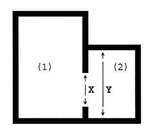
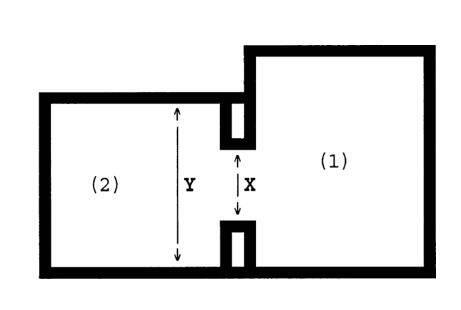

# Beleidsboek Waarderingsstelsel zelfstandige woonruimte

## Hoofdstuk 1 - Basisinformatie woningwaardering van een zelfstandige woonruimte

Dit beleidsboek gaat over de waardering van een zelfstandige woonruimte. Hiervoor heeft de Huurcommissie dit beleidsboek opgesteld.

In dit eerste hoofdstuk staat uitgelegd wanneer sprake is van zelfstandige woonruimte (paragraaf 1.4). Dit is belangrijke informatie omdat er verschillende waarderingsregels gelden voor zelfstandige woonruimte, voor onzelfstandige woonruimte (zoals een kamerwoning), voor woonwagens en/of standplaatsen.

Dit hoofdstuk begint met algemene uitleg over het woningwaarderingsstelsel (paragraaf 1.1 en 1.2). In paragraaf 1.3 staat uitleg over de verschillende soorten huursectoren: de sociale, midden- en vrije sector en hoe voor woningen in de verschillende sectoren verschillende (waarderingss-)regels kunnen gelden. Tot slot staat in dit hoofdstuk uitleg over de jaarlijkse wijzigingen van huurprijzen en andere waardes die worden gebruikt bij de woningwaardering (paragraaf 1.5).

### 1.1 Het woningwaarderingsstelsel

De waardering van een zelfstandige woonruimte gebeurt volgens het woningwaarderingsstelsel. De wetelijke basis voor dit stelsel ligt in de Uitvoeringswet huurprijzen woonruimte (hierna: Uhw) en het Besluit huurprijzen woonruimte (hierna: Bhw). De waardering van de kwaliteit van een woonruimte vindt plaats volgens het stelsel dat opgenomen is in Bijlage I van het Bhw.[^1]

_Dwingend stelsel_  
Het woningwaarderingsstelsel is een **dwingend stelsel**. Dat betekent dat het verplicht toegepast moet worden. Voor de Huurcommissie heeft de wetgever wel een uitzondering gemaakt. De wetgever biedt de Huurcommissie namelijk de mogelijkheid om van het woningwaarderingsstelsel af te wijken. De Huurcommissie heeft dus een **afwijkingsbevoegdheid**[^2] . De Huurcommissie is bevoegd om af te wijken als de aard van de woonruimte daar aanleiding toe geeft. De Huurcommissie gaat hier terughoudend mee om.

[^1]: Artikel 5 Bhw.
[^2]: Zie voetnoot 1.

### 1.2 De vaststelling van de maximale huurprijs

Met de regels van dit beleidsboek bepaalt de Huurcommissie wat de maximale huurprijs is voor een zelfstandige woonruimte. Het puntenantal van de woonruimte bepaalt (samen met de eventuele prijsopslagen) de maximale huurprijs. De maximale huurprijs per puntenantal wordt elk jaar opnieuw vastgesteld door de Minister van Volkshuisvesting en Ruimtelijke Ordening.

De maximale huurprijs is de hoogste huurprijs die voor de woonruimte gevraagd mag worden door een verhuurder. Dit noemen wij huurprijsbescherming. Hoe meer punten een woonruimte heeft, hoe hoger die huurprijs mag zijn.

### 1.3 Huurprijsbescherming van verschillende huursectoren

Niet alle zelfstandige woningen hebben recht op huurprijsbescherming. Dit hangt af van de huursector en het huurregime dat van toepassing is.

#### 1.3.1 De verschillende huursectoren

Om te bepalen of de huurprijsbeschermingsregels en welke waarderingsregels van toepassing zijn, moet eerst gekeken worden naar de <u>afsluitdatum</u> van de huurovereenkomst. Het gaat dus niet om de datum waarop het contract is opgesteld of ingaat, maar om de datum waarop de beide handtekeningen (van huurder en verhuurder) zijn gezet.

Voor de huurcontracten die zijn ondertekend op of na 1 juli 2024 zijn er 3 huursectoren: de sociale sector, de middensector en de vrije sector. De indeling van de huursectoren is per 1 januari 2026 als volgt:

| Sector            | Huurprijs                                                          | Bijbehorend  puntenaantal   |
|-------------------|--------------------------------------------------------------------|-----------------------------|
| Sociale sector    | Maximaal € 932,93                                                  | t/m 143 punten              |
| Sociale huurgrens |                                                                    |                             |
| Middensector      | Hoger dan € 932,93 maar maximal € 1.228,07  of  144 t/m 186 punten |                             |
| Vrije sector      | Hoger dan € 1.228,07                                               | 187 punten en meer          |

Deze indeling betekent dat huurders met een maximale huurprijs tot en met 186 punten aanspraak kunnen maken op huurprijsbescherming. Maar, dit geldt niet in alle gevallen. Dit wordt hieronder nader uitgelegd.

#### 1.3.2 Huurcontracten afgesloten vóór 1 juli 2024

Bij huurcontracten die zijn ondertekend vóór 1 juli 2024 wordt de huursector bepaald op basis van de aanvangshuurprijs: de huurprijs die huurder en verhuurder hebben afgesproken bij het sluiten van de huurovereenkomst. Op basis van deze aanvangshuurprijs valt de woning in de sociale sector of de vrije sector. De scheiding tussen deze sectoren wordt gevormd door de toenmalige liberalisatiegrens: de liberalisatiegrens die geldig is op de datum dat het huurcontract is afgesloten (ondertekend).

Als de huurprijs boven het bedrag van de liberalisatiegrens ligt, dat is de woonruimte onderdeel van de vrije sector. Ligt de huurprijs onder de liberalisatiegrens, dan valt de woonruimte in de sociale sector. Als een woning behoort tot de sociale sector dan kan een huurder aanspraak maken op huurprijsbescherming. Als een woning behoort tot de vrije sector dan kan dit slechts in heel beperkte gevallen.

_Schema 1.1: beoordeling van de huursector_  
Dat een woonruimte op basis van de aanvangshuurprijs in een bepaalde huursector valt staat los van het feit dat partijen een procedure kunnen starten als omschreven in hoofdstuk 3 en de huursector op basis van die procedures kan veranderen.

#### 1.3.3 Uitzonderingen op de hoofdregel

In slechts twee gevallen kan de nieuwe sectorindeling toch van toepassing zijn bij een huurcontract met een afsluitdatum vóór 1 juli 2024, namelijk bij:

1. Een huurcontract dat vóór 1 juli 2024 is afgesloten, maar voor een woonruimte die toen ook al behoorde tot de sociale sector (wat al in de sociale sector viel blijft in de sociale sector) of;
2. Een huurcontract dat vóór 1 juli 2024 is afgesloten met een geliberaliseerde huurprijs, maar waarbij de woning op basis van het puntenaantal eigenlijk in de sociale sector valt.[^3] Zie hiervoor hoofdstuk 3.2.

[^3]: Dit geldt dus niet als sprake is van een vóór 1 juli 2024 afgesloten huurcontract met een geliberaliseerde huurprijs, waarbij het puntenaantal van de woonruimte of op basis van de maximaal redelijke huurprijs in de nieuwe middensector valt.

#### 1.3.4 Toepassing wonigwaarderingsstelsels geldig op de peildatum

Welk woningwaarderingsstelsel van toepassing is, hangt af van de peildatum van het ingediende verzoek per procedure. Wat die peildatum per procedure is, wordt toegelicht in hoofdstuk 3.

De toepassing van het woningwaarderingsstelsel is gekoppeld aan kalenderjaren. Dit betekent dat voor een woningwaardering in een procedure: als de peildatum van de procedure ligt op of na 1 januari 2026, dan geldt het woningwaarderingsstelsel dat geldig is per 1 januari 2026. Ligt de peildatum op of na 1 januari 2025, dan geldt het woningwaarderingsstelsel dat gold per 1 januari 2025 enzovoort.

#### 1.3.5 Uitzonderingssituaties rondom de inwerkingtreding van de Wet betaalbare huur

In 2024 zijn de regels tussentijds gewijzigd met de Wet betaalbare huur. Daarom gelden de volgende aanvullende toepassingsregels:

- ligt de peildatum van de procedure vóór 1 juli 2024, dan geldt het woningwaarderingsstelsel dat gold vóór 1 juli 2024.
- ligt de peildatum van de procedure op of na 1 juli 2024, dan geldt het woningwaarderingsstelsel van 1 juli 2024 tot 1 januari 2025. In uitzonderlijke gevallen wordt het nieuwe woningwaarderingsstelsel (van na 1 juli 2024 en verder) toegepast, terwijl de huurovereenkomst is afgesloten (ondertekend) vóór 1 juli 2024. Dit kan bijvoorbeeld voorkomen in de procedure 'toetsing huurverlaging op grond van punten' of bij de procedure 'toetsing van de aanvangshurprijs', zoals in het onderstaande voorbeeld toegelicht.

{==

**VOORBEELD**  
Een huurder en verhuurder sloten op 1 mei 2024 een tijdelijke huurovereenkomst van maximaal 2 jaar af, zoals bedoeld in de Wet Doorstroming Huurmarkt. De ingangsdatum van deze huurovereenkomst is 1 juli 2024. De huurder dient vervolgens op tijd een verzoek in tot toetsing van de aanvangshuurprijs. Omdat de ingangsdatum op 1 juli 2024 ligt, moet het nieuwe woningwaarderingsstelsel (geldig vanaf 1 juli 2024) worden toegepast, ondanks dat de huurovereenkomst vóór 1 juli 2024 is afgesloten.

==}

### 1.4 Zelfstandige woonruimte of onzelfstandige woonruimte

Voor het waarderen van de woonruimte is het belangrijk om vast te stellen of er sprake is van een zelfstandige woonruimte. Het Bhw heeft een definitie gegeven van een zelfstandige woonruimte. Deze definitie is:

_"Onder een woonruimte welke een zelfstandige woning vormt, wordt een woonruimte verstaan als bedoeld in artikel 7:234 van het Burgerlijk Wetboek, welke wordt bewoond door maximaal twee personen of welke wordt bewoond door drie of meer personen die een duurzame gemeenschappelijke huishouding hebben. (...)."_[^4]

> [!TIP]
> Om een woonruimte als zelfstandige woning te waarderen, dient dit aangegeven te worden in het attribuut `woningwaarderingstelsel`:
> /// tab | JSON
>
```json

```
>
> ///
> /// tab | Python
>
```python

```
>
> ///

#### De toepassing van de definitie van zelfstandige woonruimte

De Huurcommissie toetst drie (hoofd)vragen om te beoordelen of sprake is van een zelfstandige (of onzelfstandige) woonruimte. Die vragen zijn de volgende:

- Voldoet de woonruimte aan de eisen van artikel 234 van bek 7 het BW?
- Wordt de woonruimte bewoond door maximaal twee personen?
- Wordt de woonruimte bewoond door drie of meer personen met een duurzame gemeenschappelijke huishouding?

Het verdient nadrukkelijk aanbeveling de volgorde van deze vragen aan te houden bij het beantwoorden van de vraag of sprake is van zelfstandige of onzelfstandige woonruimte.

##### 1. Voldoet de woonruimte aan de eisen van artikel 7:234 BW?

In dit wetsartikel staat dat sprake is van een zelfstandige woonruimte als de woonruimte voldoet aan een aantal fysieke kenmerken, namelijk een **eigen toegang** en dat de bewoner deze kan gebruiken zonder daarbij afhankelijk te zijn van **wezenlijke voorzieningen** buiten de woning. Dit staat dus los van de vraag door wie de woonruimte wordt bewoond. Die wezenlijke voorzieningen zijn ten minste:

1. één vertrek;
2. een kookgelegenheid: een aanrecht, aan- en afvoer van water en ten minste één aansluitpunt voor koken op gas of elektriciteit;
3. een wasgelegenheid, waartoe ook een douchecabine in een vertrek of 'en suite' behoort;
4. een eigen toilet.

Voldoet een woonruimte aan de bovenstaande eisen? Dan volgt daaruit <u>niet</u> automatisch dat er sprake is van een zelfstandige woonruimte. Er moet namelijk ook een oordeel gevormd worden over de tweede hoofdvraag.

[^4]: Artikel 1 lid 2 Bhw.

_Geen eigen toegang of wezenlijke voorzieningen_  
Beschikt een woonruimte niet over een eigen toegang en/of (één van) deze wezenlijke voorzieningen, dan is geen sprake van een zelfstandige woonruimte. De woonruimte is dan onzelfstandig. Deze woonruimte kan gewaardeerd worden met het [beleidsboek onzelfstandige woonruimte](https://www.huurcommissie.nl/support/beleidsboeken/waarderingsstelsel-onzelfstandige-woonruimte).

_Onvrije zelfstandige woonruimte_  
Beschikt een huurder zelf over de wezenlijke voorzieningen, maar kunnen deze alleen bereikt worden via een gemeenschappelijke verkeersruimte, dan is alsnog aan de eisen van artikel 7:234 BW voldaan. Zulke woonruimtes worden ook wel de 'onvrije zelfstandige woningen' genoemd. Het gaat bijvoorbeeld om een woonruimte waarbij de badkamer (als wezenlijke voorziening) bereikbaar is via een met andere bewoners gedeelde gang (de gemeenschappelijke verkeersruimte), maar waarbij die badkamer enkel voor die ene huurder ter beschikking is gesteld.

##### 2. Wordt de woonruimte bewoond door maximaal twee personen?

Als de woonruimte, die voldoet aan de eisen van artikel 7:234 BW, wordt bewoond door twee personen, dan is in de regel sprake van een zelfstandige woonruimte. In deze situatie zal de Huurcommissie in principe geen verdere toets doen.

Maar, als partijen het oneens zijn over de vraag of sprake is van een zelfstandige of onzelfstandige woonruimte, zal de commissie op zitting beoordeelen wel type woonruimte en daarmee welk woningwaarderingssysteem van toepassing is. Daarbij neemt de commissie de omstandigheden van het concrete geval als uitgangspunt.

Wordt de woonruimte door drie of meer personen bewoond? Dan kan nog geen conclusie worden getrokken, maar moet nog een oordeel over de volgende hoofdvraag worden gevormd.

##### 3. Wordt de woonruimte bewoond door drie of meer personen met een duurzame gemeenschappelijke huishouding?

Als een woning door drie of meer personen wordt bewoont, dan moet sprake zijn van een duurzame gemeenschappelijke huishouding om de woning te waardenen als zelfstandige woonruimte.

Het antwoord op deze derde vraag bestaat dus uit twee delen. Eerst moet beoordeeld worden of sprake is van een duurzame gemeenschappelijke huishouding. Vervolgens kan geconcludeerd worden of de woonruimte een zelfstandige of onzelfstandige woonruimte is.

Als er sprake blijkt van een duurzame gemeenschappelijke huishouding, dan wordt de woonruimte als zelfstandig aangemerkt. Is geen sprake van duurzame gemeenschappelijke huishouding, dan is de woonruimte onzelfstandig.

_Duurzame gemeenschappelijke huishouding_  
De vraag of sprake is van een duurzame gemeenschappelijke huishouding, kan door de commissie op zitting aan de hand van de volgende stappen worden beantwoord. Daarbij wordt eerst naar de feitelijke situatie gekeken.

_Koppel met een relatie of een gezin_  
Bij een koppel met een relatie of een gezin wordt aangenomen dat sprake is van een duurzame gemeenschappelijke huishouding. Bij zo'n relatie zal, vanwege het oordeel dat in die situatie sprake is van een duurzame gemeenschappelijke huishouding, vervolgens vastgesteld kunnen worden dat de woonruimte kwalificeert als zelfstandige woonruimte.

Is de onderlinge relatie anders, dan moet naar de volgende situatie(s) worden gekeken.

_Duurzame woongroep_  
Van een duurzaam gemeenschappelijk huishouden, zonder een affectieve relatie als bij een gezin, kan ook sprake zijn bij een duurzame (dus niet qua samenstelling losse, maar bestendige) woongroep. Zo kan bijvoorbeeld een religieuze woongroep een duurzame woongroep zijn. De conclusie dat sprake is van een duurzaam gemeenschappelijk huishouden moet duidelijk worden gemotiveerd. Als er sprake van een duurzame gemeenschappelijke huishouding, dan volgt daaruit de conclusie dat sprake is van een zelfstandige woonruimte. Gaat het <u>niet</u> om een duurzaam gemeenschappelijk huishouden, dan wil dat nog niet zeggen dat sprake is van onzelfstandige woonruimte, maar geldt het hierna volgende.

_Alle andere situaties_  
In alle andere situaties wordt op basis van het concrete, individuele geval beoordeeld of sprake is van een duurzame gemeenschappelijke huishouding. Daarbij is het relevant of men de bedoeling heeft om bestendig en voor onbepaalde tijd een huishouden te voeren, zo blijkt mede uit de, op civiele rechtspraak gebaseerde, vaste rechtspraak van de Afdeling Bestuursrechtspraak van de Raad van State.

In lijn met de toelichting van de Minister op het Bhw als bij de beantwoording van Kamervragen over dit onderwerp, beantwoordt de Huurcommissie de of er sprake is van een duurzame gemeenschappelijke huishouding, aan de hand van haar bestaande uitvoeringspraktijk. Deze bestaande uitvoeringspraktijk houdt in dat de Huurcommissie, in lijn met de jurisprudentie uit het privaatrecht, kijkt naar de objectieve (zoals de duur van de overeenkomst) en subjectieve (zoals de bedoeling van partijen bij aangaan van de overeenkomst) factoren, als ook alle feiten en omstandigheden van het geval in onderlinge samenhang bezien.

De Huurcommissie kijkt dus niet alleen naar (de tekst van) de huurovereenkomst. Relevant zijn ook de feiten en omstandigheden van het geval, ook die bij de totstandkoming van de overeenkomst en hetgeen partijen voor ogen stond. Als zich bijvoorbeeld de situatie voordoet dat de praktijk afwijkt van hetgeen in de huurovereenkomst staat, dan hoeft hetgeen is overeengekomen dus niet per definitie de doorslag te geven. Vragen die bij de beoordeling een rol kunnen spelen zijn onder meer:

- Woonden de huurders al eerder - direct voorafgaand aan het huren van de onderhavige woonruimte - in een andere zelfstandige woning samen als groep?
- Kenden de huurders elkaar al voorafgaand aan het sluiten van de huurovereenkomst?
- Zochten de huurders gezamenlijk een woonruimte en wilden zij ook echt één woonruimte delen? Of ligt het initiatief bij verhuurder?
- Heeft de verhuurder de ruimtes als één geheel of per kamer geadverteerd?
- Worden in de huurovereenkomst kamernummers vermeld?
- Zijn de ruimtes voorzien van een eigen (huis)nummer of andere specifieke duiding?
- Worden ruimtes in het contract of in de praktijk door verhuurder specifiek toegewezen aan een huurder?
- Kunnen huurders zelf een ruimte kiezen die zij gebruiken of wordt aan een huurder het specifieke gebruiksrecht voor een ruimte door verhuurder toegekend?
- Kan het gebruik van de ruimtes wisselend plaatsvinden of moeten dan bijvoorbeeld het contract of de feitelijke huurbetaling aangepast worden?
- Kunnen de toegangsdeuren tot de afzonderlijke ruimtes op slot?
- Staat in de huurovereenkomst één huurprijs of wordt deze verdeeld over de afzonderlijke ruimtes met voor elke ruimte een eigen bedrag?
- Verdelen de huurders de huurprijs onderling of heeft verhuurder dat (mede) bepaald?
- Wordt de huurprijs in één keer door één huurder betaald of betaalt iedere huurder voor zichzelf direct aan verhuurder?
- Zijn de huurders hoofdelijk aansprakelijk?
- Als een huurder vertrekt, bepalen dan de achterblijvende huurders wie de nieuwe medebewoner wordt?
- Hebben de huurders inspraak of een vetorecht als er wegens vertrek van een huurder een nieuwe medebewoner gezocht wordt door de verhuurder?
- Hebben de huurders een gezamenlijke rekening (voor de huurbetaling)?
- Doen de huurders boodschappen gezamenlijk, voor elkaar of is het ieder voor zich?

**LET OP:** deze vragen dienen als voorbeeld. Afhankelijk van de concrete situatie kunnen vragen niet aan bod komen of worden andere vragen toegevoegd c.q. aanvullende punten in overweging genomen. Dit is voorbehouden aan de zittingscommissie die de desbetreffende zaak behandelt.

_Conclusie_  
Wordt aan de hand van de toets op de criteria na bevraging van partijen tijdens de zitting in een individueel geval vastgesteld dat sprake is van een duurzame gemeenschappelijke huishouding? Dan kan vervolgens geconcludeerd worden dat sprake is van een zelfstandige woonruimte. Blijkt geen sprake te zijn van een duurzame gemeenschappelijke huishouding? Dan luidt de opvolgende conclusie dat voor de toepassing van het woningwaarderingsstelsel sprake is van een onzelfstandige woonruimte.

Een huurder kan in principe niet eenzijdg zorgen voor een andere classificatie van de huurwoning door bijvoorbeeld zonder toestemming van verhuurder de huurwoning onder te verhuren of iemand anders te laten intrekken. Heeft een verhuurder hier echter mee ingestemd, dan kan dit wel een effect hebben op de kwalificatie van de woonruimte en daarmee de toepasselijkheid van het woningwaarderingsstelsel.

### 1.5 Jaarlijkse indexatie huurprijsgrenzen en maximale huurprijzen

In de voorgaande paragrafen wordt gesproken over de maximale huurprijzen en verschillende huurprijsgrenzen. De hieraan gekoppelde bedragen en de kengetallen die gebruikt worden bij de berekening van het puntenantal voor de WOZ-waarde worden jaarlijks geïndxeerd.

#### 1.5.1 De liberalisatiegrens

De liberalisatiegrens werd vanaf 1 januari 2011 jaarlijks per 1 januari opnieuw vastgesteld. Voor 2011 liep een jaargang van 1 juli tot 1 juli. Een overzicht van de liberalisatiegrenzen vanaf 1989 is te vinden in Bijlage 2 van dit beleidsboek.

#### 1.5.2 De socialesectorgrens en vrijesectorgrens

De indexatie van de socialesectorgrens en vrijesectorgrens vindt jaarlijks per 1 januari plaats. Een overzicht van de sociale- en vrijesectorgrenzen zijn te vinden in Bijlage 2 van dit beleidsboek.

#### 1.5.3 De maximale huurprijzen

De maximale huurprijzen worden elk jaar per 1 januari geïndxeerd, zodat deze gelijk valt met de hiervoor beschreven indexaties.[^5] Een overzicht van de maximale huurprijzen per 1 januari 2026 is te vinden in Bijlage 3 van dit beleidsboek.

[^5]: Vóór 1 juli 2024 werden de maximale huurprijzen jaarlijks per 1 juli van elk kalenderjaar geïndxeerd.

## Hoofdstuk 2 - Het woningwaarderingstelsel voor een zelfstandige woning

In dit hoofdstuk wordt toegelicht waarvoor een zelfstandige woning punten kan krijgen, wanneer er een prijsopslag van toepassing is en hoe de Huurcommissie in de praktijk met de regels omgaat. Zo wordt duidelijk welke voorwaarden gelden en hoe de maximale huurprijs uiteindelijk wordt berekend.

De waardering vindt plaats per thema of categorie, de zogenoemde rubrieken. Er zijn 12 rubrieken. In paragraaf 1 staan de algemene regels die gelden bij de woningwaardering. In de paragrafen 2.1 tot en met 2.12 staan de regels per rubriek uitgewerkt. Tot slot staat in paragraaf 13 uitgelegd welke toeslagen bovenop de maximale huurprijs mogelijk zijn.

### 2.1 Algemene regels over de woningwaardering

#### 2.1.1 Waardering van de woning als onroerende zaak

Bij de woningwaardering geldt de algemene regel dat alleen de (gemeenschappelijke) vertrekken, overige ruimten en voorzieningen die tot de onroerende zaak behoren met punten worden gewaarderd. Een onroerende zaak is een gebouw of constructie die duurzaam met de grond is verbonden. Een woning is dus een voorbeeld van een onroerende zaak.

Daarnaast komt in dit beleidsboek het begrip 'onroerende aanhorigheden voor'. Een onroerende aanhorigheid komt voor waardering in aanmerking omdat het onderdeel is van de woning (als onroerende zaak). Van onroerende aanhorigheden is sprake als het gaat om voorzieningen die:

- naar hun aard onlosmakelijk met de gehuurde woning zijn verbonden, of;
- volgens de huurovereenkomst deel uitmaakt van de woning.

Of een voorziening naar zijn aard onlosmakelijk met de gehuurde woning is verbonden, wordt mede beoordeeld aan de hand van twee criteria uit artikel 4 van Boek 3 van het BW. Het gaat om:

1. voorzieningen die volgens de verkeersopvatting (de algemeen gangbare mening) onderdeel uitmaken van een zaak of;
2. voorzieningen die zodanig verbonden zijn met een zaak dat zij niet zonder beschadiging van betekenis kunnen worden losgemaakt.

De vraag of iets een onroerende aanhorigheid is kan bij verschillende onderdelen van de woningwaardering van belang zijn. Zoals bij de rubriek verwarming en verkoeling (rubriek 3), keuken (rubriek 5), gemeenschappelijke ruimtes (rubriek 9) en gemeenschappelijke parkeerplaatsen (rubriek 10). Waar nodig wordt nader uitleg gegeven.

#### 2.1.2 Algemene regel: waardering van de door verhuurder aangebrachte voorzieningen

De algemene regel is dat alleen de voorzieningen die de verhuurder heeft aangebracht voor waardering in aanmerking komen. Voorzieningen die de bewoner onverplicht en voor eigen rekening heeft aangebracht (de zogenaamde 'zelf aangebrachte voorzieningen') worden niet met punten gewaardeerd, tenzij de verhuurder een vergoeding heeft verstrekt voor de zelfaangebrachte voorziening.

#### 2.1.3 Algemene regel: waardering van voorzieningen niet afhankelijk van functioneren

Voor de waardering volgens het woningwaarderingstelsel is noodzakelijk dat de voorzieningen zijn ingebouwd en door de verhuurder zijn aangebracht, zoals in de paragraven hierboven toegelicht. Het functioneren van de voorziening is bij de woningwaardering niet relevant. Wel kan er dan mogelijk sprake zijn van een ernstig onderhoudsgebrek.

#### 2.1.4 Algemene rekenregel: afronding per rubriek

Het totaal aantal punten wordt per rubriek afgerond op 0,25 punt, waarbij vanaf een achtste (1/8) punt naar boven wordt afgerond. Dat wil zeggen dat 0,125 wordt afgerond naar 0,25. Een kwartpunt is de kleinst werkbare waardering binnen het woningwaarderingstelsel voor een afzonderlijke rubriek.

#### 2.1.5 Algemene rekenregel: eindsaldering op hele punten

Het totale puntenantal voor de woonruimte wordt berekend door eerst alle punten per rubriek bij elkaar op te tellen (inclusief de punten voor de gemeenschappelijke ruimten en voorzieningen). Het totaal moet daarna worden afgerond op hele punten. Bij 0,5 punten of meer wordt afgerond naar boven op hele punten, bij minder dan 0,5 punten wordt afgerond naar beneden op hele punten.

De toeslag van 35% bij zorgworingen wordt toegepast op het puntentotaal van de rubrieken 1 t/m 11.1 van het Bhw en pas daarna afgerond.

{==

**VOORBEELD**  
Een woning krijgt in rubriek 8 een puntenantaal van 4,81. In dit geval wordt afgerond op 4,75 punten en niet 5,00 punten. De reden is dat tussen 4,81 en 4,75 geen verschil zit van 0,125 punt - ofwel 1/8 punt. Er is dus geen afronding op een 0,25 punt naar boven. Er wordt daarom afgerond op 0,25 punt naar beneden.

==}

#### 2.1.6 Algemene rekenregel: aparte berekening bij meer dan 250 punten

Bij een woonruimte met m é er dan 250 punten wordt de maximale huurprijs als volgt berekend: elk punt boven de 250 wordt vermenigvuldigd met het verschil tussen de bedragen, genoemd in de huurprijstabel (zie Bijlage 3) bij 249 en 250 punten. Het verkregen bedrag wordt vervolgens opgeteld bij de maximale huurprijs die volgens de huurprijstabel behoort bij 250 punten.

{==

**VOORBEELD**  
Een zelfstandige woning wordt gewaardeerd met 255 punten. Bij een puntenaantal van 250 hoort een maximale huurprijs van € 1.608,68 (prijspeil 1 januari 2025). Maar het puntenaantal voor de woning ligt vijf punten hoger. Dit verschil van vijf punten dient te worden vermenigvuldigd met het verschil tussen de bedragen die correspondeerden met 249 en 250 punten. Dat verschil bedraagt in dit geval: € 6,62 (€ 1.608,68 - € 1.1602,06 =). De verhoging op de maximale huurprijs is in dit geval € 33,10 (€ 6,62 x 5). De maximale huurprijs bedraagt dus € 1.641,78 (€ 1.608,68 + € 33,10).

==}

### 2.2 Rubriek 1 en 2: vertrekken en overige ruimten

Binnen het woningwaarderingstelsel is sprake van drie soorten binnenruimten, namelijk vertrekken, overige ruimten en verkeersruimten. Dit onderscheid is belangrijk omdat de waardering per soort ruimte verschilt. Vertrekken en overige ruimten worden gewaardeerd onder [rubriek 1 en 2](#22-rubriek-1-en-2-vertrekken-en-overige-ruimten). Gemeenschappelijke ruimten worden gewaardeerd onder [rubriek 9](#29-rubriek-9-gemeenschappelijke-vertrekken-overige-ruimten-en-voorzieningen).

_Buiten de woning, maar in het woongebouw_  
Er kan sprake zijn van vertrekken, overige ruimten (en bijbehorende voorzieningen, zoals verwarming, keuken en sanitair) die buiten de woning, maar wel binnen het woongebouw liggen. Als derden deze ruimte of voorziening niet kunnen gebruiken, bijvoorbeeld omdat de ruimte is afgesloten met een slot, dan worden deze meegeteld in de waardering.

#### 2.2.1 Vertrekken

{==

1 punt per m² per vertrek

==}

Voorbeelden van vertrekken zijn een woonkamer, hobby- en/of studeerkamer, staapkamer en eetkamer die voldoen aan de gestelde eisen. Daarnaast geldt dat een ruimte die uitsluitend als keuken, badkamer of douchehumte is bestemd <u>altijd</u> een vertrek is. Een vertrek wordt gewaardeerd met 1 punt per vierkante meter in rubriek 1.

In deze paragraaf staat hoe het aantal vierkante meters per vertrek moet worden bepaald en aan welke eisen een vertrek moet voldoen.

##### 2.1.1.1 Afronden op hele m²

De waardering van vertrekken wordt gebaseerd op hele vierkante meters. Om tot die hele vierkante meters te komen, geeft het Bhw nadere instructies.

- Meet elk vertrek apart.
- Noteer de uitkomst op 2 decimalen (bijv. 12,38 m²).
- Tel de uitkomsten van alle vertrekken samen bij elkaar op. Bij een getal dat eindigt op 0,50 m² wordt afgerond omhoog. Bijvoorbeeld: 28,51 m² wordt 29 m² Als het getal eindigt op 0,49 m² of lager wordt naar beneden afgerond. Bijvoorbeeld: 15,43 m² wordt 15 m².

{==

**VOORBEELD**  
Een woonruimte heeft een kamer van 3,75 meter lang en 4,12 meter breed. Daarnaast is een keuken aanwezig van 2,95 meter bij 3,81 meter. Het berekenen van het puntenantal gaat dan als volgt:

Kamer: 3,75 x 4,12 = 15,4912 m², afgerond op 2 decimalen: 15,49 m²  
Keuken: 2,95 x 3,81 = 11,2395 m², afgerond op 2 decimalen: 11,24 m²

==}

##### 2.2.1.2 De voorwaarden van een vertrek

> [!NOTE]
>
> - De gespecificeerde ruimtesoort is leidend bij de waardering van een ruimte. Een ruimte dient `Ruimtesoort` `vertrek` te hebben om in aanmerking te komen voor een waardering in de rubriek 'Oppervlakte van vertrekken'.
> - Een ruimte dient alleen als vertrek gespecificeerd te worden wanneer deze voldoet aan alle onderstaande eisen. De doorgehaalde eisen worden niet door het systeem gecontroleerd.
> - Wanneer een ruimte met `Ruimtesoort` `vertrek` niet voldoet aan de minimale oppervlakte, wordt er gekeken of de ruimte gewaardeerd kan worden onder de rubriek 'Oppervlakte van overige ruimten'.

Een ruimte wordt als een vertrek gewaardeerd als deze voldoet aan alle van de volgende eisen:

1. ~~de vloer moet begaanbaar zijn~~;
2. ~~de muren (wanden) moeten uit vast materiaal te bestaan~~;
3. de ruimte moet:
    - ~~over ten minste 80% van de langste zijde ten minste 1,50 meter breed zijn~~;
    - minimaal 4,00 m² groot zijn (een oppervlakte van 3,50 m² of 3,95 m² is onvoldoende);
    - ~~een vrije hoogte hebben van minimaal 2,10 meter (gemeten vanaf de vloer tot het zichtbare plafond, waarbij het eventuele balkon onder het zichtbare plafond buiten beschouwing blijft), over ten minste 50% van de oppervlakte of over een oppervlakte van 11 m²~~;
    - ~~ten minste 0,50 m² aan de buitenlucht grenzend transparent oppervlak te hebben (bijvoorbeeld een raam of deur met vensters)~~;
    - ~~beschikken over ventilatie die direct met de buitenlucht is verbonden~~;
    - ~~voorzien zijn van ten minste één stopcontact en één lichtpunt~~.

##### 2.2.1.3 Zolderruimte als vertrek

Een zolderruimte kan worden gewaardeerd als een vertrek of een overige ruimte. Om een zolderruimte als vertrek te kunnen aanmerken moet deze aan 2 extra eisen voldoen:

1. de zolderruimte moet bereikbaar zijn via een vaste trap en
2. ~~het dak van de zolderruimte moet beschoten zijn. Dat betekent dat het dak aan de binnenkant is afgewerkt, waardoor de dakconstructie is afgesloten en de binnenzijde niet open ligt (en er bijvoorbeeld geen dakpannen zichtbaar zijn)~~.

##### 2.2.1.4 Aangrenzende ruimten met een open doorgang

Het kan voorkomen dat twee vertrekken (of overige ruimten) die met elkaar in verbinding staan, als één vertrek (of overige ruimte) gewaardeerd moeten worden. Dat is het geval als tussen de twee vertrekken (of overige ruimten) er een niet afsluitbare opening is die:

- breder is dan 50% van de muur waarin die opening zit en
- minimaal 0,85 meter breed en 2 meter hoog is.
- De muur in het vertrek (of de overige ruimte) waar de tussenwand het smalst is dient als uitgangspunt te worden gemeten.

Hieronder twee voorbeelden:

{==

**VOORBEELD 1**  
Als de lengte van de doorgang (X) breder is dan 50% van de lengte van Y, dan zijn ruimten 1 en 2 samen één vertrek of overige ruimte.



==}

{==

**VOORBEELD 2**  
Als de lengte van de doorgang (X) minder is dan 50% van de length van Y, dan zijn ruimten 1 en 2 beiden afzonderlijk een vertrek of overige ruimte. Let op: als zich in de opening een (deur)omlijsting bevindt, dan wordt gesproken van twee (afzonderlijke) ruimten en geldt deze situatie dus niet.



==}

#### 2.2.2 Overige ruimten

{==

0,75 punt per m²

==}

> [!TIP]
> Dit voorbeeld toont de minimale gegevens voor waardering van de oppervlakte van overige ruimten
> /// tab | JSON
>
```json

```
>
> ///
> /// tab | Python
>
```python

```
>
> ///

Een overige ruimte is bijvoorbeeld een bijkeuken, berging, wasruimte, kelder of toiletruimte die voldoet aan de voorwaarden van een overige ruimte. Een overige ruimte wordt gewaardeerd met 0,75 punt per m² in rubriek 2.

In dit hoofdstuk staat hoe het aantal vierkante meters per overige ruimte moet worden bepaald en aan welke eisen een overige ruimte moet voldoen.

##### 2.2.2.1 Afronding op hele m²

De waardering van overige ruimten wordt (net als de vertrekken) gebaseerd op hele vierkante meters. Om tot die hele vierkante meters te komen geeft het Bhw nadere instructies.

- Meet elke overige ruimte apart.
- Noteer de uitkomst op 2 decimalen (bijv. 12,38 m²).
- Tel de uitkomsten van alle overige ruimten samen bij elkaar op. Als het getal op 0,50 m² of meer eindigt: rond af omhoog. Bijvoorbeeld: 28,51 m² → wordt 29 m². Als het getal op minder dan 0,50 m² eindigt: rond af naar beneden. Bijvoorbeeld: 15,43 m² → wordt 15 m².

##### 2.2.2.2 De voorwaarden van een overige ruimte

> [!NOTE]
>
> - De gespecificeerde ruimtesoort is leidend bij de waardering van een ruimte. Een ruimte met `Ruimtesoort` `overige ruimte` komt in aanmerking voor waardering in de rubriek 'Oppervlakte van overige ruimten' als de oppervlakte minimaal 2 m² is.
> - Een ruimte met `Ruimtesoort` `vertrek` komt in aanmerking voor waardering in de rubriek 'Oppervlakte van overige ruimten' als de oppervlakte minder dan 4 m² en minimaal 2 m² is.
> - Een ruimte dient alleen als overige ruimte gespecificeerd te worden wanneer deze voldoet aan alle onderstaande eisen. De doorgehaalde eisen worden niet door het systeem gecontroleerd.

Een ruimte wordt als overige ruimte gewaardeerd als deze voldoet aan alle van de volgende eisen:

1. ~~De vloer moet begaanbaar zijn;~~
2. De ruimte moet een minimale oppervlakte van 2,00 m² hebben (1,95 m² voldoet hier dus niet aan);
3. ~~De ruimte voldoet niet aan de eisen van een vertrek (zie paragraaf 2.1) of een verkeersruimte (zie paragraaf 2.3).~~

##### 2.2.2.3 Zolderruimte zonder vaste trap

Als een zolderruimte geen vertrek is maar wel als overige ruimte kan worden aangemerkt en er is <u>geen vaste trap</u> naar de zolder, dan worden er <u>5 punten afgetrokken</u>, van de waarde die aan het vloeroppervlak wordt toegekend. Maar: er kunnen nooit meer punten afgetrokken worden dan het totaal aantal punten dat de zolderruimte zelf waard is. Met andere woorden: de waarde van de zolder kan door deze aftrek niet negatief worden.

> [!NOTE]
>
> - Een zolderruimte groter dan 2m2 met het `Bouwkundigelement` `vlizotrap` wordt gewaardeerd onder `Oppervlakte van overige ruimten`, mits deze wordt ingeschoten met `ruimtesoort` `overige ruimte`.
> - Een zolderruimte groter dan 2m2 maar kleiner dan 4m2 met het `Bouwkundigelement` `trap` wordt gewaardeerd onder `Oppervlakte van overige ruimten`, mits deze wordt ingeschoten met `ruimtesoort` `overige ruimte`.
> - Zolderruimte groter dan 4m2 met het `Bouwkundigelement` `trap` wordt gewaardeerd onder `Oppervlakte van vertrekken`, mits deze wordt ingeschoten met `ruimtesoort` `vertrek`.

##### ~~2.2.2.4 Toegang ruimte via zolderruimte~~

~~Als er op zolder een ruimte is die alleen bereikbaar is via de zolderruimte, dan wordt de loopruimte die je nodig hebt om die ruimte te bereiken niet meegeteld bij de oppervlakte van de zolder. Wat dan overblijft aan zolderruimte moet minimaal 2,00 m² zijn, anders voldoet de zolderruimte niet meer aan de eisen voor de waardering van een 'overige ruimte'.~~

##### 2.2.2.5 Privé parkeerruimte

Een binnenruimte die bedbeeld is als parkeerruimte en waartoe bewoners van één adres op grond van de huurovereenkomst exclusieve toegang hebben (privé parkeerruimte), wordt gewaardeerd als overige ruimte. Een voorbeeld is een garagebox die hoort tot de woning. Is er sprake van een privé-parkeerruimte in een buitenruimte, dan wordt de ruimte gewaardeerd in rubriek 8 ('Buitenruimte').

> [!NOTE]
> De `Ruimtedetailsoort` `garage` wordt tot op heden alleen gewaardeerd als overige ruimte wanneer deze voldoet aan de voorwaarden.

#### 2.2.3 Verkeersruimten

{==

N.v.t.

==}

Verkeersruimten zijn ruimten die bedoeld zijn voor het bereiken van een andere ruimte en niet zijn bestemd om duurzaam in te verblijven. Bekende voorbeelden zijn een hal, gang of overloop. Verkeersruimten krijgen <u>geen</u> punten voor hun oppervlakte in rubriek 1 of 2.

#### 2.2.4 Meetinstructies vertrekken en overige ruimtes

> [!NOTE]
> De woningwaardering package gaat er vanuit dat de gebruiker zich houdt aan onderstaande meetinstructies voor vertrekken en overige ruimten. Met uitzondering van _Kasten_ kunnen de meetinstructies niet getoetst of berekend worden op basis van het VERA model.

In de toelichting op het woningwaarderingsstelsel geeft het Bhw een aantal meetinstructies mee. In deze paragraaf staat hoe de Huurcommissie deze instructies toepast.

~~_Binnenmaatse meting van oppervlakten van vertrekken_~~  
~~De oppervlakten van vertrekken en overige ruimtes worden door de Huurcommissie 'binnenmaats' gemeten. Het gaat dus om netto en niet om bruto oppervlakten (waarin ook binnen- en buitenmuren en verkeersruimten worden inbegrepen).~~

~~De vertrekken en overige ruimten moeten voor de woningwaardering worden opgemeten:~~

- ~~Van **muur tot muur**~~;
- ~~Op een hoogte van **1,50 meter boven de vloer**~~;
- ~~**Inclusief de oppervlakte van alle tot de ruimte behorende kasten**~~.

~~De meethoogte van 1,50 meter geldt ook als de oppervlakte afwijkt van die op het vloerniveau.~~

~~_**De volgende regels gaan over welke delen van een ruimte juist wel of niet moeten worden meegeteld bij het bepalen van de netto vloeroppervlakte van een ruimte.**_~~  

_Kasten_  
De wetgever spreekt in de toelichting van het Bhw dat alle tot de woning behorende losse en vaste kasten moeten worden meegenomen in de berekening van de oppervlakte. Voor de praktijk van de Huurcommissie betekent dit dat alle tot de verreken behorende kasten moeten worden meegerekend.

Met andere woorden: de netto oppervlakte van een kast die <u>in een vertrek</u> uitkomt, telt mee bij de oppervlakte van dat vertrek. Hoe groot of klein de kast is heeft hier geen invloed op. De plek van de deur van de kast bepaalt bij welke ruimte een kast hoor. Dat geldt ook voor het waarderen van een kastenwand tussen twee vertrekken.

~~_Vloeroppervlakte onder aanrecht, keukentoestel, wasbak en instalaties_~~  
~~Vloeroppervlakte onder aanrechten, toestellen in de keuken, badkuip, lavet of douchebak, moederhaard, cv-ketel, boilerinstallatie en radiatoren telt mee bij het bepalen van de totale oppervlakte van de ruimte. De oppervlakte van het vertrek of overige ruimte wordt dus bijvoorbeeld niet verminderd de oppervlakte van een douchecabeine.~~

~~_Gas- en/of elektrameter_~~  
~~Zit in een (kast in een) vertrek of overige ruimte een gas- en/of elektrameter, dan wordt van de gemeten oppervlakte 30 x 60 centimeter afgetrokken. Dit is de minimale afmeting van een meterkast bij bestaande bouw.~~

~~_Oppervlakte kanalen en leidingen_~~  
~~De oppervlakte die wordt ingenomen door grondleidingen (horizontale leidingen) wordt meegeteld bij het bepalen van de oppervlakte van de ruimte. Niet meegeteld wordt de oppervlakte die ingenomen wordt door:~~

- ~~verticale koven~~;
- ~~schoorsteen- en ventilatiekanalen~~;
- ~~stand- of grondleidingen (behalve horizontale leidingen)~~.

~~Bij een schoorsteenmanteel en/of rookkanaal (die naar boven of beneden breed kan uitlopen) is de oppervlakte op 1,50 meter hoogte bepalend.~~

~~_Pui_~~  
~~Bij een pui wordt de binnenzijde (het kozijn) als uitgangspunt gebruikt voor de meting.~~

~~_Erker_~~  
~~Een erker wordt meegerekend in de oppervlakte als deze aan de binnenkant een vrije hoogte heeft van ten minste 1,50 meter.~~

~~_Entresol_~~  
~~Bij een entresol (ook wel een mezzanine of tussenverdieping genoemd) wordt de oppervlakte boven én onder de entresol meegerekend, mits de entresol een vrije hoogte heeft van ten minste 1,50 meter.~~

~~_Hellend of verlaagd plafond_~~  
~~Bij een (ten dele) hellend of verlaagd plafond wordt alleen het geedeelte van de ruimte waarboven het plafond ten minste 1,50 meter hoog is meegenomen in de oppervlakteberekening.~~

~~Voor een (ten dele) hellend plafond geldt aanvullend dat de 1,50 meter hoogte loopt tot het dakbeschot, het zichtbare dakvlak of het zichtbare plafond. Met gordingen en balken wordt bij de meting geen rekening gehouden.~~

~~_Oppervlakte onder een open of gesloten vaste trap_~~  
~~Van de oppervlakte onder een open of gesloten vaste trap telt alleen mee het gedeelte waar de ruimte tussen de vloer en de onderkant van de trap ten minste 1,50 meter hoog is. De oppervlakte die door een ingeschoven liggende inschuifbare of opvouwbare trap wordt ingenomen, wordt niet meegeteld.~~

### 2.3 Rubriek 3: Verwarming en verkoeling

{==

2 punten per verwarmd vertrek  
1 punt per verwarmde overige ruimte of verkeersruimte (tot maximaal 4 punten)  
1 punt per verwarmd én verkoeld vertrek (tot maximaal 2 punten)  

==}

Vertrekken, overige ruimtes én verkeersruimtes kunnen punten krijgen als deze zijn verwarmd, namelijk 2 punten per verwarmd vertrek en 1 punt voor overige ruimtes en verkeersruimten. Voor de laatste twee soorten binnenruimten geldt een maximum van 4 punten. Daarnaast kan een vertrek ook punten krijgen als deze is verkoeld kan worden. Hiervoor geldt ook een maximum aantal van 2 punten. Voor de w ahardering gelden nadere regels die hieronder worden uitgelegd.

#### 2.3.1 Punten voor verwarmde ruimtes

Punten voor verwarming en verkoeling in een vertrek, overige ruimte of verkeersruimte worden alleen toegekend als de verwarming (of de voorziening met zowel een verwarmingsfunctie als verkoelingsfunctie) tot de woning behoort (de onroerende zaak of als onroerende aanhorigheid, zie hiervoor [paragraaf 2.1.1](#211-waardering-van-de-woning-als-onroerende-zaak). Dit is het geval bij radiatoren als deze zijn bevestigd aan de muur of in de grond. Een mobiele elektrische radiator of een mobiele airco behoort niet tot de onroerende zaak. Gevelkachels en gashaarden behoren ook niet tot de onroerende zaak. Een verdikte buis, pijp of moederhaard wordt wél gerekend tot de onroerende zaak, indien deze als zodanig bedoeld of herkenbaar is.

#### 2.3.2 Open keuken in een vertrek of overige ruimte

Vertrekken of overige ruimten die met elkaar in verbinding staan, vorden in een bepaald geval als één verwarmd vertrek of overige ruimte gewaardeerd. Dit is het geval als zich tussen die twee verwarmde vertrekken of overige ruimten een opening bevindt, die breder is dan 50% van de muur, waarin deze opening zich bevindt. Het moet hierbij gaan om een niet afsluitbare opening, die over een breedte van minimaal 0,85 meter een minimumhoogte heeft van 2,00 meter. Het voorbeeld in [paragraaf 2.2.1.4](#2214-aangrenzende-ruimten-met-een-open-doorgang) geeft dit visueel weer.

Binnen rubriek 3 van de woningwaardering wordt van de bovenstaande regel afgeweken. Zowel de open keuken als het vertrek of overige ruimte waarmee de open verbinding bestaat, wordt voor deze rubriek namelijk individueel gewaardeerd met punten indien deze verwarmd zijn. Onder een open keuken wordt hier dus verstaan een keuken die in open verbinding staat met een ander vertrek of overige ruimte, terwijl zich tussen de keuken en het andere vertrek een opening bevindt, die breder is dan 50% van de tussenmuur [paragraaf 2.2.1.4](#2214-aangrenzende-ruimten-met-een-open-doorgang). Een verwarmde woonkamer met open keuken wordt dus gewaardeerd met 4 punten.

Ook een aanrecht dat is geplaatst in een woon- of slaapvertrek is een open keuken, ook als er geen duidelijke afscheiding is tussen het keukengedeelte en de rest van het vertrek.

> [!NOTE]
> Omdat wij in de package niet (kunnen) controleren op keukenkastjes, doen wij de aanname dat elke ruimte, die van zichzelf geen keuken is, met een aanrecht langer dan 1 meter als open keuken wordt gewaardeerd voor verkoeling en verwarming

#### 2.3.3 Extra punten bij verkoelingsfunctie

De Huurcommissie waardeert 2 soorten situaties wat betreft de verkoeling van de woonruimte, namelijk:

1. woningen die zonder koeling voldoende koel kunnen blijven
2. voorzieningen in de woning met een verwarmingsfunctie én een verkoelingsfunctie

Hierbij moet rekening worden gehouden met de volgende nadere eisen:

1. **Alleen vertrekken** komen in aanmerking voor een waardering door een verkoelingsfunctie. Er kan 1 punt worden behaald per vertrek tot een maximum van 2 punten.
2. Bij een woning die zonder koeling voldoende koel kan blijven moet er een geldige energielabel zijn opgenomen volgens de NTA 8800 methode (geldig vanaf 1 januari 2021). In dit energielabel moet de koelfunctie zijn meegenomen. Een verouderd label is dus onvoldoende.
3. Centrale koelsystemen zoals omkeerbare warmtepompen, passieve koeling door een bodemlus of een WKO systeem moeten zijn voorzien zijn van vloerkoeling, lage temperatuur-radiatoren of radiatorconvectoren.
4. Bij een ander koelsysteem (onroerend aanhorig) dan hierboven genoemd, zoals een vaste airco, moet de koelingsvoorziening een productgebonden energielabel hebben van minimaal A+ (bepaald volgens de Europese Ecodesign-richtlijn) en een minimaal vermogen kunnen leveren van 100 W/m2 bij een werkingstemperatuur tot 35 graden Celsius.

### 2.4 Rubriek 4: Energieprestatie

{==

Eengezinswoning: -15 t/m 62 punten  
Meergezinswoning: -15 t/m 58 punten  

==}

> [!TIP]
> Dit voorbeeld toont de gegevens voor de waardering van de energieprestatie van een woning met een energieprestatievergoeding. De monumentale status is van belang omdat die invloed heeft op de waardering van de energieprestatie.  
> /// tab | JSON
>
```json

```
>
> ///
> /// tab | Python
>
```python
  
```
>
> ///

De energieprestatie van de woning telt mee in de woningwaardering. De energieprestatie is af te lezen in een geldig energielabel of geldige energie-index van de woning.

#### 2.4.1 Vindplaats energieprestatie woning

De energieprestatie is van een woonruimte is op te zoeken via de website [EP-online](https://www.ep-online.nl/). Door te zoeken op een postcode en huisnummer kan de energieprestatie van de woonruimte worden gevonden. De energieprestatie blijkt (ook) uit het energielabelafschrift dat wordt uitgegeven nadat een energielabel of energie-index is opgenomen in de woonruimte.

#### 2.4.2 Energieprestaties die geldig zijn voor de woningwaardering

De woonruimte krijgt punten voor de energieprestatie als de woning een geldend energielabel of energie-index heeft. Aan een woonruimte zonder geldig energielabel of energie-index worden punten toegekend op basis van het bouwjaar van de woning. De volgende energielabels of -indexen zijn geldig:

- een energielabel dat is opgenomen vóór 1 januari 2015;
- een energie-index die is opgenomen op of na 1 januari 2015 tot 1 januari 2021 (én als op [www.ep-online.nl](https://www.ep-online.nl/) staat aangegeven dat deze energie-index geldig is voor de toepassing van het woningwaarderingsstelsel);
- een energielabel dat is opgenomen op of na 1 januari 2021 (op basis van de opnamemethode NTA 8800).

#### 2.4.3 Energieprestaties die _niet_ geldig zijn voor de woningwaardering

1. Energieprestatie opgenomen ná de peildatum  
    Voor de woningwaardering dient een geldige energieprestatie op tijd te zijn vastgesteld. Voor de Huurcommissie betekent dit dat een geldige energieprestatie moet zijn opgenomen vóór de peildatum van de procedure, bijvoorbeeld de ingangsdatum van de huuroevereenkomst bij de procedure 'toetsing van de aanvangshuurprijs'.
2. Energie-index zonder de toevoeging: geldig voor WWS  
    Bij de energie-index is de indeling in letters vervangen door een cijfer. Deze wordt alleen in de puntentelling meegenomen als in EP-online staat aangegeven dat de energie-index geldig is voor de toepassing van het woningwaarderingsstelsel ('geldig voor WWS'). Staat er enkel een energie-index zonder die toevoeging, dan wordt hier geen waardering voor toegekend.
3. Vervallen energielabel of energie-index  
    Een energielabel of energie-index is maximaal 10 jaar geldig. Dat betekent dat een energielabel, opgenomen op bijvoorbeeld 1 oktober 2014 vervalt per 1 oktober 2024. Aan een vervallen energielabel of energie-index wordt geen waardering toegekend.
4. Energielabel afgegeven in de periode 1 januari 2015 tot 1 januari 2021  
    Een energielabel dat is afgegeven in de periode van 1 januari 2015 tot 1 januari 2021 krijgt geen punten in het woningwaarderingsstelsel. Dit zijn namelijk de zogenaamde 'vereenvoudigde energielabels', die slechts een meer globale inscha ting van de energieprestatie van een woonruimte geven. Alleen energieindexen die in de genoemde periode zijn afgegeven komen in aanmerking voor waardering.
5. Energieprestatie niet afgegeven voor de individuele woonruimte  
    Het kan voorkomen dat een wooncomplex of ander gebouw bestaat uit meerdere (zelfstandige) woonruimten. Om voor waardering in aanmerking te kunnen komen, moet voor de individuele zelfstandige woonruimte geldige energieprestatie zijn afgegeven. Een energielabel voor het hele complex/gebouw wordt niet in de waardering meegenomen.

#### 2.4.4 Punten voor geldige energieprestaties

Bij de puntentoekening voor de energieprestatie wordt onderscheid gemaakt tussen eengezinswoningen en meergezinswoningen (ook wel: duplexwoningen). Het verschil tussen deze woningen is dat bij een eengezinswoning geen andere woningen aanwezig zijn boven of onder de woning. Een eengezinswoning is dus bijvoorbeeld om een rijtjeshuis, twee-onder-een-kapwoning of vrijstaande woning. Alle woningen die geen eengezinswoning zijn, zijn meergezinswoningen.

De labelklasse (A++++ t/m G) bepaalt het aantal punten voor de energieprestatie. Bij een energie-index wordt het puntenantal bepaald door het relevante cijfer. In de onderstaande tabellen is dit nader ingevuld.

Labelklasse energieprestatie

| Energielabel, afgegeven vanaf<br>1 januari 2021   | Punten voor een<br>eengezinswoning   | Punten voor een<br>meergezinswoning   |
|---------------------------------------------------|--------------------------------------|---------------------------------------|
| A++++                                             | 62                                   | 58                                    |
| A+++                                              | 57                                   | 53                                    |
| A++                                               | 52                                   | 48                                    |
| A+                                                | 47                                   | 43                                    |
| A                                                 | 41                                   | 37                                    |
| B                                                 | 34                                   | 30                                    |
| C                                                 | 22                                   | 15                                    |
| D                                                 | 14                                   | 11                                    |
| E                                                 | - 4*                                 | - 4*                                  |
| F                                                 | - 9                                  | - 9                                   |
| G                                                 | - 15                                 | - 15                                  |

Energie-index en punten per soort woning

| Energie-index (EI),<br>afgegeven vóór 1 januari<br>2021 (NEN-7120) | Punten voor een<br>eengezinswoning | Punten voor een<br>meergezinswoning |
|--------------------------------------------------------------------|------------------------------------|-------------------------------------|
| EI ≤ 0,6                                                           | 52                                 | 48                                  |
| 0,6 < EI ≤ 0,8                                                     | 47                                 | 43                                  |
| 0,8 < EI ≤ 1,2                                                     | 41                                 | 37                                  |
| 1,2 < EI ≤ 1,4                                                     | 34                                 | 30                                  |
| 1,4 < EI ≤ 1,8                                                     | 22                                 | 15                                  |
| 1,8 < EI ≤ 2,1                                                     | 14                                 | 11                                  |
| 2,1 < EI ≤ 2,4                                                     | - 4\*                              | - 4\*                               |
| 2,4 < EI ≤ 2,7                                                     | - 9                                | - 9                                 |
| El > 2,7                                                           | - 15                               | - 15                                |

\* Artikel 10d (energiepressatie) van de Uhw (amendement De Hoop, 36496, nr. 40) schrijft dwingend voor wat de puntentoekenning voor label E, F en G moet zijn. Abusievelijk is in het Bhw een schrijffout ontstaan bij label E. Daar is in het WWS -5 opgenomen, waar de wet -4 voorschrijft. Nu de wet leidend is, wordt tot een wijzigingsbesluit dit oplost, via de afwijkingsmogelijkheid van artikel 5, tweede lid, van het Bhw woonruimte gebruik gemaakt om de juiste punten voor energielabel E toe te kennen, zijnde -4.

#### 2.4.5 Punten energieprestatie zonder geldig energielabel of energie-index

Als een woonruimte geen (geldig) energielabel of energie-index heeft bepaalt het bouwjaar van de woning het aantal punten voor de energieprestatie. Het ontbreken van een (geldig) energielabel leidt in het algemeen tot een lager aantal punten. Bij het waarderen van de energieprestatie op basis van het bouwjaar wordt namelijk geen rekening gehouden met het feit dat veel woningeigenaren op een later moment energiebesparende voorzieningen hebben aangebracht. Die voorzieningen komen in een energielabel wel tot uitdrukking. De waardering van de energieprestatie op basis van het bouwjaar blijkt uit de onderstaande tabel:

| Bouwjaar      | Punten voor een<br>eengezinswoning    | Punten voor een<br>meergezinswoning   |
|---------------|---------------------------------------|---------------------------------------|
| 2002 en later | 41                                    | 37                                    |
| 2000 t/m 2001 | 34                                    | 30                                    |
| 1992 t/m 1999 | 22                                    | 15                                    |
| 1984 t/m 1991 | 14                                    | 11                                    |
| 1979 t/m 1983 | - 4\*                                 | - 4*                                  |
| 1977 t/m 1978 | - 9                                   | - 9                                   |
| 1976 of ouder | - 15                                  | - 15                                  |

\* Artikel 10d (energiepressatie) van de Uhw (amendement De Hoop, 36496, nr. 40) schrijft dwingend voor wat de puntentoekenning voor label E, F en G moet zijn. Abusievelijk is in het Bhw een schrijffout ontstaan bij label E. Daar is in het WWS -5 opgenomen, waar de wet -4 voorschrijft. Nu de wet leidend is, wordt tot een wijzigingsbesluit dit oplost, via de afwijkingsmogelijkheid van artikel 5, tweede lid, van het Bhw gebruik gemaakt om de juiste punten voor energielabel E toe te kennen, zijnde -4.

#### 2.4.6 Uitzonderingssituaties energieprestatie

In een aantal gevallen geldt een afwijking voor het bepalen van de waardering van de energieprestatie. Deze situaties worden hieronder uitgelegd.

##### 2.4.6.1 Energieprestatie van monumenten

Monumenten en energieprestatie

{==

0 punten bij monumenten met label E, F of G  

==}

Er geldt een uitzonderingregel voor de waardering van de energieprestatie voor rijks-, provinciale en gemeentelijke monumenten. Hiervoor worden geen minpunten toegekend voor de energielabels E, F en G en daarmee samenhangende energie-indexen en bouwjaren. De puntentoekenning voor de energieprestatie is dan 0 punten.  

Of een woonruimte geheel of ten dele onderdeel is van een rijks-, provinciaal of gemeentelijk monument is afhankelijk van nadere regels. Deze regels staan in [paragraaf 2.13](#213-opslagen) van dit hoofdstuk per soort monument uitgelegd. Voor de toepassing van deze uitzonderingsituatie geldt dat de Huurcommissie **passief beleid** voert. Het is dus aan partijen (veelal de verhuurder) om aan te tonen dat een woonruimte onder deze uitzondering valt.

##### 2.4.6.2 ~~Gerede twijfel energieprestatie (HEO)~~

~~Soms twijfelt de huurder aan de juistheid van het label dat voor de woonruimte is afgegeven. In zo'n geval heeft de Huurcommissie de mogelijkheid om een Huurcommissie Eigen Oordeel (HEO) uit te spreken. De huurder moet dan wel aantonen dat:~~

1. ~~sprake is van gerede twijfel over de juistheid van de energielabel én~~
2. ~~dat een gewijzigd energielabel van invloed is op de maximaal redelijke huurprijs.~~

~~_Gerede twijfel_~~  
~~Bij 'gerede twijfel' wordt beoordeeld of de huurder voldoende heeft aangetoond dat een verkeerd woningkenmerk of verkeerde woningkenmerken is/zijn gebruikt bij het vaststellen van het energielabel, waardoor de juistheid van de labelklasse voor de desbetreffende woning in het geding is. Zo'n fout kenmerk is bijvoorbeeld: het verkeerde soort glas, zoals enkel in plaats van dubbeel glas. Of er staat een verkeerd type woning op het label, bijvoorbeeld een hoekwoning in plaats van een tussenwoning. Of de muren zijn slecht geïsoleerd, terwijl het energielabel aangeeft dat het huis juist goed geïsoleerd is.~~

~~De huurder dient gerede twijfel aan te tonen door middel van het energielabelafschrift en moet onderbouwen waarom een onjuist woningkenmerk is gebruikt. Het energielabelafschrift is te downloaden via Mijnoverheid.~~

~~_Onderzoek door de Huurcommissie_~~  
~~Indien de Huurcommissie tot een eigen oordeel wil komen dan laat de Huurcommissie onderzoeken wat de energieprestatie van de woning is. Het eigen oordeel is uitsluitend in de voorliggende zaak van kracht, wordt niet geregistreerd in het register van de Rijksdienst voor Ondernemend Nederland en komt te vervallen na ontbinding van de huurovereenkomst.~~

##### 2.4.6.3 Energieprestatievergoeding

{==

Eengezinswoning: 32 punten bij EPV  
Meergezinswoning: 28 punten bij EPV  

==}

Voor woningen die (gedeeltelijk) zelf in hun energieverbruik voorzien, bijvoorbeeld door zonnepanelen, kunnen huurder en verhuurder een energieprestatievergoeding (hierna: EPV) afspreken. Daarvoor moet de woning wel voldoen aan de eisen voor een EPV.[^6] Als dat het geval is wordt het aantal punten voor de energieprestatie lager. Zo wordt voorkomen dat de huurder zowel via de EPV als in de huurprijs een bedrag verschuldigd is voor de opwekking van energie. Bij een EPV wordt voor een eengezinswoning 32 punten toegekend voor de energieprestatie en bij een meergezinswoning 28 punten.

> [!NOTE]
> Let op: deze definitie is anders dan vaak gehanteerd wordt zie: [https://github.com/Aedes-datastandaarden/vera-referentiedata/issues/154](https://github.com/Aedes-datastandaarden/vera-referentiedata/issues/154). Echter, na gesprekken met experts zijn wij tot de conclusie gekomen dat hoewel de definitie anders is opgeschreven, het dezelfde intentie heeft als de gebruikelijke definitie:
>
> - één verblijfsobject in een pand, met als functie wonen -> `Eengezinswoning`
> - meerdere verblijfsobjecten in een pand waarvan minstens één met functie wonen -> `Meergezinswoning`

[^6]: Voor meer informatie, zie de website: Energieprestatievergoeding (EPV) | RVO.nl.

#### 2.4.7 ~~Afwijkingsbevoegdheid Huurcommissie~~

~~De hierboven opgenomen tabellen met puntentoekenning voor de energielabels gaan tot A++++. De Huurcommissie heeft voor twee situaties de bevoegdheid gekregen om daarvan af te wijken:~~

1. ~~Als blijkt dat de kosten die gemaakt zijn voor het bereiken van de energieprestatie aanmerkelijk afwijken van wat als gebruikelijk wordt beschouwd.~~
2. ~~Als de energieprestatie aanmerkelijk beter is dan wat als gebruikelijk wordt beschouwd bij een energielabel A++++.~~

### 2.5 Rubriek 5: Keuken

Een keuken komt voor waardering in aanmerking als deze aan bepaalde basisiseisen voldoet. Ook de ingebouwde apparatuur en voorzieningen in de keuken tellen onder voorwaarden mee in de woningwaardering.

#### 2.5.1 De basisiseisen voor een keuken

Om punten te krijgen in de rubriek 'keuken' moet er in de ruimte een aantal basisvoorzieningen aanwezig zijn. Die basisvoorzieningen zijn:

- ~~een aan- en afvoer van water;~~
- ~~ten minste één vast aansluitpunt voor koken op gas of elektriciteit;~~
- een aanrechtblad van minimaal 1 meter lengte in één stuk (de lengte is inclusief spoelbak en/of kookplaat);
- ~~twee inbouwkasten van ten minste 50 centimeter breed;~~
- ~~een waterdichte wandafwerking boven het waterdichte aanrechtblad en in de kookhoek van minimaal 1,50 meter (gemeten vanaf de vloer).~~

> [!NOTE]
> Zorg ervoor dat alleen aanrechten mét een spoelbak worden meegegeven, en alleen indien de keuken voldoet aan de basisvoorzieningen, en dat deze spoelbak niet ook nog als aparte `wastafel` wordt meegegeven.

~~De wandafwerking moet een onroerende aanhorigheid zijn (zie [paragraaf 2.1.1](#211-waardering-van-de-woning-als-onroerende-zaak)). Een keuken met bijvoorbeeld een tegelwand of waterdichte verf voldoet dus wel aan deze eis, maar een plastic zeil als wandafwerking voldoet niet. Een hedendaagse keuken zal aan deze eis voldoen, daarom neemt de Huurcommissie als uitgangspunt dat de wandafwerking waterdicht is.~~

~~Als een of meer van de basisvoorzieningen niet aanwezig zijn, dan worden geen punten toegekend voor het onderdeel ‘keuken’ in de woningwaardering. Dus ook niet voor eventuele extra voorzieningen als hierna in [paragraaf 2.5.3](#253-punten-voor-extra-voorzieningen-keuken) benoemd.~~

#### 2.5.2 Punten voor basisvoorzieningen keuken

> [!TIP]
> Dit voorbeeld toont de minimale gegevens voor de waardering van een keuken met een aanrecht. De lengte van het aanrecht (3000 mm) bepaalt de puntenwaardering.
> /// tab | JSON
>
```json

```
>
> ///
> /// tab | Python
>
```python

```
>
> ///

Als een keuken over alle basisvoorzieningen beschikt, worden hiervoor punten toegekend. Het aantal punten hangt af van de lengte van het waterdichte aanrechtblad, volgens de onderstaande tabel:

| Lengte aanrecht     |   Punten |
|---------------------|----------|
| Minder dan 1 meter  |        0 |
| Tussen 1 en 2 meter |        4 |
| Langer dan 2 meter  |        7 |

Een aanrecht met spoelbak dat korter is dan 1 meter voldoet _niet_ aan de basisvoorzieningen en krijgt daarom géén punten in de rubriek keuken. Wel kan de spoelbak als wastafel nog één punt krijgen in de rubriek sanitair. Een aanrecht zonder onderkasten kan ook als wastafel gewaardeerd worden.

_De lengte van het aanrecht bepalen_  
x
Voor het meten van een aanrecht gelden de volgende regels:

- ~~de aanrechtlengte wordt gemeten over het midden van het bovenblad, waarbij ingebouwde spoelbakken en kookplaten mee gemeten worden.~~
- ~~de lengte van werkblad dat niet direct aan het aanrecht aansluit wordt meegeteld. Dat geldt ook voor een werkblad dat uit ander materiaal is samengesteld.~~
- ~~als een aanrechtblad langer is dan de onderkasten (als het ware uitsteekt) dan wordt dat deel van het aanrechtblad mee gemeten als er onder dat langere deel losse apparatuur (bijv. koelkast, vaatwasser of wasmachine) kan worden geplaatst en daaronder aansluitmogelijkheden aanwezig zijn voor die apparatuur.~~
- ~~bij een ingemetseld aanrechtblad of waar de wandbeteleging op het blad is aangebracht, wordt alleen het bruikbare/zichtbare gedeelte gemeten.~~
- ~~de lengte van een kookeiland wordt bepaald door de lengte van de lange zijde.~~
- { align=right width="50%" } ~~bij een hoekaanrecht wordt de lengte bepaald door de lange zijde van het langere aanrechtdeel te meten (de horizontale blauwe lijn in de tekening) en daarbij de lengte van de lange zijde van het korte aanrechtdeel (de verticale lijn in de tekening) bij elkaar op te tellen.~~

> [!NOTE]
> De woningwaarderingpackage gaat ervanuit dat lengten van aanrechten worden ingestuurd die zijn gemeten volgens de meetinstructies van de huurcommissie.

#### 2.5.3 Punten voor extra voorzieningen keuken

> [!TIP]
> Dit voorbeeld toont de minimale gegevens voor de waardering van voorzieningen in een keuken. De lengte van het aanrecht is van belang om tot waardering van de voorzieningen te komen.
> /// tab | JSON
>
```json

```
>
> ///
> /// tab | Python
>
```python

```
>
> ///

Een ruimte die beschikt over de basisvoorzieningen voor een keuken kan ook extra punten voor voorzieningen in de keuken krijgen. Het aantal punten voor de extra voorzieningen kan niet meer zijn dan het aantal punten voor de basisvoorzieningen (die aanrechtlengte). Als het aantal punten voor de extra voorzieningen hoger uitvalt, dan wordt dit afgetopt.

{==

**VOORBEELD**
Een ruimte beschikt over de basisvoorzieningen voor een keuken en komt dus in aanmerking voor de waardering als keuken. Het aanrechtblad is 1,6 meter lang. Hiervoor worden 4 punten toegekend. De keuken heeft verder een ingebouwde inductie kookplaat (1,75 punten) met afzuiginstallatie (0,75 punt,) een ingebouwde elektrische oven (1 punt) en een inbouwkoelkast (1 punt). Voor deze extra voorzieningen zou 4,5 punt gekregen kunnen worden. Maar omdat voor het aanrechtblad 4 punten zijn toegekend, wordt het aantal punten voor de extra voorzieningen afgetopt (gemaximeerd) op 4 punten. Deze keuken krijgt in totaal dus 8 punten.

==}

De voorzieningen die voor waardering in aanmerking komen staan in de onderstaande tabel:

| Voorzieningen                                                                                        | Punten   |
|------------------------------------------------------------------------------------------------------|----------|
| afzuiginstallatie\*                                                                                  | 0,75     |
| Inbouw kookplaat inductie                                                                            | 1,75     |
| Inbouw kookplaat keramisch                                                                           | 1        |
| Inbouw kookplaat gas                                                                                 | 0,50     |
| Inbouw koelkast                                                                                      | 1        |
| Inbouw vrieskast                                                                                     | 0,75     |
| Inbouw oven elektrisch                                                                               | 1        |
| Inbouw oven gas                                                                                      | 0,50     |
| Inbouw magnetron                                                                                     | 1        |
| Inbouw vaatwasmachine                                                                                | 1,50     |
| Extra kastruimte boven het<br>minimum (per 60 cm breedte,<br>met een minimum van 60 cm<br>hoogte)\** | 0,75     |
| Éénhandsmengkraan                                                                                    | 0,25     |
| Thermostatische mengkraan                                                                            | 0,50     |
| Kokend waterfunctie (al dan<br>niet apart of in aanvulling op de<br>kraan)                           | + 0,50   |

\* ~~Bij een afzuiginstallatie gaat het om een luchtafvoer met afzuiging naar buiten de woning of op basis van recirculatie met actieve koolstof- en vetfilters. Een afzuiginstallatie kan zowel een afzuig- of recirculatiekap boven de kookinstalatie zijn, als een afzuigsysteem dat in het in het aanrecht is ingebouwd.~~

\** ~~Om aan het basisniveau voor de kwalificatie als keuken te voldoen, moeten twee inbouwkasten aanwezig zijn met een breedte van minimaal 50 centimeter (per stuk) aanwezig zijn. De totale minimumbreedte bedraagt dus 1 meter. Per 60 centimeter breedte extra kastruimte kan vervolgens, als ook aan de andere eisen wordt voldaan, 0,75 punt extra worden toegekend. Bij de meting wordt uitgegaan van de buitenmaat.~~

#### 2.5.4 Voorziening met twee functies

Eén voorziening met twee functies worden als twee losse voorzieningen gewaardeerd. Bijvoorbeeld een ingebouwde combimagnetron/oven of een gecombineerde koel- en vrieskast. Een koelkast met een klein vriesvakje wordt niet als combinatievoorziening gezien. Van een koel-/vriescombinatie is pas sprake als beide een eigen aparte deur hebben.

### 2.6 Rubriek 6: Sanitair

Sanitair in de woonruimte komt voor waardering in aanmerking. De waardering van sanitair is niet beperkt tot de badkamer en toiletruimte, maar kan ook gaan over sanitaire voorzieningen in andere ruimten. Bijvoorbeeld een douche in een woon- of slaapkamer.

#### 2.6.1 Punten voor sanitaire basisvoorzieningen

> [!TIP]
> Dit voorbeeld toont de gegevens voor de waardering van sanitaire basisvoorzieningen.
> /// tab | JSON
>
```json

```
>
> ///
> /// tab | Python
>
```python

```
>
> ///

Het woningwaarderingstelsel geeft punten aan de hieronder beschreven sanitaire basisvoorzieningen:

_Toilet_  
Een toilet met waterspoeling krijgt punten als deze geplaatst is in een daartoe bestemde ruimte én binnen de woonruimte ligt. Een toilet dat buiten de woonruimte, maar binnen het woongebouw ligt wordt alleen gewaardeerd als het gebruik door derden is uit te sluiten. Toiletten die buiten toiletruimten en badkamers zijn aangebracht worden niet gewaardeerd.

| Voorziening                             | Punten   |
|-----------------------------------------|----------|
| Toilet (staand) in een toiletruimte     | 3        |
| Toilet (staand) in een badkamer         | 2        |
| Hangend toilet in een toiletruimte      | 3,75     |
| Hangend toilet in een badkamer          | 2,75     |
| Toilet buiten toiletruimte of  badkamer | n.v.t.   |

_Wastafel_  
~~Alle bakken voor wassen en spoelen die op de waterleiding én het huisriool zijn aangesloten, worden geteld als wastafel. De kranen kunnen onder voorwaarden afzonderlijk worden gewaardeerd als extra sanitaire voorzieningen. Een meerpersoonswastafel heeft een minimale breedte van 70 centimeter en is voorzien van twee kranen.~~ Voor dergelijke wastafels geldt een maximum van 1,50 punt per vertrek of overige ruimte, met uitzondering van de badkamer. Voor wastafels geldt een maximum van 1 punt per vertrek of overige ruimte, met uitzondering van de badkamer.

| Voorziening                                     | Punten                                       |
|-------------------------------------------------|----------------------------------------------|
| Wastafel in badkamer                            | 1 per wastafel                               |
| Wastafel in vertrek/overige ruimte              | Maximaal 1 per vertrek of overige ruimte     |
| Meerpersoonswastafel in badkamer                | 1,50 per meerpersoonswastafel                |
| Meerpersoonswastafel in vertrek/overige ruimte  | Maximaal 1,50 per vertrek of overige ruimte  |

_Niet_ als wastafel worden gewaardeerd:

- ~~een dergelijke bak waarboven een douche is aangebracht;~~
- ~~een spoelbak in het keukenaanrecht, tenzij deze onderdeel uitmaakt van een keukenaanrecht dat korter is dan één meter (zie ook paragraaf 5.2);~~
- ~~een bidet of lavet.~~
- ~~een aansluitpunt voor warm en koud water dat bedoeld is voor het gecombineerd gebruik van een wastafel én het naastgelegen bad of douche (bijv. door een zwenkarm). In dit geval wordt alleen het bad of de douche gewaardeerd.~~

_Bad en douche_  
Als douche wordt iedere, door de verhuurder aangebrachte, installatie voor het nemen van een stortbad geteld. Hieronder valt dus ook een douchecabine die voldoet aan de gestelde voorwaarden, maar geplaatst is in een ander vertrek of overige ruimte dan de bad- of doucheruimte.

Een bad wordt gewaardeerd ~~indien een volwassen persoon er in een normale zithouding in kan plaatsnemen. Als een bad is voorzien van een (hand)douche, dan wordt de douchegarnituur niet afzonderlijk geteld~~.

| Voorziening   |   Punten |
|---------------|----------|
| Douche        |        4 |
| Bad           |        6 |
| Bad/douche    |        7 |

#### 2.6.2 Punten voor extra sanitaire voorzieningen

> [!TIP]
> Dit voorbeeld toont de gegevens voor de waardering van sanitaire extra voorzieningen. Voor de waardering van extra voorzieningen dient in de ruimte ook een bad of douche aanwezig te zijn.
> /// tab | JSON
>
```json

```
>
> ///
> /// tab | Python
>
```python

```
>
> ///

Een bad- of doucheruimte kan punten krijgen voor extra voorzieningen als de ruimte voldoet aan alle van de volgende eisen:

- ~~een waterdichte vloerafwerking~~ (inclusief een bad in een vertrek met een nietwaterdichte vloer, omdat een bad zelf als waterdichte afwerking wordt gezien);
- ~~de ruimte heeft over ten minste 50% van de oppervlakte een vrije hoogte van 2,00 meter (gemeten vanaf de vloer tot het zichtbare plafond);~~
- ~~een waterdichte wandafwerking tot 1,50 meter hoogte voor de badruimte en 1,80 meter voor de doucheruimte;~~
- een wastafel ~~inclusief (tweehands)mengkraan en spiegel~~;
- een douche of bad ~~met aansluitpunten voor warm en koud water, voorzien van een warm- en koudwaterkraan of een mengkraan~~.

Als aan de bovenstaande eisen wordt voldaan, kunnen alleen voor de volgende onderstaande voorzieningen extra punten worden toegekend.

| Voorziening                                                    | Punten                          |
|----------------------------------------------------------------|---------------------------------|
| Bubbelfunctie van het bad                                      | 1,50                            |
| Gemonteerde volledige afscheiding van de douche\*              | 1,25                            |
| Handdoekenradiator                                             | 0,75                            |
| Ingebouwd kastje met in- of opgebouwde wastafel                | 1                               |
| Kastruimte (mits minimaal 40 centimeter in breedte en hoogte)  | 0,75 (tot een maximum van 0,75) |
| Stopcontact (maximaal twee per (meerpersoons)wastafel)         | 0,25                            |
| Éénhandsmengkraan                                              | 0,25                            |
| Thermostatische mengkraan                                      | 0,50                            |

\* ~~In het geval van een gemonteerde volledige afscheiding van de douche vindt de waardering van 1,25 punten plaats wanneer de doucheruimte beschikt over een onroerend aanhorige afscheiding met een waterdichte afwerking aan alle zijden van de douche. Ter illustratie: een glazen douchewand en glazen deuren vallen hier wel onder, maar een douchegordijn (dat snel weggenomen kan worden) niet~~.

> [!NOTE]
> Voor een ingebouwde kast met wastafel moet de wastafel als aparte voorziening worden meegegeven.

Het aantal punten voor extra voorzieningen kan niet meer zijn dan het totaalaantal punten voor de douche, het bad en/of bad/douche gezamenlijk. Als het aantal punten voor de extra voorzieningen hoger uitvalt, dan wordt dit afgetopt. Zie het voorbeeld hieronder.

{==

**VOORBEELD**  
Een badruimte in een woning heeft een 1 bad/douchecombinatie (7 punten). Daarnaast is er in de slaapkamer nog een douche aanwezig (4 punten). Voor de sanitaire basisvoorzieningen worden dus in totaal 11 punten toegekend (7 + 4). De badruimte voldoet aan de eisen voor de waardering van extra sanitaire voorzieningen. De badruimte heeft een bubbelfunctie voor het bad (1,50 punt), een gemonteerde volledige afscheiding van de douche (1,25 punt), 2 handdoekenradiatoren (2 x 0,75 punt), 2 stopcontacten (2 x 0,25), 1 thermostatische mengkraan (0,5 punt) en 2 eenhandsmengkranen (2 x 0,25 punt). De extra sanitaire voorzieningen worden gewaardeerd met 5,75 punten in totaal. De punten worden voor de extra sanitaire voorzieningen (5,75 punten) worden niet afgetopt, omdat het puntenantal lager is dan het totaal aantal punten voor de douche en bad/douchecombinatie (11 punten).

==}

### 2.7 ~~Rubriek 7: Woonvoorzieningen voor personen met een handicap~~

{==

~~1 punt per € 332,00 netto-investering~~

==}

~~Het woningwaarderingstelsel kent punten toe voor woonvoorzieningen voor personen met een handicap. Daaronder wordt in deze rubriek verstaan: een person die ten gevolge van ziekte of gebrek aantoonbare beperkingen ondervindt.~~

~~Er wordt 1 punt toegekend per € 332,00 netto-investering door de verhuurder. De nettoinvestering is het bedrag dat overblijft na aftrek van subsidie en eigen bijdrage van de huurder. Daarbij geldt de voorwaarde dat de kosten in een redelijke verhouding staan tot de geboden kwaliteit~~

~~Met deze puntenwaardering wordt ervan uitgegaan dat de verhuurder een redelijke rendementswaarborg heeft voor het door hem geïnvesteerde vermogen. Hiermee wordt bedoeld: de kosten van de ingrepen minus:~~

- ~~de eigen bijdrage van de huurder, en;~~  
- ~~de financiële tegemoetkoming van gemeente, of;~~  
- ~~een financiële tegemoetkoming van een andere instantie die vanwege een wettelijke regeling die tegemoetkoming verleent (bij dure woonvoorzieningen).~~  

~~Indien de huurovereenkomst met de persoon met een handicap is beëindigd dan vervalt de toepassing van deze rubriek, tenzij de nieuwe huurder ook een handicap heeft.~~

#### 2.7.1 ~~Voorwaarden voor puntentoekenning~~

~~Er zijn voorwaarden voor de puntentoekenning waaraan de bestede kosten in of aan de woonruimte ten behoeve van de persoon met een handicap moet voldoen. Het moet gaan om:~~

- ~~maatwerkvoorzieningen: op de behoeften, persoonskenmerken en mogelijkheden van een persoon aftgestemd geheel van diensten, hulpmiddelen, woningaanpassingen en andere maatregelen ten behoeve van zelfredzaamheid, participatie of beschermd wonen en opvang, of;~~  
- ~~woningaanpassingen: een bouwkundige of woontechnische ingreep in of aan een woonruimte, als bedoeld in artikel 1.1.1, eerste lid, van de Wet maatschappelijke ondersteuning 2015, of;~~  
- ~~gesubsidieerde voorzieningen of ingrepen op grond van een andere wettelijke regeling.~~  

~~Voor de bovenstaande woonvoorzieningen, woningaanpassingen of ingrepen kunnen punten worden toegekend indien aan de volgende (opeengestapelde) voorwaarden is voldaan:~~  

1. ~~de ingreep moet hebben plaatsgevonden op of ná 01-04-1994;~~  
2. ~~de ingreep moet voor een deel zijn gesubsidieerd;~~  
3. ~~de ingreep dient voor de persoon met een handicap te zijn aangebracht.~~  

~~Extra vloeroppervlakte (als bedoeld in de subsidieregelingen) wordt aangemerkt als gesubsidieerde voorziening.~~

#### 2.7.2 ~~Geen waardering als volledig gedekt door subsidie~~

~~Als de kosten voor de voorzieningen ten behoeve van de persoon met een handicap, met een subsidie volledig zijn gedekt, dan komen de voorzieningen niet voor waardering in aanmerking.~~

#### 2.7.3 ~~Gedeeltelijke subsidiëring~~

~~Het komt voor dat een voorziening niet geheel maar deels wordt beschouwd als een specifieke aanpassing voor een persoon met een handicap en daarom slechts voor een deel is gesubsidieerd. In zo'n geval worden alleen die onderdelen van de voorziening gewaardeerd, die ook in een vergelijkbare woning als standaardvoorziening voorkomen.~~

### 2.8 Rubriek 8: Buitenruimten

{==

2 punten per privé-buitenruimte en 0,35 punt per m²  
0,75 punt per m² gemeenschappelijke buitenruimte / adressen met toegang en gebruiksrecht  

==}

> [!TIP]
> Dit voorbeeld toont de waardering van twee typen buitenruimten:
>
> - Een privé achtertuin van 50 m².
> - Een dakterras van 25 m² dat wordt gedeeld met één ander adres en daarom voor 50% meetelt.
>
> Voor de waardering van gedeelde buitenruimten zijn de lengte en breedte (naast oppervlakte) van belang.
> /// tab | JSON
>
```json

```
>
> ///
> /// tab | Python
>
```python

```
>
> ///

Buitenruimten komen voor waardering in aanmerking. Het woningwaarderingsstelsel maakt hierbij onderscheid tussen privé-buitenruimten en gemeenschappelijke buitenruimten. Er worden **maximaal 15 punten** toegekend voor de privé-buitenruimte en gemeenschappelijke buitenruimte samen.

#### 2.8.1 Punten voor privé-buitenruimte

~~Privé-buitenruimten zijn tot de woning behorende buitenruimten, waarvan de huurder van de desbetreffende woning **volgens de huurovereenkomst** het exclusieve gebruiksrecht en toegang heeft.~~ Dit kunnen onder meer voor-, zij- of achtertuinen, balkons, platjes of terrassen zijn, maar ook een oprit die exclusief tot de woning behoort. Wanneer zich binnen de privé-buitenruimte een parkeerplek bevindt, gelden de parkeerplek en de weg daar naartoe als privé-buitenruimte.

Met exclusief gebruiksrecht van privé-buitenruimte wordt bedoeld dat uitsluitend de huurder het recht heeft om te bepalen welk gebruik hij maakt van de privé-buitenruimten die tot de woning behoren.

Voor de aanwezigheid van een privé-buitenruimte worden 2 punten toegekend en vervolgens per vierkante meter 0,35 punt. Voor de privé-buitenruimte geldt géén minimumafmeting. Bijvoorbeeld: 10 m² privé-buitenruimte = 5,5 punt (2 + (10 x 0,35)).

#### 2.8.2 Punten voor een gemeenschappelijke buitenruimte

Gemeenschappelijke buitenruimten zijn ruimtes die door meerdere bewoners worden gebruikt. De bewoners delen de ruimtes, bijvoorbeeld een tuin of dakteras. Voor gemeenschappelijk buitenruimten worden 0,75 punten per vierkante meter toegekend, gedeeld door het aantal adressen dat toegang en gebruiksrecht heeft.

Gemeenschappelijke buitenruimten moeten voor de woningwaardering aan een drietal voorwaarden voldoen, namelijk:

1. er moet sprake zijn van een minimumafmeting van 2,00 meter x 1,50 meter, 1,50 meter (hoogte, breedte, diepte), en,
2. het moet gaan om tot het woongebouw behorende buitenruimten waar de bewoners van ten minste twee adressen ~~in het woongebouw volgens de huurovereenkomst~~ exclusieve toegang en gebruiksrecht toe hebben, en,
3. ~~de huurder(s) moet(en) toegang hebben tot de gemeenschappelijke buitenruimte zonder vertrekken, overige ruimten of verkeersruimten te gebruiken die uitsluitend ter beschikking staan aan de verhuurder of aan (een) andere huurder(s).~~

{==

**VOORBEELD**  
Er is een woongebouw met een gemeenschappelijk dakteras van 30 m² waartoe drie adressen exclusief toegang en gebruiksrecht toe hebben volgens hun huurovereenkomst. Het dakteras wordt dan gewaardeerd met: (0,75 x 30) / 3 = 7,5 punten.

==}

#### 2.8.3 Gemeenschappelijke buitenruimte als parkeerplek

Gedeelde buitenruimten die als parkeerplek bedoeld zijn, worden gewaardeerd volgens [rubriek 10](#210-gemeenschappelijk-parkeerruimten).

#### 2.8.4 Geen enkele buitenruimte

Als een woning geen privé buitenruimte heeft en ook geen gemeenschappelijke buitenruimte, dan krijgt de woning 5 minpunten.

#### 2.8.5 Eisen aan balkons, dakterassen en loggia's

Balkons, dakterassen en loggia's moeten aan de volgende eisen voldoen om voor punten in aanmerking te komen. Ze moeten:

1. ~~zijn voorzien van een beloopbare afwerking, zoals vlonders, tegels e.d. en~~
2. ~~rondom voorzien van een afscheiding die ook dient als valbeveiliging, en~~
3. ~~via een deur\* of schuifpui toegankelijk zijn.~~

~~\*Als het balkon of dakteras is voorzien van beweegbare ramen en/of deuren in de gevel, die bestemd zijn om als toegang tot de buitenruimte te worden gebruikt, dan wordt het balkon of het terras met punten gewaardeerd.~~

_Loggia is altijd een buitenruimte_  
Een loggia wordt gewaardeerd als buitenruimte en dus niet als binnenruimte.

_Franse balkons en zeembalkons_  
Franse balkons worden niet als buitenruimte beschouwd. Een Frans balkon is een opening in de gevel met naar binnen draaiende deuren, voorzien van een balustrade direct tegen het kooïjn of de gevel.

Zeembalkons worden, ~~zolang zij voldoen aan de hiervoor aangegeven eisen van een balkon,~~ wel gewaardeerd als buitenruimte. Een zeembalkon is een zeer smal balkon, dat net breed genoeg is voor het zemen van ramen.

#### 2.8.6 Minpunten bij geen enkele buitenruimte

Als een woning helemaal geen privé-buitenruimte, gemeenschappelijk buitenruimte of loggia heeft, dan geldt een aftrek van 5 punten.

> [!NOTE]
> Hoewel deze zin suggereert dat de loggia niet valt onder privé-buitenruimte of gemeenschappelijke buitenruimte, gaan wij er vanuit dat de loggia wel onder één van beide categorieën valt en dat loggia in deze zin op een ongelukkige manier is toegevoegd om te benadrukken dat een loggia een buitenruimte is.

#### 2.8.7 Meetinstructies buitenruimten

~~Van de buitenruimten wordt de gehele onbebouwde oppervlakte gemeten, gemeten loodrecht op de voor-, achter- of zijgevel. Bij balkons wordt gemeten vanaf de binnenzijde van het balkonhek. Bij (gedeeltelijk) inpandige balkons wordt bovendien gemeten ten opzichte van het terugliggende deel van de gevel.~~

~~Als uitzondering op de regel voor het meten van de gehele onbebouwde oppervlakte, wordt de oppervlakte, die wordt ingenomen door een balkonkast of kolenhok e.d., bij de oppervlakte van de desbetreffende buitenruimte meegerekend.~~

#### 2.8.8 Rekenmethode

De oppervlakten voor gemeenschappelijke en privé-buitenruimten worden afzonderlijk berekend. Als sprake is van meerdere buitenruimten die tot dezelfde categorie behoren (privé of gemeenschappelijk) dan wordt per categorie de oppervlakte van die meerdere buitenruimtes opgeteld en afgerond op twee decimalen. Daarna wordt de oppervlakte van beide categorieën bij elkaar opgeteld. In totaal kan maximaal 15 punten worden toegekend.

### 2.9 Rubriek 9: Gemeenschappelijke vertrekken, overige ruimten en voorzieningen

{==

1 punt per m² per gemeenschappelijk vertrek / adressen met toegang en gebruiksrecht 0,75 punt per m² gemeenschappelijke overige ruimte / adressen met toegang en gebruiksrecht

==}

> [!TIP]
> Dit voorbeeld toont de waardering van gemeenschappelijke vertrekken, overige ruimten en voorzieningen
> /// tab | JSON
>
```json

```
>
> ///
> /// tab | Python
>
```python

```
>
> ///

Gemeenschappelijke vertrekken en overige ruimtes worden gewaardeerd volgens het woningwaarderingsstel. Een vertrek krijgt 1 punt per vierkante meter en een gemeenschappelijke overige ruimte wordt gewaardeerd met 0,75 punt per vierkante meter. Voor beide type ruimtes geldt dat het puntaenantal per ruimte moet worden gedeeld door het aantal adressen dat exclusieve toegang en gebruiksrecht heeft. Deze voorwaarde wordt hieronder nader toegelicht.

#### 2.9.1 Basisvoorwaarden waardering gemeenschappelijke vertrekken en overige ruimtes

Gemeenschappelijke vertrekken en overige ruimtes die tot het woongebouw behorende binnenruimten worden onder voorwaarden gewaardeerd. Er moet aan de volgende voorwaarden voldaan:

1. de bewoners van **ten minste twee adressen** in het woongebouw hebben **~~volgens de huurovereenkomst exclusieve~~ toegang en gebruiksrecht** tot de binnenruimte, en,
2. ~~de huurder(s) moeten toegang hebben tot de gemeenschappelijke binnenruimte zonder gebruik te maken van vertrekken, overige ruimten of verkeersruimten die uitsluitend ter beschikking staan aan de verhuurder of aan (een) andere huurder(s).~~

#### 2.9.2 Punten voor voorzieningen in gemeenschappelijke ruimten

Punten voor voorzieningen, zoals verkoeling en verwarming, keuken en sanitair, die zich bevinden in gemeenschappelijke vertrekken en overige ruimten worden gewaardeerd volgens het woningwaarderingstelsel. Het puntenaantal moet vervolgens per rubriek worden gedeeld door het aantal adressen dat toegang en gebruiksrecht heeft tot de ruimte.

> [!NOTE]
> Het aantal adressen dient doorgegeven te worden op het attribuut `gedeeld_met_aantal_eenheden`, waarbij de eenheid zelf meegeteld dient te worden in het totaal. Een waarde van 2 of hoger wordt geïnterpreteerd als een gemeenschappelijke ruimte.

#### 2.9.3 Gemeenschappelijke (spoel)keuken

~~Als het verstrekken van warme maaltijden onderdeel vormt van de huurovereenkomst dan~~ worden ook de aanwezige gemeenschappelijke (spoel)keuken en bijbehorende opslagruimte in de waardering meegenomen. Het gaat hier om de puntenwaardering van de oppervlakte van die ruimten, gedeeld door het aantal adressen dat toegang en gebruiksrecht heeft.

> [!NOTE]
> Indien dit zo is, geef bijvoorbeeld een `keuken` mee met `gedeeld_met_aantal_eenheden`.

#### 2.9.4 Gemeenschappelijke ruimten en voorzieningen in een zorgwoning

> [!TIP]
> Dit voorbeeld toont hoe een zorgwoning wordt aangegeven door de doelgroep op 'zorg' te zetten. Voor een zorgwoning hoeven de gemeenschappelijke ruimten en voorzieningen niet verder gespecificeerd te worden.
> /// tab | JSON
>
```json

```
>
> ///
> /// tab | Python
>
```python

```
>
> ///

De ervaring leert dat bij het waarderen van de gemeenschappelijke ruimten en voorzieningen in een zorgwoning of woon/zorgcomplex de waardering per woning veelal uitkomt op een totaal van ongeveer 3 punten. Om arbeidsintensief meetwerk te voorkomen kent de Huurcommissie in dat geval een waardering van 3 punten per woning toe.

#### 2.9.5 Uitgesloten van waardering

~~Vertrekken, overige ruimten en buitenruimtes waarvoor ook door derden een vergoeding/huurprijs wordt betaald en vertrekken en ruimten die door de eigenaar/verhuurder in gebruik zijn (bijv. kantoor- ruimte, opslagrimte, e.d.) komen niet voor waardering in aanmerking.~~

#### 2.9.6 Meetinstructie gemeenschappelijke ruimten

Met vertrekken en overige ruimten wordt onder deze rubriek voor het overige aangesloten bij de definities en meetinstructies zoals toegelicht in [paragraaf 2.2](#22-rubriek-1-en-2-vertrekken-en-overige-ruimten).

#### 2.9.7 Rekenmethode gemeenschappelijke ruimten

1. Bepaal of het een vertrek of een overige ruimte is en bereken de oppervlaktepunten (zie [paragraaf 2.2](#22-rubriek-1-en-2-vertrekken-en-overige-ruimten));
2. Bepaal de punten voor verkoeling en verwarming in rubriek 3;
3. Indien van toepassing, bepaal de extra punten in de rubrieken 5, 6 en/of 7;
4. Tel de punten uit de hierboven genoemde stappen bij elkaar op;
5. Deel het totaal aantal punten door het aantal adressen dat toegang en gebruiksrecht heeft tot de gemeenschappelijke binnenruimten;
6. Rond af op een kwart punt (zie [paragraaf 1.2.4](#214-algemene-rekenregel-afronding-per-rubriek)).

### 2.10 Gemeenschappelijk parkeerruimten

{==

4 - 9 punten per type parkeerplek / aantal adressen met gebruiksrecht

==}

Het woningwaarderingstelsel kent punten toe aan verschillende typen gemeenschappelijke parkeerplekken. De waardering is afhankelijk van de afdekking van de buitenlucht.

#### 2.10.1 Basisvoorwaarden waardering gemeenschappelijk parkeerruimte

Punten voor een gemeenschappelijke parkeervoorziening worden ~~alleen~~ toegekend ~~als de parkeervoorziening als een onroerende aanhorigheid gekwalificeerd wordt. Hiervan is sprake~~:

- ~~als de parkeervoorziening naar haar aard onlosmakelijk verbonden is met de woonruimte. Dit is bijvoorbeeld het geval als de parkeerplek direct in verbinding staat met de woonruimte of als de parkeerplek tot het adres of complex behoort, zoals bij een gemeenschappelijke oprit of gemeenschappelijke garage; of~~  
- ~~als de parkeervoorziening volgens de verkeersopvatting of krachtens de huurovereenkomst deel uitmaakt van de gehuurde woning.~~  

~~Van deze laatste situatie is sprake als:~~

1. ~~in de huurovereenkomst is afgesproken dat de parkeervoorziening tot de onroerende zaak behoort, en~~
2. ~~de woonruimte en parkeerplaats verhuurd zijn zonder dat ze van elkaar contractueel te scheiden zijn.~~

~~Als de parkeerplek geen onroerende aanhorigheid is, heeft de verhuurder de mogelijkheid dit als los goed te verhuren volgens artikel 201 van Boek 7 van het BW.~~

#### 2.10.2 Definitie gemeenschappelijke parkeerruimte

Een gemeenschappelijke parkeerruimte is een ruimte die toegankelijk is voor bewoners van ten minste twee adressen die daar exclusief gebruiksrecht op hebben, waarin zich ten minste één parkeerplek bevindt. Zoals bijvoorbeeld een gemeenschappelijke parkeergarage onder een wooncomplex of een gemeenschappelijke parkeerplaats buiten met één of meerdere parkeerplekken.

De parkeerplek mag niet openbaar te gebruiken zijn, maar moet bij een wooncomplex of adres horen en in de huurovereenkomst moet exclusief gebruiksrecht zijn toegekend.

#### 2.10.3 Punten per soort parkeerplek

Een parkeerplek is een afgebakend vak en heeft een oppervlakte van minimaal 12 m² waarin een gangbare personenauto in zijn geheel past. Een afgebakend vak betekent dat het kenbaar moet zijn waar zich een parkeerplek bevindt. Dit kan bijvoorbeeld door een bord, al dan niet in combinatie met lijnmarkeringen op de grond of een bepaald type of kleur tegel om het vak af te kaderen. Het woningwaarderingsstelsel maakt onderscheid tussen drie soorten gemeenschappelijke parkeerplekken. Deze staan in de tabel hieronder beschreven.

| Type parkeerplek                                                                                            | Puntenantal |
|-------------------------------------------------------------------------------------------------------------|------------ |
| Type I: een parkeerplek in een afgesloten parkeergarage behorende tot het complex                           | 9           |
| Type II: een parkeerplek buiten behorende tot het complex of de woning met dak (hieronder telt een carport) | 6           |
| Type III: een parkeerplek buiten behorende tot het complex of de woning zonder dak                          | 4           |

> [!NOTE]
> Onderstaande `Ruimtedetailsoorten` corresponderen met bovenstaande parkeerplek types:
>
> - Type I: `Ruimtedetailsoort.parkeerplek_in_inpandige_afgesloten_parkeergarage` met code `PIP`
> - Type II: `Ruimtedetailsoort.parkeerplek_in_uitpandige_afgesloten_parkeergarage` met code `PUP` en `Ruimtedetailsoort.carport` met code `CAR`
> - Type III: `Ruimtedetailsoort.Parkeerplek_buiten_behorend_bij_complex` met code `PBC`

#### 2.10.4 Rekenmethode

Het puntenaantal moet worden berekend door het puntenaantal per gemeenschappelijke parkeerplek te delen door aantal adressen dat toegang en gebruiksrecht heeft.

> [!NOTE]
> Omdat de woningwaardering package op eenheidniveau de punten voor het woningwaarderingstelsel berekent, is het niet mogelijk om `Ruimtedetailsoort.parkeergarage` en `Ruimtedetailsoort.parkeerterrein` te waarderen. Deze twee ruimtedetailsoorten maken een berekening met het huidige VERA-model te complex. Om punten te krijgen voor deze rubriek moeten de parkeervakken los worden ingeschoten. Daartoe is het attribuut `Eenhedenruimte.aantal` als uitbreiding op het VERA-model toegevoegd. Hierdoor is het mogelijk om aan te geven tot hoeveel van elk parkeerplektype de eenheid toegang heeft zonder dat elk parkeervak van een parkeergarage of parkeerterrein meegegeven dient te worden. Wanneer een laadpaal als bouwkundig element wordt meegegeven, wordt deze bij de ruimte meegeteld voor de berekening van de punten, waarbij het aantal wordt bepaald door `Eenhedenruimte.aantal`. Daarnaast is ook `Eenhedenruimte.gedeeld_met_aantal_eenheden` als uitbreiding toegevoegd. Dit attribuut dient ook op elk type parkeerplek meegegeven te worden.

#### 2.10.5 Laadpalen

Als de parkeerplek beschikt over een laadpaal voor elektrisch rijden, die exclusief is voor gebruik door bewoners, dan worden 2 extra punten toegekend, geeldeld door het aantal adressen dat toegang en gebruiksrecht heeft.

> [!TIP]
> Gemeenschappelijke parkeerplekken kunnen als volgt meegegeven worden.
> /// tab | JSON
>
```json

```
>
> ///
> /// tab | Python
>
```python

```
>
> ///

### 2.11 Rubriek 11: Punten voor de WOZ-waarde

> [!TIP]
> Dit voorbeeld toont hoe punten voor de WOZ-waarde berekend kunnen worden.
> /// tab | JSON
>
```json

```
>
> ///
> /// tab | Python
>
```python

```
>
> ///

Een groot deel van het totale puntenaantal wordt bepaald door de punten die een woonruimte krijgt voor de WOZ-waarde van het gehuurde. De WOZ-waarde geeft de geschatte marktwaarde van de woning weer. Deze waarde wordt in principe ieder kalenderjaar door de gemeente vastgesteld en wordt in de WOZ-beschikking van de desbetreffende woning weergegeven. De WOZ-waarde van de woning is te vinden via het [WOZ-waardeloket](https://www.wozwaardeloket.nl/).

#### 2.11.1 Waarderingsmethode WOZ-waarde

Er zijn drie manieren waarop een woonruimte punten kan krijgen. Deze manieren zijn als volgt:

1. De woonruimte krijgt punten voor **de laatst vastgestelde WOZ-waarde**: dit is de standaardregel; of
2. De woonruimte krijgt punten op basis van **85% van de taxatiewaarde van de woonruimte**: wanneer er geen relevante WOZ-waarde voor de woonruimte bekend is; of
3. De woonruimte krijgt punten op basis van de geldende **minimale WOZ-waarde**: als er geen relevante WOZ-waarde of taxatiewaarde bekend is.

_Taxatiewaarde door erkend Register-Taxateur_  
De taxatiewaarde van de woonruimte moet blijken uit een (hybride)taxatierapport dat door een Register-Taxateur is opgesteld. De verhuurder is verantwoordelijk voor het (laten) opstellen van dit rapport. De taxatiewaarde geldt totdat een WOZ-waarde is vastgesteld. Als er een WOZ-waarde is vastgesteld dan vervalt de taxatiewaarde voor de toepassing van deze rubriek.

> [!NOTE]
> In bovenstaand geval dient van 85% van de taxatiewaarde als een WOZ-waarde in het datamodel opgegeven te worden.

_Minimum WOZ-waarde_  
De minimum WOZ-waarde komt pas aan bod als er voor een woonruimte geen relevante WOZ-waarde aanwezig is én de verhuurder geen taxatierapport (zoals hierboven bedoeld) heeft ingediend. De hoogte van de minimumwaarde is in het Bhw vastgelegd. In de tabel hieronder staat de geldige minimum WOZ-waarde en die van de afgelopen drie kalenderjaren:

| Peildatum procedure   | Minimum WOZ-waarde   |
|-----------------------|----------------------|
| Per 1 januari 2026    | € 85.806             |
| Per 1 januari 2025    | € 77.582             |
| Per 1 juli 2024       | € 73.607             |
| Per 1 juli 2023       | € 71.602             |

_Geen andere berekeningen mogelijk_  
Het Bhw staat geen andere manier van berekenen van het puntenaantal voor de WOZwaarde toe dan hierboven opgesomd. Het is **nadrukkelijk** niet meer mogelijk om tot een benadering van de van de WOZ-waarde te komen. Bijvoorbeeld door te vergelijken met andere woningen en daar een puntenantal aan te hangen voor de woningwaardering.

#### 2.11.2 Punten voor de WOZ-waarde, taxatiewaarde of minimum WOZ-waarde

De hoofdregel is dat er een berekening plaatsvindt voor het puntenaantal op basis van de laatst vastgestelde WOZ-waarde voor de zelfstandige woonruimte. Bij de berekening van het puntenantal worden ook kengetallen gebruikt. Deze getallen worden ieder jaar opnieuw vastgesteld door de minister.[^7] De kengetallen van de afgelopen jaren staan verderop in deze paragraaf.

_Maximale waardering van de WOZ-waarde is 33% van het totale puntenaantal_  
Het aandeel van de WOZ-waarde in de puntenwaardering is gemaximeerd. Dat betekent dat maximaal 33% van het totale puntenaantal van een woning bepaald mag worden door de WOZ-waarde van de woning. Dit wordt ook wel de 'cap op de WOZ' genoemd. Als 'de cap' wordt toegepast wordt het aantal punten voor de WOZ-waarde afgerond naar beneden op hele punten. Er zijn een aantal uitzonderingen op deze regel. Deze uitzonderingen staan uitgelegd in [paragraaf 2.11.7](#2117-de-uitzonderingen-op-de-woz-cap).

_Berekening van het puntenaantal op basis van kengetallen_  
De berekening voor het puntenaantal op basis van de WOZ-waarde bestaat uit twee onderdelen. Per kalenderjaar wijzigen de bedragen waarmee de punten voor de WOZwaarde worden berekend. **De waardepeildatum bepaalt met welke getallen moet worden gerekend** in deze rubriek.[^8] De waardepeildatum van de WOZ-waarde ligt op 1 januari van het voorafgaande kalenderjaar. De WOZ-waarde in de WOZ-beschikking van 2026 heeft bijvoorbeeld een waardepeildatum van 1 januari 2025.

In de tabel hieronder staan de bedragen voor de berekening van punten voor WOZwaardes die per 1 januari 2026 zijn (of worden) vastgesteld en voor die van de afgelopen drie kalenderjaren.

| Datum vaststelling  WOZ-waarde   | Waardepeildatum   | Onderdeel I   | Onderdeel II   |
|----------------------------------|-------------------|---------------|----------------|
| 1 januari 2026                   | 1 januari 2025    | € 16.954      | € 268          |
| 1 januari 2025                   | 1 januari 2024    | € 15.329      | € 242          |
| 1 januari 2024                   | 1 januari 2023    | € 14.543      | € 229          |
| 1 januari 2023                   | 1 januari 2022    | € 14.146      | € 222          |

Hieronder staat de rekenmethode voor het puntenaantal voor de WOZ-waarde met de bedragen die per 1 januari 2026 geldig zijn:

Onderdeel I:

- 1 punt voor iedere € 16.954 van de **laatstelijk vastgestelde WOZ-waarde** met **waardepeildatum 1 januari 2025**, 85% van de taxatiewaarde of de minimum WOZ-waarde. Rond dit puntenaantal <u>niet</u> af.

Onderdeel II:

- Bereken eerst het aantal m² van de vertrekken (rubriek 1), overige ruimtes (rubriek 2) en parkeerplekken type I (rubriek 10). In deze rubriek tellen uitsluitend parkeerplekken van type I mee. Hierbij kan worden gerekend met de standaard maatvoering van 12 m² per parkeerplaats;
- Rond hierna de oppervlakte af op hele vierkante meters. Bij 0,5 m² of meer wordt afgerond naar boven, bij minder dan 0,5 m² wordt afgerond naar beneden;
- Deel de WOZ-waarde door het aantal berekende m² en vervolgens door € 268 (bij een WOZ-waarde met **waardepeildatum 1 januari 2025**, 85% van de taxatiewaarde of minimum WOZ-waarde). Dit geeft het puntenaantal voor onderdeel II. Rond dit puntenantaal <u>niet</u> af.
- Tel de punten van de twee onderdelen bij elkaar op en rond volgens de instructie van [paragraaf 2.1.4](#214-algemene-rekenregel-afronding-per-rubriek) af op een kwart punt. Dit is het puntenaantal voor de WOZwaarde.

> [!NOTE]
> Wij gaan er vanuit dat de oppervlakte van de parkeerplekken ook nog gedeeld moet worden door het aantal adressen dat toegang heeft tot de parkeerplek, omdat er anders onredelijk veel punten kunnen worden toegewezen voor parkeerplekken. Wij hanteren geen standaardmaat van 12m2, omdat een parkeerplek Type I kleiner dan12m2 niet onder rubriek 10 valt.

{==

**VOORBEELD**  
De WOZ-waarde van een woning is op 1 januari 2026 vastgesteld op € 300.000, met de waardepeildatum 1 januari 2025. De oppervlakte van de vertrekken en overige ruimten van de woning is 60 m².

- Onderdeel II: € 300.000 / € 16.954 = 17,6949392474 punten
- Onderdeel II: € 300.000 / 60 (m²) / € 268 = 18,6567161479 punten
- Totaal = 36,3516556653. Dit is afgerond 36,25 punten.

==}

[^7]: Deze kengetallen worden jaarlijks per 1 januari geïndexeerd met de gemiddelde verandering van de WOZ-waarde en staan vermeld in de jaarlijkse circulaire ‘huurprijsbeleid’.

[^8]: Deze methode voorkomt dat puntentotaal verandert door indexatie van rekencijfers. Door de waardering te koppelen aan de waardepeildatum van de afgegeven WOZ-beschikking, kan een verhuurder of huurder jaarlijks direct berekenen wat de WOZ-punten zijn. Indien de woning geen afwijkende waardeontwikkeling heeft dan wat landelijk gemiddeld is, dan zorgt deze rekenmethode ervoor dat de woning niet in punten toe- of afneemt.

#### 2.11.3 Uitzondering taxatiewaarde bij tijdelijke woningen

Bij een tijdelijke woning moet de Register-Taxateur de objectafbakeningsvoorschriften en waarderingsvoorschriften van hoofdstuk III van de Wet WOZ gebruiken, met uitzondering van de voorschriften op grond van artikel 17, vierde lid, en artikel 18, eerste en tweede lid, van de Wet WOZ. In plaats van de voorschriften van artikel 18, eerste en tweede lid, gaat de Register Taxateur uit van de staat van de woning na oplevering.

De definitie van een tijdelijke woning is voor de Huurcommissie: een woning die voor een bepaalde tijd op een tijdelijke locatie mag worden gebouwd, met de toegelaten functie wonen of tijdelijke afwijking Omgevingsplan. Dit zijn woningen die voldoen aan de eisen die gelden voor nieuwbouw of die getoetst zijn aan tijdelijke woningen zoals gedefinieerd in het Besluit bouwwerken leefomgeving (termijn van ten hoogste 15 jaar).

#### 2.11.4 ~~Uitzonderingsregel waardering van 'gebouwd eigendom in aanbouw'~~

~~Als de WOZ-waarde betrekking heeft op een 'gebouwd eigendom in aanbouw', zoals bedoeld in artikel 17 lid 4 Wet WOZ, dan wordt voor de puntentoekenning uitgegaan van de waarde van de woning als ware de bouw voltooid. De WOZ-beschikking zal het voortgangspercentage vermelden. De Huurcommissie moet dan de WOZ-waarde gerelateerd aan de voortgang van de aanbouw omrekenen naar de waarde 'als ware de bouw voltooid', dus naar 100%.~~

~~De definitie van 'gebouwd eigendom in aanbouw' is voor de Huurcommissie: een onroerende zaak of gedelte daarvan waarvoor een omgevingsvergunning is verleend en die door bouw nog niet geschikt is voor gebruik overeenkomstig haar beoogde bestemming. Het gaat hier om de situatie waarbij nieuwbouw/verbouw is begonnen na 1 januari van een lopend jaar en die niet is afgerond voor 1 januari van het daaropvolgende jaar.~~

~~Hiervan is bijvoorbeeld sprake als de werkzaamheden aan het gehuurde zijn gestart na 1 januari 2022 en zijn voltooid ná 1 januari 2023, terwijl de WOZ-beschikking 2023 als peildatum 1 januari 2022 heeft. De WOZ-beschikking 2024, die als peildatum 1 januari 2023 heeft, zal in dat geval niet de waarde weergeven 'als ware de bouw voltooid'. In dat geval kan de woning worden aangemerkt als 'een gebouwd eigendom in aanbouw', zoals bedoeld in artikel 17 lid 4 Wet WOZ en moet de Huurcommissie de waarde omrekenen naar 100%.~~

> [!NOTE]
> Wanneer sprake is van gebouwd eigendom in aanbouw, dient de naar 100% omgerekende WOZ-waarde met de juiste waardepeildatum doorgegeven te worden.

#### 2.11.5 Uitzondering waardering nieuwbouwwooningen opgeleverd tussen 2015 - 2019

Als aan alle van de volgende eisen wordt voldaan geldt een minimale waardering van 40 punten voor de WOZ-waarde:

- er is sprake van een bouwkundige oplevering of gereedheid van een nieuwbouwwoing, **of**
- er is sprake van verbouw waarna de woning voldoet aan de op dat moment geldende energieprestatie-eisen voor nieuwbouwwoningen. [^9]
- de nieuwbouw of verbouw heeft plaatsgevonden in de jaren 2015-2019;
- de woning heeft voor de onderdelen 1 t/m 10 en 12 van het woningwaarderingstelsel minimaal 110 punten behaald.

> [!NOTE]
> We deze regeling niet specifiek toe voor 'hoogniveau renovatie', maar voor bouwjaar 2015-2019.

Indien aan een van deze eisen niet wordt voldaan geldt de 'gewone' berekening zoals uitgelegd in paragraaf 2.11.2.

[^9]: Hiermee worden de toen geldende eisen uit het Bouwbesluit 2012 bedoeld. Dit type verbouw wordt ook wel hoogniveaurenovatie genoemd.

#### 2.11.6 Uitzonderingsregel waardering kleine nieuwbouwwoningen in COROPgebied\* Utrecht/Amsterdam opgeleverd tussen 2018 - 2022

Om de bouw van huurwoningen in de middensector te bevorderen heeft de wetgever bepaald dat voor sommige kleine nieuwbouwwoningen een andere berekening van de WOZ-waarde geldt. Deze berekening houdt in dat een ander kengetal moet worden gebruikt bij onderdeel II. Dit leidt tot een hoger aantal punten voor het onderdeel WOZwaarde.

Voor het toepassen van deze aparte berekeningsmethode moet de woning voldoen aan de volgende eisen:

- de woning is kleiner dan 40 m² en,
- de woning ligt in de COROP-gebieden Amsterdam en Utrecht[^10]: zie Bijlage 1 en,
- de bouwkundige oplevering of gereedheid van de nieuwbouwwoning heeft plaatsgevonden in de jaren 2018-2022 of,
- er is sprake van verbouw in de jaren 2018-2022 waarna de woning na de bouwkundige oplevering voldoet aan de op dat moment geldende energieprestatieisen voor nieuwbouwwoningen. [^11]

> [!NOTE]
> Wij gaan er vanuit dat de 40m2 verwijst naar de gebruiksoppervlakte van de woning.

Alleen als de bovenstaande eisen wordt voldaan aan al deze eisen dient bij de berekening van de WOZ-waarde gerekend te worden met de volgende kengetallen:

| Datum vaststelling  WOZ-waarde   | Waardepeildatum   | Onderdeel I   | Onderdeel II   |
|----------------------------------|-------------------|---------------|----------------|
| 1 januari 2026                   | 1 januari 2025    | € 16.954      | € 114          |
| 1 januari 2025                   | 1 januari 2024    | € 15.329      | € 103          |
| 1 januari 2024                   | 1 januari 2023    | € 14.543      | € 97           |
| 1 januari 2023                   | 1 januari 2022    | € 14.146      | € 94           |

[^10]: Een COROP-gebied is een statistische eenheid ontworpen door de Coördinatie Commissie Regionaal Onderzoeksprogramma. Dit gebied betreft een cluster van één of meer aangrenzende gemeenten in dezelfde provincie, ontworpen voor regionaal onderzoek.

[^11]: Het gaat hier om de energieprestatie-eisen zoals bedoeld in het Bouwbesluit 2012.

#### 2.11.7 De uitzonderingen op de WOZ-cap

Het aandeel van de WOZ-waarde in de puntenwaardering is gemaximeerd. Dat betekent dat maximaal 33% van het totale puntenantal van een woning bepaald mag worden door de WOZ-waarde van de woning. Maar de WOZ-cap geldt _niet_ in de volgende situatie:

- wanneer een woning zonder de 'cap op de WOZ' 187 of meer punten krijgt en door 'de cap op de WOZ' minder dan 187 punten krijgt: dan geldt een minimale waardering van 186 punten voor de woning.

Maar op de bovenstaande regel gelden weer twee uitzonderingen. De bovengenoemde regel geldt namelijk niet voor:

- woningen waarvan de woningwaardering zonder 'de cap op de WOZ' lager is dan 187 punten; en
- als sprake is van een kleine nieuwbouwwoning (kleiner dan 40 m²) en,
    - die is gelegen in COROP-regio's Amsterdam en Utrecht en,
    - die is opgeleverd in de jaren 2018-2022 (zie paragraaf 2.11.6)

Daarnaast wordt in nog twee andere gevallen de 'cap op de WOZ' niet toegepast, namelijk:

- als de minimum WOZ-waarde is toegepast, aangezien de WOZ-waarde in dat geval niet meer dan 33% zal bedragen, of
- als het gaat om een nieuwbouwwoning gebouwd in de jaren 2015-2019 waarvoor minimaal 110 punten zijn behaald voor de onderdelen 1 t/m 10 en 12 van het woningwaarderingstelsel.[^12] In deze situatie wordt minimaal 40 punten voor het onderdeel WOZ-waarde toegekend. Dit komt overeen met 26,6%, waardoor geen aftopping plaatsvindt.

Deze laatste twee gevallen zijn niet expliciet in de wet uitgezonderd, omdat het puntenantal voor de WOZ-waarde in deze gevallen rekenkundig nooit meer dan 33% kan bedragen.

**Rekenvoorbeeld 1:** _door toepassing van de cap op de WOZ wordt het aantal punten in rubriek WOZ-waarde verlaagd van 134 naar 66. Het totale puntenantal blijft boven de 187 punten._

|                                      | WOZ-  punten   | Punten in de  overige  rubrieken   | Totaal  puntenantaal   | Vrije sector?   |
|--------------------------------------|----------------|------------------------------------|------------------------|-----------------|
| Zonder toepassing  cap op de WOZ     | 134 (= 50%)    | 134 (= 50%)                        | 268 (=100%)            | Ja              |
| Met toepassing van  de cap op de WOZ | 66 (= 33%)     | 134 (= 67%)                        | 200 (= 100%)           | Ja              |

**Rekenvoorbeeld 2:** _de cap op de WOZ wordt niet toegepast, omdat het puntenantal lager is dan 187 (namelijk 160). De WOZ-punten mogen een groter aandeel hebben dan 33% van het totale puntenantal._

| WOZ-  punten   | Punten in de  overige  rubrieken   | Totaal  puntenantaal   | Vrije sector?   |
|----------------|------------------------------------|------------------------|-----------------|
| 80 (= 50%)     | 80 (= 50%)                         | 160 (=100%)            | Nee             |

**Rekenvoorbeeld 3:** _door toepassing van de cap op de WOZ krijgt de woning een puntenantaal lager dan 187 punten (namelijk 162 punten). Wanneer een woning zonder die beperking een waardering heeft van meer dan 186 punten en door deze beperking een waardering krijgt die lager is dan 187 punten, daarom geldt een waardering van 186 punten voor de woning._

|                                      | WOZ-  punten                 | Punten in de  overige  rubrieken   | Totaal  puntenantaal       | Vrije sector?   |
|--------------------------------------|------------------------------|------------------------------------|----------------------------|-----------------|
| Zonder toepassing  cap op de WOZ     | 109 (= 50%)                  | 109 (= 50%)                        | 218 (=100%)                | Ja              |
| Met toepassing van  de cap op de WOZ | 53,7 (=  33%),  afg onder 53 | 109 (= 67%)                        | 162 (= 100%)  -  wordt 186 | Nee             |

[^12]: Hieronder vallen ook gerenoveerde woningen waarbij de energieprestatie voldoet aan de eisen van artikel 5.2 van het Bouwbesluit 2012 die gelden voor nieuwbouwwoningen.

### 2.12 Rubiek 12: Bijzondere voorzieningen

{==

\+ 35% punten bij een zorgwoning

==}

> [!TIP]
> Dit voorbeeld toont hoe een zorgwoning wordt aangegeven door de doelgroep op 'zorg' te zetten. De extra attributen in het model (zoals de WOZ-waarde, energielabel, ruimtegegevens, etc.) zijn van belang omdat de 35% opslag voor zorgwoningen wordt berekend over het totale puntenaantal van de rubrieken 1 t/m 11.
> /// tab | JSON
>
```json

```
>
> ///
> /// tab | Python
>
```python

```
>
> ///

Als sprake is van een zorgwoning, dan wordt het puntentotaal die de woning krijgt op basis van de rubrieken 1 t/m 11.1 van het Bhw met 35% verhoogd.[^13] Dit heeft een hoger puntenantaal als gevolg en telt daarom mee in het bepalen van de huursector waarin de woonruimte valt.

[^13]: Dit betekent dat punten die eventueel worden toegekend op basis van rubriek 11.2 (paragraaf 2.11.5 van dit hoofdstuk) niet worden meegenomen in de berekening.

#### 2.12.1 Voorwaarden zorgwoning

Er is sprake van een zorgwoning als aan de volgende voorwaarden is voldaan.

> [!NOTE]
> De onderstaande doorgehaalde voorwaarden worden niet gecontroleerd door de woningwaardering package. Wanneer een eenheid de doelgroep Zorg heeft, wordt de woning automatisch als zorgwoning gewaardeerd.

1. ~~de woning ligt in een woongebouw;~~
2. ~~de woning en het woongebouw waarin de woning ligt zijn bestemd voor mensen met een fysieke beperking wat minimaal blijkt uit de aanwezigheid van drempelloze toegankelijkheid en doorgankelijkheid;~~
3. ~~de huurovereenkomst van de woning voorziet op de aanwezigheid van technische voorzieningen in het gebouw die het mogelijk maken dat een individuele persoonsalarmering verbinding kan maken met de noodalarmcentrale in zowel de woning als het complex waarvan de woning deel uitmaakt;~~
4. ~~de huurovereenkomst van de woning moet zien op het gebruik van gemeenschappelijke ruimten voor maaltijden of recreatie~~

~~_Drempelloze toegankelijkheid en doorgankelijkheid_~~  
~~Deze drempelloze toegankelijkheid en doorgankelijkheid houden ten minste in dat:~~

- ~~alle gangen, waar de bewoners doorheen moeten om de eigen woning en andere relevante (gemeenschappelijke) ruimten in het woongebouw te bereiken, een minimale breedte hebben van 1,2 meter, en~~
- ~~er is een lift of hellingbaan indien de eigen woning en andere relevante ruimten drempels hebben van 2 centimeter of hoger.~~

~~_Toelichting alarmsysteem_~~  
~~Het woongebouw moet zodanig zijn uitgerust dat een afgegeven persoonsalarm door individuele persoonsalarmering overal verbinding kan maken met de noodalarmcentrale. Hierbij gaat het zowel om de woning als het complex waarvan de woning deel uitmaakt. De uitrusting in het gebouw moet bijvoorbeeld in staat zijn om een signaal van een persoonsalarm op te vangen als dat signaal uit de lift van het complex wordt verzonden of vanuit een tuin of dakterras. Voorbeelden van technische voorzieningen zijn een noodoproepinstallatie of een persoonlijk alarmsysteem dat op het lichaam wordt gedragen met een halskoord.~~

~~_Gemeenschappelijke ruimten voor maaltijden en recreatie_~~  
~~Het gebruik van gemeenschappelijke ruimten voor maaltijden of recreatie moet deel uitmaken van een huurovereenkomst om een woning als zorgwoning te kunnen aan te merken.~~

~~Deze gedeelde ruimten moeten bij het woongebouw horen (of als onroerende aanhorigheid van het complex kunnen worden aangemerkt, zie [paragraaf 2.1.1](#211-waardering-van-de-woning-als-onroerende-zaak)). Het exclusieve gebruik van deze ruimten door de huurders van het woongebouw is geen vereiste, maar de ruimtes moeten wel in de eerste plaats beschikbaar zijn voor de huurders van het woongebouw.~~

~~Als de gemeenschappelijke ruimten voor maaltijden of recreatie niet binnen hetzelfde maar geheel of gedeeltelijk in een naastgelegen (woon)gebouw zijn gelegen, dienen deze voorzieningen binnendoor (gesloten loopbrug, corridor, etc.) bereikbaar te zijn om als zorgwoning in de zin van het Bhw te kwalificeren.~~

#### 2.12.2 Aanbelfunctie met video- en audioverbinding

{==

0,25 punt voor aanbelfunctie met video en audio

==}

> [!TIP]
> Dit voorbeeld toont hoe een woning met aanbelfunctie wordt aangegeven.
> /// tab | JSON
>
```json

```
>
> ///
> /// tab | Python
>
```python

```
>
> ///

Een aanbelfunctie met video- en audioverbinding is een systeem dat tweewegcommunicatie mogelijk maakt met beeld en geluid tussen degene die aanbelt en een aanwezige in de woonruimte. ~~Daarbij dient er ook sprake te zijn van de mogelijkheid tot het openen van de (gemeenschappelijke) voordeur vanuit de woonruimte (op afstand) die toegang geeft tot het complex waarvan de woning onderdeel uitmaakt. Als aan deze voorwaarden wordt voldaan~~ wordt de aanbelfunctie gewaardeerd met 0,25 punt.

#### 2.12.3 Laadpalen

{==

2 punten per laadpaal

==}

> [!TIP]
> Dit voorbeeld toont hoe een carport met een laadpaal wordt aangegeven.
> /// tab | JSON
>
```json

```
>
> ///
> /// tab | Python
>
```python

```
>
> ///

Een laadpaal voor elektrisch rijden die exclusief bestemd is voor gebruik door de bewoners, wordt gewaardeerd met 2 punten. Dit geldt alleen als de laadpaal bestemd is voor het elektrisch opladen van een gemotoriseerd voertuig, dat niet een bromfiets, fiets met trapondersteuning of gehandicaptenvoertuig is.

Als een gemeenschappelijke parkeerruimte een laadpaal heeft, wordt voor de berekeningsmethode aangesloten bij [rubriek 10](#210-gemeenschappelijk-parkeerruimten).

### 2.13 Opslagen

De punten die aan de hand van de rubrieken worden toegekend aan een woonruimte leiden tot een totaal aantal punten met daarbij behorende maximale huurprijs. Maar het woningwaarderingsstelssel maakt het ook mogelijkheid om bovenop de maximale huurprijs op basis van punten nog een toeslag te rekenen voor monumenten en nieuwbouw. Er mag dan een hogere maximale huurprijs worden gevraagd. De soorten opslagen worden in deze paragraaf uitgelegd.

#### 2.13.1 Cumulatie van opslagen beperkt mogelijk

Als meerdere toeslagen van toepassing zijn, dan worden de percentages eerst bij elkaar opgeteld en daarna wordt met het totale percentage de huurprijs vermeerderd. Maar de samenloop van verschillende opslagen is in beperkte mate mogelijk. Zo kunnen de monumentenopslag (zowel de Rijksmonumenten als provinciale en gemeentelijke monumenten) en de opslag voor een beschermd stads- of dorpsgezicht niet tegelijkertijd voor dezelfde woonruimte worden toegekend (dit staat in artikel 8, vijfde lid, onder c van het Bhw).

Het toekennen van de monumentenopslag of de opslag voor beschermd stad- of dorpsgezicht mét de nieuwbouwopslag is wel mogelijk. Vereist is dan wel dat aan alle vereisten van de beide opslagen - dus ieder voor zich - is voldaan. Naar verwachting komt deze situatie in de praktijk dan ook niet vaak voor.

#### 2.13.2 Opslag maakt van een gereguleerde woning geen vrijesectorwoning

In hoofdstuk 1 is toegelicht dat huurders van zelfstandige woonruilte met een maximale huurprijs tot en met 186 punten huurprijsbescherming toekomt. Daarbij is bepalend wat het puntenantal en/of de bijbehorende maximale huurprijs is. De opslagen die in deze paragraaf aan de orde komen, hebben daar geen involed op. Met andere woorden: door een opslag valt een woning die op basis van het puntenantal in de mindensector valt niet ineens in de vrije sector. Wel mag de verhuurder die hogere huurprijs vragen.

#### 2.13.3 Rijksmonumenten

{==

35% op de maximale huurprijs of 50 punten

==}

> [!TIP]
> Dit voorbeeld toont de minimale gegevens die nodig zijn om aan te geven dat een zelfstandige woonruimte de status van rijksmonument heeft.
> De datum van afsluiten van de huurovereenkomst is van belang omdat vanaf 1 juli 2024 de nieuwe wetgeving (Wet betaalbare huur) van kracht is, waardoor rijksmonumenten een procentuele opslag van 35% krijgen op de maximale huurprijs in plaats van de eerdere puntentoeslag van 50 punten.
> /// tab | JSON
>
```json

```
>
> ///
> /// tab | Python
>
```python

```
>
> ///

Sommige woningen zijn geheel of ten dele onderdeel van een Rijksmonument. Deze moeten voor de woningwaardering zijn geregistreerd in het [Rijksmonumentenregister](https://monumentenregister.cultureelerfgoed.nl/) van de Rijksdienst voor het Culturele Erfgoed (zoals bedoeld in [artikel 1.1 Erfgoedwet](https://wetten.overheid.nl/BWBR0037521/2024-01-01/#Hoofdstuk1_Artikel1.1). De Huurcommissie hanteert **passief beleid**. Dat betekent dat in dit geval de verhuurder moet aantonen dat een woning aangewezen is als, of deel uitmaakt van, een Rijksmonument. Het is dus onvoldoende om alleen te vermelden dat de woning een Rijksmonument is.

De opslag is hierna afhankelijk van wanneer de huurovereenkomst is gesloten. Er zijn twee situaties mogelijk, namelijk:

- als de huurovereenkomst is afgesloten op of na het tijdstip van inwerkingtreding van de Wet betaalbare huur (vanaf 1 juli 2024) dan wordt de maximale huurprijs vermeerderd met 35%.
- als de huurovereenkomst is afgesloten vóór 1 juli 2024 dan worden 50 punten extra toegekend.

Omdat deze laatste regel effect heeft op het puntenantal in plaats van de maximale huurprijs kan de toepassing van deze regel tot gevolg hebben dat de woning in de vrije sector valt.

> [!NOTE]
> De datum van afsluiten van de huurovereenkomst dient gespecificeerd te worden voor rijksmonumenten. Het VERA model heeft hier echter geen attribuut voor. Daarom is hiervoor het attribuut `datum_afsluiten_huurovereenkomst` toegevoegd aan het `EenhedenEenheid` model. Zie [https://github.com/Aedes-datastandaarden/vera-openapi/issues/69](https://github.com/Aedes-datastandaarden/vera-openapi/issues/69)

#### 2.13.4 Gemeentelijke en provinciale monumenten

{==

\+ 15% op de maximale huurprijs

==}

> [!TIP]
> Dit voorbeeld toont de minimale gegevens die nodig zijn om aan te geven dat een zelfstandige woonruimte de status van gemeentelijk monument heeft.
> /// tab | JSON
>
```json

```
>
> ///
> /// tab | Python
>
```python

```
>
> ///

Sommige woningen zijn geheel of ten dele onderdeel van een gemeentelijk of provinciaal monument. Om hiervoor een opslag te krijgen dient het gemeentelijk monument te zijn aangewezen door het college van burgemeester en wethouders. Een provinciaal monument moet zijn aangewezen door Gedeputeerde Staten. De Huurcommissie hanteert **passief beleid**. De verhuurder moet in dit geval aantonen dat een woning aangewezen is als of deel uitmaakt van een gemeentelijk of provinciaal monument. Het is dus onvoldoende om alleen te vermelden dat de woning een monument is. Indien aan de voorwaarden wordt voldaan dan wordt de maximale huurprijs vermeerderd met 15%.

#### 2.13.5 Beschermd dorps- en stadsgezicht

{==

\+ 5% op de maximale huurprijs

==}

> [!TIP]
> Dit voorbeeld toont de minimale gegevens die nodig zijn om aan te geven dat een zelfstandige woonruimte deel uitmaakt van een rijksbeschermd stadsgezicht. Het bouwjaar is van belang omdat alleen woningen gebouwd vóór 1965 in aanmerking komen voor de opslag van 5%.
> /// tab | JSON
>
```json

```
>
> ///
> /// tab | Python
>
```python

```
>
> ///

Sommige woningen liggen in gebieden die zijn aangewezen als beschermd stads- of dorpsgezicht en kunnen hiervoor gewaardeerd worden. De Huurcommissie hanteert voor beschermde stads- en dorpsgezichten een **passief beleid**. Dit betekent dat het in dit geval aan de verhuurder is om aan te tonen dat de woonruimte aan de voorwaarden voor deze prijsopslag voldoet. Het is dus onvoldoende om alleen te vermelden dat de woning in beschermd stads- of dorpsgezicht valt.

Niet alle woningen die in beschermde stads-of dorpsgezichten liggen komen voor de opslag in aanmerking. Voor de waardering moet namelijk aan de volgende voorwaarden worden voldaan:

1. de woonruimte light in een gebied dat is aangewezen als een rijksbeschermd stads -of dorpsgezicht als bedoeld in artikel 2.34. vierde lid, van de Omgevingswet; en  
2. de woonruimte behoort tot een woning die is gebouwd vóór 1965; en  
3. de woonruimte bestaat niet uit of maakt geen deel uit van:  
    - een Rijksmonument als bedoeld in artikel 1.1 van de Erfgoedwet; of
    - een gemeentelijk monument (aangewezen door het college van burgemeester en wethouders); of
    - een provinciaal monument (aangewezen door Gedeputeerde Staten).

#### 2.13.6 Nieuwbouw

{==

\+ 10% op de maximale huurprijs bij nieuwbouwwoning in de middensector

==}

> [!TIP]
> Dit voorbeeld toont de minimale gegevens voor de aanduiding dat een zelfstandige woonruimte recht geeft op de nieuwbouwopslag van 10%.
>
> Voor deze opslag is het belangrijk dat de woning na 1 juli 2024 voor het eerst in gebruik wordt genomen en dat de bouw vóór 1 januari 2028 is gestart. In het voorbeeld is dit aangegeven met een `begin_bouwdatum` van 1 juni 2024 en een `in_exploitatiedatum` van 1 september 2024. Het voorbeeld bevat ook andere velden zoals energieprestaties, ruimten, panden en WOZ-waarde omdat deze nodig zijn voor de volledige woningwaardering — de nieuwbouwopslag wordt namelijk alleen toegepast wanneer de woning op basis van de punten van het woningwaarderingsstelsel in de middensector valt, wat berekend wordt op basis van deze gegevens.
> /// tab | JSON
>
```json

```
>
> ///
> /// tab | Python
>
```python

```
>
> ///

Sommige woonruimten die in de middensector vallen, komen binnen het woningwaarderingsstelsel in aanmerking voor een nieuwbouwopslag. Hieronder volgen daarom een eerst aantal definities:

- _nieuwbouw_: nieuwbouw houdt in dat een volledig nieuw pand met nieuwe woonruimten neergezet wordt.
- _bijbouw_: bijbouw betekent dat al sprake is van bebouwing waarbij geheel nieuwe woningen worden bijgebouwd. Bijvoorbeeld door nieuwe woningen tegen de bestaande bebouwing aan te bouwen of door optoppen (duus bovenop de bestaande woning).
- _transformatie_: transformatie betekent dat een nieuwe woonruimte ontstaat door een functiewijziging van een bestaand verblijfsobject. Een voorbeeld is een transformatie van een winkelruimte of kantoorruimte naar een woonruimte.

##### 2.13.6.1 Voorwaarden voor de nieuwbouwopslag

De maximale huurprijs voor een woonruimte wordt met 10% vermeerderd als aan de volgende eisen is voldaan:

1. de woning is voor het eerst in gebruik genomen na 1 juli 2024; en
2. de start van de nieuwbouw, transformatie of bijbouw van de woning vindt plaats vóór 1 januari 2028, en
3. de woonruimte behoort op basis van de punten van het woningwaarderingsstelsel in de middensector.

> [!NOTE]
> In tegenstelling tot de VERA-definitie van `inExploitatiedatum` gebruiken wij voor ons inputmodel `inExploitatiedatum` als de datum van de _eerste_ ingebruikname. Zie: [https://github.com/woonstadrotterdam/woningwaardering/issues/105](https://github.com/woonstadrotterdam/woningwaardering/issues/105)

##### 2.13.6.2 Bewijslast voor verhuurder

De Huurcommissie hanteert een **passief beleid**. De verhuurder moet aantonen dat de woning voldoet aan de voorwaarden van de nieuwbouwopslag. De verhuurder dient hierbij, indien mogelijk, gebruik te maken van de gegevens die geregistreerd staan in de registratie in de Basisadministratie Adressen en Gebouwen (hierna: de BAG). Zo wordt bij nieuwbouw in de BAG 'bouw gestart' en de praktische ingebruikname per pand geregistreerd. Deze data kan gebruikt worden om bij de nieuwbouwwoning aan te tonen dat de start van de bouw van de woonruimte voor 1 januari 2028 lag. Indien de BAG ontoereikend is, moet de verhuurder andere bewijstukken aanleveren waaruit blijkt dat de woning voldoet aan bovenstaande voorwaarden. In een geval van een transformatie wordt de gemeente hierover geïnformeerd en kan de verhuurder bijvoorbeeld de benodigde informatie over de transformatie bij de gemeente opvragen.

##### 2.13.6.3 Einde nieuwbouwopslag

De nieuwbouwopslag eindigit na 20 jaar, gerekend vanaf het moment van ingebruikname van de woonruimte.

##### 2.13.6.4 Nieuwbouwopslag na bewonerswissel

De nieuwbouwopslag geldt ook na een bewonerswissel.

##### 2.13.6.5 Geen nieuwbouwopslag bij (op)splitsen

In geval van opslitsen van woningen (woningvormen) wordt geen opstag gerekend. In dat geval wordt er namelijk geen woonruimte (m²) toegevoegd.
